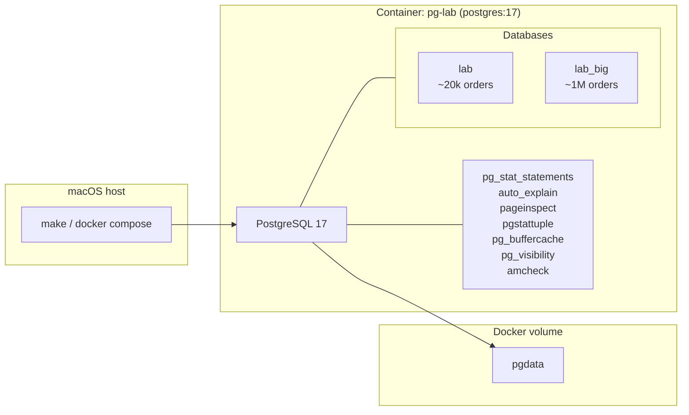
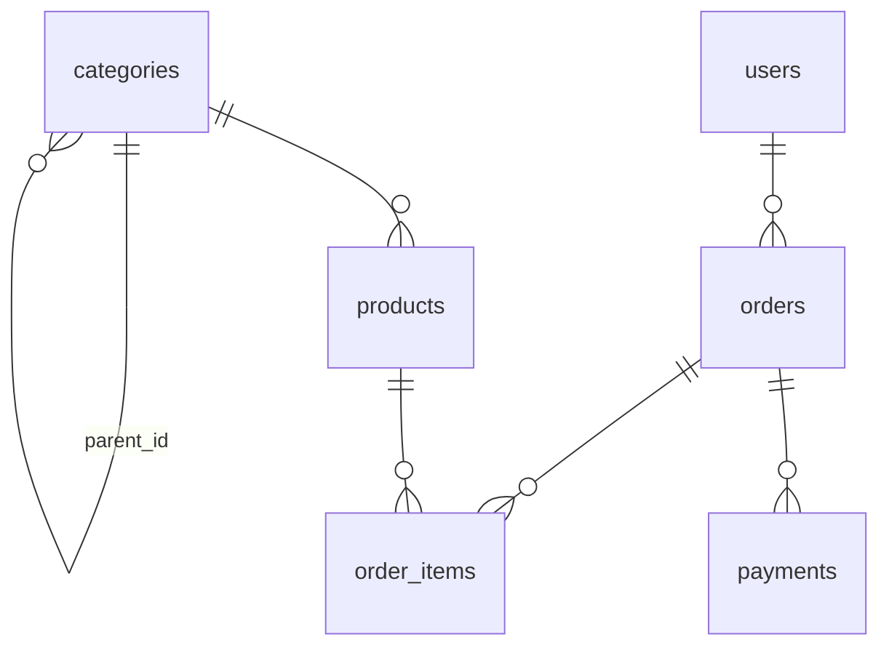

# Phần 00 — Môi trường thực hành

> **Mục tiêu:** có một PostgreSQL để **phá**, không phải để giữ gìn.

---

## 1. Vì sao cần một môi trường riêng

Phần lớn kiến thức database mà một Backend Engineer thực sự dùng được đến từ việc quan
sát database ở trạng thái **không bình thường**: lúc bảng đang bloat, lúc planner ước
lượng sai, lúc hai transaction đang chặn nhau, lúc query phải ghi tạm ra đĩa.

Trên production bạn không được phép tạo ra những trạng thái đó. Trên môi trường staging
của công ty thì thường cũng không, vì có người khác đang dùng. Kết quả là đa số người học
chỉ đọc mô tả về các hiện tượng này mà chưa từng nhìn thấy chúng, nên khi gặp thật thì
không nhận ra.

Môi trường trong phần này được thiết kế để làm ngược lại:

- **Dễ phá và dễ dựng lại.** Một lệnh `make reset` là quay về trạng thái ban đầu. Bạn
  không cần cẩn thận với nó.
- **Nói nhiều.** Cấu hình được chỉnh để PostgreSQL ghi log những thứ mà production
  thường tắt đi: mọi lần autovacuum chạy, mọi temp file, mọi lần chờ lock.
- **Có sẵn dụng cụ mổ.** Toàn bộ extension chẩn đoán dùng trong giáo trình được cài từ đầu.

> **Cảnh báo:** cấu hình trong phần này **không phải** cấu hình production. Nhiều tham số
> được đặt ở giá trị mà trên production sẽ là sai. Chỗ nào cố tình sai sẽ được nói rõ.

---

## 2. Môi trường gồm những gì



Một container PostgreSQL 17, hai database dùng chung một schema, dữ liệu nằm trên Docker
volume tên `pgdata`. Cổng phía máy host là **5433** (không phải 5432) để tránh đụng
PostgreSQL đã cài sẵn trên máy, nếu có.

Các file cấu hình:

| File | Vai trò |
|---|---|
| `docker/docker-compose.yml` | Định nghĩa container |
| `docker/postgresql.conf` | Cấu hình PostgreSQL cho môi trường học |
| `docker/init/*.sql` | Chạy **một lần duy nhất** khi volume còn trống |
| `sql/01-schema.sql` | Schema dùng xuyên suốt giáo trình |
| `sql/02-seed.sql` | Sinh dữ liệu, chạy lại được nhiều lần |

Điểm cần nhớ về `docker/init/`: các script này chỉ chạy **lần đầu tiên**, khi volume
`pgdata` còn rỗng. Sửa chúng rồi `make restart` sẽ không có tác dụng gì — phải `make reset`.

---

## 3. Hai database: `lab` và `lab_big`

| Database | Kích thước | Dùng khi nào |
|---|---|---|
| `lab` | ~17 MB, 20.000 order | Đọc Execution Plan, thử MVCC, thử lock, thử transaction |
| `lab_big` | ~443 MB, 1.000.000 order | Khi cần thấy khác biệt hiệu năng thật |

Lý do phải tách ra rất quan trọng, và nó cũng là bài học đầu tiên về planner.

**Level 1 — Trực giác.** Nếu một cuốn sách chỉ có 3 trang, việc lật giở từng trang để tìm
một từ còn nhanh hơn việc mở mục lục ở cuối sách rồi lật ngược lại. Index cũng vậy: với
bảng đủ nhỏ, đọc hết bảng rẻ hơn đi qua index.

**Level 2 — Góc nhìn Backend Engineer.** Nếu bạn chỉ thử nghiệm trên dataset vài nghìn row
trên máy cá nhân, PostgreSQL sẽ chọn Sequential Scan cho gần như mọi thứ. Bạn rất dễ rút ra
kết luận sai: "index không có tác dụng", hoặc tệ hơn, "planner của PostgreSQL không thông
minh". Rồi khi lên production với 50 triệu row, mọi kết luận đó đảo ngược.

**Level 3 — PostgreSQL Internals.** Planner không chọn theo quy tắc mà chọn theo **cost**.
Sequential Scan đọc tuần tự với chi phí `seq_page_cost` mỗi page; Index Scan phải đọc index
rồi nhảy ngẫu nhiên vào heap với chi phí `random_page_cost` mỗi lần, cộng thêm
`cpu_index_tuple_cost` cho mỗi index entry. Khi số page của bảng nhỏ, tổng cost của
Sequential Scan gần như luôn thấp hơn. Cơ chế tính cost này là nội dung của Phần 06.

Kết luận thực hành: **mọi kết luận về hiệu năng phải được kiểm chứng trên `lab_big`.**
`lab` chỉ dùng để nhìn cấu trúc và hành vi.

---

## 4. Giải thích cấu hình

File `docker/postgresql.conf` được chia thành từng nhóm. Dưới đây là lý do đằng sau các
lựa chọn quan trọng.

### 4.1. `work_mem = 4MB` — cố tình để thấp

```conf
work_mem = 4MB
```

`work_mem` là lượng bộ nhớ mà **mỗi node** trong Execution Plan được dùng trước khi phải
ghi tạm ra đĩa. Điểm dễ hiểu sai nhất: đây **không phải** giới hạn cho mỗi query, mà cho
mỗi node cần bộ nhớ (mỗi Sort, mỗi Hash, mỗi HashAggregate). Một query có 5 node như vậy,
chạy với 2 parallel worker, có thể dùng tới `5 × 3 × work_mem`.

Giá trị 4MB là mặc định của PostgreSQL và thấp so với nhu cầu thật. Ở đây ta **giữ nguyên
mức thấp có chủ ý**, vì nó giúp tái hiện dễ dàng hiện tượng quan trọng nhất khi đọc
`EXPLAIN`:

```text
Sort Method: external merge  Disk: 25400kB
```

Đây là dấu hiệu query phải ghi dữ liệu tạm ra đĩa. Trên production, đây là một trong những
nguyên nhân phổ biến nhất khiến query chậm đột ngột khi dữ liệu lớn dần. Với `work_mem`
cao, bạn sẽ không bao giờ nhìn thấy nó trên máy của mình.

Phần 07 và Phần 11 sẽ quay lại tham số này.

### 4.2. Nhóm logging — bật gần như tối đa

```conf
log_min_duration_statement = '200ms'
log_checkpoints = on
log_lock_waits = on
log_temp_files = 0
log_autovacuum_min_duration = 0
```

| Tham số | Tác dụng | Vì sao bật |
|---|---|---|
| `log_min_duration_statement = 200ms` | Ghi lại mọi câu lệnh chạy quá 200ms | Thấy ngay query nào chậm mà không cần công cụ ngoài |
| `log_checkpoints = on` | Ghi lại mỗi lần checkpoint | Phần 09 cần nhìn thấy checkpoint spike |
| `log_lock_waits = on` | Ghi lại khi một transaction chờ lock quá `deadlock_timeout` | Phần 08 cần thấy ai chặn ai |
| `log_temp_files = 0` | Ghi lại **mọi** temp file, kể cả nhỏ | Bằng chứng trực tiếp của việc thiếu `work_mem` |
| `log_autovacuum_min_duration = 0` | Ghi lại **mọi** lần autovacuum chạy | Phần 04 cần biết autovacuum có chạy hay không |

Lưu ý giá trị `0` ở đây nghĩa là "ghi tất cả", còn `-1` mới là "tắt". Đây là quy ước dễ
nhầm trong PostgreSQL.

Trên production, `log_temp_files = 0` và `log_autovacuum_min_duration = 0` thường quá ồn.
Giá trị thường dùng là `log_temp_files = 1MB` và `log_autovacuum_min_duration = 1s`.

### 4.3. `logging_collector = off` — để log đi thẳng ra Docker

```conf
logging_collector = off
log_destination = 'stderr'
```

Với cấu hình này, log không ghi vào file bên trong container mà đi thẳng ra stderr, nên
`make logs` là đủ để xem. Trên production thì ngược lại: `logging_collector = on` để log
được xoay vòng và giữ lại.

### 4.4. `autovacuum_naptime = 10s`

Mặc định là 1 phút. Rút xuống 10 giây để khi làm lab ở Phần 04 không phải ngồi chờ.
Trên production, giá trị mặc định thường là hợp lý; rút ngắn chỉ làm tăng tải vô ích.

### 4.5. `wal_level = logical`

Đặt sẵn từ đầu để Phần 10 (Replication) không phải restart lại cluster. Đánh đổi: mức
`logical` ghi nhiều WAL hơn `replica`, vì nó phải ghi thêm thông tin đủ để tái tạo được
thay đổi ở mức row. Trên production, chỉ bật `logical` khi thật sự cần logical replication
hoặc CDC.

### 4.6. `shm_size: 1gb` trong `docker-compose.yml`

Đây là cấu hình của Docker, không phải của PostgreSQL, nhưng bỏ qua nó thì parallel query
sẽ lỗi. PostgreSQL dùng dynamic shared memory (thường là POSIX shared memory trong
`/dev/shm`) để các parallel worker trao đổi dữ liệu với process cha. Mặc định Docker chỉ
cấp 64MB cho `/dev/shm`, và một Parallel Hash Join trên bảng lớn có thể vượt mức đó.

### 4.7. `lc_messages = 'C'`

Giữ thông báo lỗi của PostgreSQL bằng tiếng Anh. Lý do rất thực tế: khi tra cứu một lỗi,
thông báo tiếng Anh cho kết quả tìm kiếm hữu ích hơn nhiều so với bản dịch.

### 4.8. Sửa cấu hình: khi nào `reload`, khi nào `restart`

Không phải tham số nào cũng áp dụng được ngay. Cột `context` trong `pg_settings` cho biết
điều đó:

```sql
SELECT name, setting, context
FROM pg_settings
WHERE name IN ('work_mem', 'shared_buffers', 'log_temp_files', 'shared_preload_libraries');
```

| `context` | Ý nghĩa | Cách áp dụng |
|---|---|---|
| `user` | Đổi được ngay trong session | `SET work_mem = '64MB';` |
| `superuser` | Như trên nhưng cần quyền superuser | `SET` |
| `sighup` | Đổi được không cần restart | `SELECT pg_reload_conf();` |
| `postmaster` | Bắt buộc restart cả cluster | `make restart` |

`shared_buffers` và `shared_preload_libraries` thuộc nhóm `postmaster` — đây là lý do
`pg_stat_statements` và `auto_explain` phải được khai báo từ trước khi khởi động.

---

## 5. Các extension chẩn đoán

Tất cả đều là contrib module đi kèm PostgreSQL, không phải phần mềm bên thứ ba.

| Extension | Trả lời câu hỏi gì | Dùng ở phần |
|---|---|---|
| `pg_stat_statements` | Query nào tốn nhiều thời gian nhất trên toàn cluster? | 07, 14 |
| `auto_explain` | Execution Plan của query chậm đó là gì, mà không cần chạy lại? | 07, 14 |
| `pageinspect` | Bên trong một page 8KB thực sự có gì? | 02, 03, 05 |
| `pgstattuple` | Bảng/index này bloat bao nhiêu phần trăm? | 04, 05 |
| `pg_buffercache` | Buffer cache đang giữ những page nào? | 01, 07 |
| `pg_visibility` | Visibility Map đang ở trạng thái nào? | 02, 04, 05 |
| `pg_prewarm` | Nạp sẵn bảng vào cache để đo đạc công bằng | 06, 07 |
| `amcheck` | Cấu trúc B-tree này có còn toàn vẹn không? | 05 |

Hai extension đầu tiên là thứ bạn sẽ dùng nhiều nhất trong công việc thật.
`pg_stat_statements` cho biết **query nào** đáng quan tâm, `auto_explain` cho biết **vì sao**.

Điểm cần lưu ý về `pg_stat_statements`: nó **chuẩn hóa** câu query, thay các literal bằng
tham số. Hai câu `WHERE id = 1` và `WHERE id = 2` được gộp thành một dòng thống kê duy nhất
`WHERE id = $1`. Đây là điều bạn muốn — nếu không, bảng thống kê sẽ đầy các biến thể vô nghĩa.

---

## 6. Dataset

### 6.1. Schema

Mô hình một hệ thống thương mại điện tử rút gọn:



Kích thước sau khi seed:

| Bảng | `lab` | `lab_big` |
|---|---:|---:|
| `categories` | 20 | 200 |
| `users` | 5.000 | 200.000 |
| `products` | 1.000 | 20.000 |
| `orders` | 20.000 | 1.000.000 |
| `order_items` | 50.000 | 2.500.000 |
| `payments` | 18.000 | 900.000 |

### 6.2. Schema cố tình thiếu index

Trong `sql/01-schema.sql` **không có index nào trên foreign key column**:
`orders.user_id`, `order_items.order_id`, `order_items.product_id`, `payments.order_id`
đều trần. Chỉ có PRIMARY KEY và UNIQUE constraint.

Đây là chủ ý, vì hai lý do:

1. Phần 05 và Phần 06 sẽ tự tay thêm từng index rồi đo lại. Nhận sẵn một schema đã tối ưu
   thì không học được gì — bạn cần thấy trạng thái "trước" để hiểu giá trị của trạng thái "sau".
2. Phần 08 cần đúng trạng thái này để tái hiện một sự cố production kinh điển: xóa một row
   ở bảng cha khi bảng con thiếu index trên foreign key, khiến PostgreSQL phải quét toàn bộ
   bảng con trong lúc đang giữ lock.

PostgreSQL **tự động tạo index cho PRIMARY KEY và UNIQUE, nhưng không tự tạo index cho
FOREIGN KEY**. Đây là một trong những nguyên nhân phổ biến nhất của query chậm mà người
mới không ngờ tới.

### 6.3. Dữ liệu được sinh lệch có chủ ý

Dữ liệu ngẫu nhiên phân bố đều là dữ liệu **không thực tế**, và tệ hơn, nó khiến planner
luôn ước lượng đúng. Mà planner ước lượng đúng thì không có gì để học.

Dữ liệu ở đây được sinh lệch ở ba chỗ:

**`users.country_code` lệch nặng:**

| Giá trị | Tỷ lệ |
|---|---:|
| `VN` | 70% |
| `US` | 15% |
| `JP` | 8% |
| `SG` | 5% |
| `DE` | 2% |

Đây là nguyên liệu cho bài về MCV list (Most Common Values) và selectivity ở Phần 06:
`WHERE country_code = 'VN'` và `WHERE country_code = 'DE'` có selectivity chênh nhau 35 lần,
và planner có thể chọn hai plan hoàn toàn khác nhau cho cùng một câu query chỉ khác literal.

**`orders.user_id` lệch theo `power(random(), 2)`:** một số ít user có rất nhiều order,
phần lớn user chỉ có vài order — giống hệt phân bố thật của mọi hệ thống thương mại điện tử.
Phân bố này là nguyên nhân khiến planner ước lượng sai số row của một Nested Loop Join.

**`orders.status` lệch:** `completed` 80%, `shipped` 10%, `pending` 7%, `cancelled` 3%.

Ngoài ra, `setseed(0.42)` được gọi ở đầu script seed, nên chuỗi số ngẫu nhiên là **cố định**.
Dữ liệu sinh ra trên máy bạn giống hệt trên máy người khác, và các con số trong bài giảng
khớp với con số bạn nhìn thấy.

### 6.4. `payments` cố tình thiếu 10%

10% order không có payment (những order có `id` chia hết cho 10). Đây là nguyên liệu cho
các bài về `LEFT JOIN`, anti-join và `NOT EXISTS` ở Phần 06.

### 6.5. Vì sao script seed có `VACUUM FULL`

Trong `sql/02-seed.sql`, sau khi nạp `order_items`, có một câu `UPDATE` tính lại
`orders.total_amount` cho **toàn bộ** row của `orders`. Trong PostgreSQL, `UPDATE` không
sửa tại chỗ mà ghi ra một version mới của tuple và đánh dấu version cũ là dead tuple.

Đo bằng `pgstattuple('orders')` trên database `lab`, trước và sau khi thêm `VACUUM FULL`
vào script:

| Trạng thái | `table_len` | `free_percent` |
|---|---:|---:|
| Sau `UPDATE`, chỉ `VACUUM` thường | 2800 kB | 47,61% |
| Sau `VACUUM FULL` | 1472 kB | 0,72% |

Trên `lab_big`, tổng kích thước bảng `orders` giảm từ **180 MB xuống 93 MB** sau cùng
thay đổi đó.

Bảng phình gần gấp đôi chỉ vì một câu `UPDATE`. `VACUUM` thường **không** trả lại phần
disk đó cho hệ điều hành — nó chỉ đánh dấu không gian là dùng lại được cho các row mới.
Chỉ `VACUUM FULL` mới viết lại toàn bộ bảng sang file mới.

Script seed dùng `VACUUM FULL` để dataset khởi điểm không mang sẵn bloat. Bloat phải là thứ
**bạn tự tạo ra** khi học Phần 04, chứ không phải thứ có sẵn mà không biết từ đâu ra.

Hãy ghi nhớ ngay từ bây giờ: `VACUUM FULL` giữ `ACCESS EXCLUSIVE LOCK`, tức là chặn cả đọc
lẫn ghi trên bảng đó trong suốt thời gian chạy. Chạy nó trên production mà không có kế
hoạch downtime là một cách rất hiệu quả để gây sự cố.

### 6.6. Vì sao ngay sau `VACUUM FULL` lại phải `VACUUM` thêm một lần nữa

Cuối script seed có hai lệnh trông như thừa:

```sql
VACUUM (FULL) orders;
VACUUM (ANALYZE) categories, users, products, orders, order_items, payments;
```

Lệnh thứ hai không thừa. `VACUUM FULL` viết lại bảng sang file mới nhưng **không dựng lại
Visibility Map** — sau khi nó chạy xong, không page nào được đánh dấu all-visible.

Mà Index Only Scan chỉ hoạt động khi page đã all-visible. Nếu chưa, PostgreSQL vẫn phải
quay về heap để kiểm tra tính hiển thị của từng tuple, và Index Only Scan mất hết ý nghĩa.

Đo trên `lab_big` với cùng một câu query `SELECT count(*) FROM orders WHERE id BETWEEN 1 AND 5000`:

| Thời điểm | Visibility Map | Plan được chọn | Buffer đọc |
|---|---:|---|---:|
| Ngay sau `VACUUM FULL` | 0 / 9163 page | Bitmap Heap Scan | 195 |
| Sau `VACUUM` thường | 9163 / 9163 page | Index Only Scan (`Heap Fetches: 0`) | 20 |

Gần **10 lần** khác biệt về số buffer phải đọc, cho cùng một câu query, cùng một dữ liệu,
cùng một index. Thứ duy nhất thay đổi là Visibility Map.

Đây không phải chuyện của riêng script seed. Trên production, sau mỗi lần `VACUUM FULL`
hoặc `pg_repack`, mọi query đang dựa vào Index Only Scan sẽ chậm đi cho tới lần VACUUM kế
tiếp. Đó là một tác dụng phụ rất hay bị bỏ sót khi lên kế hoạch bảo trì.

Phần 02 sẽ mổ xẻ Visibility Map, Phần 05 sẽ quay lại Index Only Scan.

---

## 7. Những gì bạn nên rút ra từ phần này

Trước khi sang Phần 01, hãy chắc rằng bạn giải thích được:

1. Vì sao cùng một câu query lại có thể cho hai Execution Plan khác nhau trên `lab` và `lab_big`.
2. `work_mem` là giới hạn cho mỗi cái gì — query, node, hay connection?
3. Vì sao `shared_preload_libraries` bắt buộc phải restart mới có tác dụng, còn
   `log_temp_files` thì không.
4. Vì sao `VACUUM` không làm bảng nhỏ lại còn `VACUUM FULL` thì có.
5. Vì sao chạy `VACUUM FULL` xong lại có thể làm một số query **chậm đi**.
6. PostgreSQL tự tạo index cho constraint nào và không tạo cho constraint nào.

Nếu có câu nào chưa trả lời được, phần tương ứng ở trên có câu trả lời.

---

**Tiếp theo:** [lab.md](lab.md) — dựng môi trường và kiểm chứng từng thứ ở trên.
