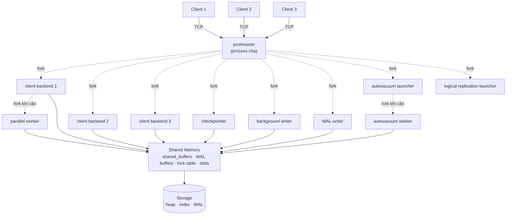
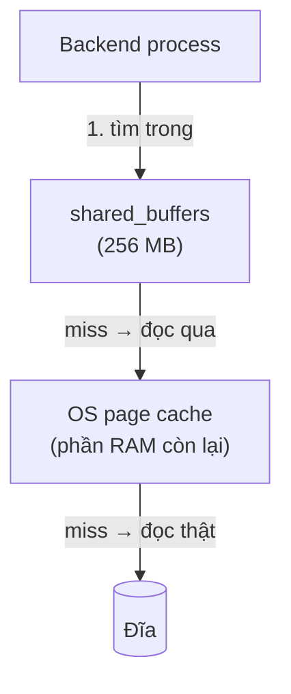
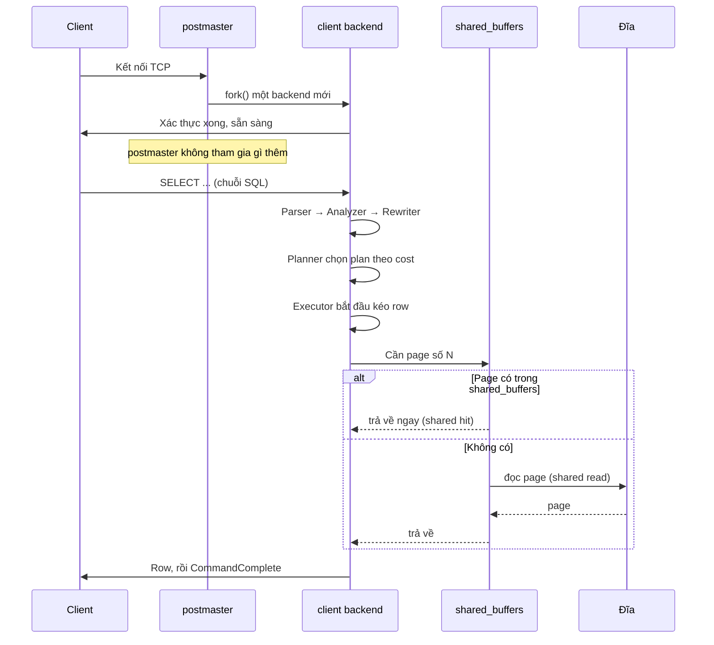

# Phần 01 — Kiến trúc tổng quan PostgreSQL

> **Mục tiêu:** biết trong một PostgreSQL đang chạy có những process nào, ai chịu trách
> nhiệm gì, và một câu SQL đi qua những tầng nào trước khi trả về kết quả.

---

## 1. Khái niệm: PostgreSQL không phải một chương trình

Khi nói "PostgreSQL đang chạy", thứ đang chạy không phải một process duy nhất, mà là **một
tập hợp process** cùng chia sẻ một vùng shared memory.

Chạy thử trên container của Phần 00:

```sql
SELECT pid, backend_type, state FROM pg_stat_activity ORDER BY pid;
```

```text
 pid  |         backend_type         | state
------+------------------------------+--------
   70 | checkpointer                 |
   71 | background writer            |
   73 | walwriter                    |
   74 | autovacuum launcher          |
   75 | logical replication launcher |
 2137 | client backend               | active
```

Sáu process, mà mới chỉ có **một** connection. Năm process đầu chạy nền, không phục vụ
client nào cả; chúng làm những việc mà nếu không có, database sẽ không dùng được lâu dài.

Đây là mô hình cần nắm trước khi học bất cứ thứ gì khác: **mọi vấn đề hiệu năng của
PostgreSQL cuối cùng đều quy về việc một trong các process này đang làm gì, hoặc đang chờ
cái gì.**

---

## 2. Process model

### 2.1. Bức tranh tổng thể



`postmaster` là process cha. Nó **không** xử lý query. Việc của nó là lắng nghe cổng, và
với mỗi connection mới thì `fork()` ra một process con để phục vụ connection đó.

### 2.2. Từng process làm gì

| Process | Nhiệm vụ | Nếu nó gặp vấn đề thì triệu chứng là gì |
|---|---|---|
| `postmaster` | Lắng nghe cổng, fork process con, giám sát và khởi động lại process chết | Không kết nối được vào database |
| `client backend` | Xử lý toàn bộ vòng đời câu SQL cho **một** connection | Query chậm, `idle in transaction` |
| `checkpointer` | Định kỳ ghi toàn bộ dirty buffer xuống đĩa, đánh dấu điểm khôi phục | I/O tăng vọt theo chu kỳ (checkpoint spike) |
| `background writer` | Ghi dần dần dirty buffer để backend không phải tự ghi | Backend phải tự ghi buffer, latency tăng bất thường |
| `walwriter` | Đẩy WAL buffer xuống đĩa | Latency của `COMMIT` tăng |
| `autovacuum launcher` | Theo dõi bảng nào cần vacuum, fork ra worker | Bảng bloat, xid wraparound |
| `autovacuum worker` | Chạy VACUUM/ANALYZE thực tế trên một bảng | I/O nền tăng, hoặc bloat nếu quá ít worker |
| `logical replication launcher` | Quản lý các subscription của logical replication | Logical replication ngừng |
| `parallel worker` | Chạy một phần của Execution Plan song song với backend cha | Query lớn chậm hơn dự kiến |

Hai điểm hay nhầm:

- **`background writer` và `checkpointer` không phải một.** `checkpointer` ghi **tất cả**
  dirty buffer tại thời điểm checkpoint; `background writer` ghi **rải rác** một ít, liên
  tục, để lúc backend cần buffer trống thì đã có sẵn. Phần 09 mổ xẻ kỹ.
- **Từ PostgreSQL 15 trở đi không còn `stats collector`.** Thống kê được lưu thẳng trong
  shared memory. Nếu bạn đọc tài liệu cũ thấy nhắc tới process này, đó là kiến thức đã lỗi thời.

### 2.3. Một connection = một process

Đây là đặc điểm định hình gần như mọi quyết định vận hành PostgreSQL.

**Level 1 — Trực giác.** Mỗi khách vào quán được một nhân viên phục vụ riêng, đi theo từ
đầu tới cuối. Phục vụ rất chu đáo, nhưng thuê thêm nhân viên thì tốn, và 500 nhân viên
trong một quán nhỏ thì họ va vào nhau nhiều hơn là phục vụ khách.

**Level 2 — Góc nhìn Backend Engineer.** Kiểm chứng bằng cách mở 20 connection rồi đếm:

```text
         backend_type         | count
------------------------------+-------
 client backend               |    21
 walwriter                    |     1
 autovacuum launcher          |     1
 logical replication launcher |     1
 background writer            |     1
 checkpointer                 |     1

Tổng process trong container: 29
```

20 connection từ `pgbench` cộng 1 connection của chính câu query đang chạy = 21 client
backend, mỗi cái là một process thật của hệ điều hành.

Hệ quả trực tiếp: **`max_connections = 500` nghĩa là bạn cho phép hệ điều hành tạo tới 500
process.** Không phải 500 "khe cắm" nhẹ nhàng. Mỗi process có stack riêng, catalog cache
riêng, plan cache riêng, và `work_mem` riêng cho mỗi node trong plan của nó.

**Level 3 — PostgreSQL Internals.** Vì sao chọn process chứ không phải thread?

- Quyết định từ những năm 1990, khi thread chưa ổn định và chưa portable giữa các hệ điều hành.
- Đổi lại có **độ cô lập cao**: một backend crash không kéo cả cluster xuống — `postmaster`
  phát hiện, hủy shared memory về trạng thái an toàn và khởi động lại.
- Cái giá: `fork()` không rẻ, và mỗi process phải tự dựng lại cache cục bộ của nó.

### 2.4. Chi phí thật của việc mở connection

Đo bằng `pgbench` ngay trong container, cùng một câu `SELECT 1`, 8 client, 5 giây:

| Cách chạy | Latency trung bình | TPS |
|---|---:|---:|
| Dùng lại connection | 0,067 ms | 119.016 |
| Mở connection mới mỗi transaction (`-C`) | 5,003 ms | 1.599 |

**Chênh nhau 74 lần.**

Câu query hoàn toàn giống nhau. Toàn bộ khác biệt nằm ở chi phí bắt tay TCP, xác thực,
`fork()` một process mới, và dựng lại toàn bộ cache cục bộ của backend đó.

Đây là lý do vì sao **connection pool không phải tối ưu hóa nâng cao, mà là yêu cầu cơ
bản** của mọi ứng dụng chạy PostgreSQL. Một service mở connection mới cho mỗi HTTP request
đang tự giới hạn mình ở khoảng 1/74 năng lực thật của database.

Phần 11 sẽ nói về PgBouncer và các chế độ pooling.

### 2.5. Bộ nhớ của một backend

Đọc `/proc/<pid>/status` của một client backend:

```text
VmSize:  366712 kB
VmRSS:    15012 kB
```

`VmSize` (~358 MB) là toàn bộ vùng địa chỉ ảo, trong đó phần lớn là shared memory được map
chung — **không** phải mỗi backend tốn 358 MB.

`VmRSS` (~15 MB) là phần thực sự nằm trong RAM, nhưng con số này cũng tính cả những page
shared memory mà backend đó đã chạm vào. Phần bộ nhớ **thật sự riêng** của mỗi backend nhỏ
hơn nhiều — thường vài MB — nhưng nó **tăng theo `work_mem`** khi query cần sort hoặc hash.

Bài học: đừng ước lượng RAM cần thiết bằng cách nhân RSS với `max_connections`, vì sẽ tính
trùng phần shared. Nhưng cũng đừng bỏ qua phần riêng, vì `work_mem` nhân lên rất nhanh.
Phần 11 có công thức tính.

---

## 3. Vòng đời của một câu SQL

### 3.1. Năm chặng


| Chặng | Đầu vào | Đầu ra | Có tra catalog không |
|---|---|---|---|
| **Parser** | Chuỗi SQL | Parse tree | Không |
| **Analyzer** | Parse tree | Query tree | Có |
| **Rewriter** | Query tree | Query tree đã viết lại | Có |
| **Planner** | Query tree | Plan tree | Có (statistics) |
| **Executor** | Plan tree | Row | Có (dữ liệu) |

### 3.2. Parser chỉ biết ngữ pháp, không biết bảng của bạn

Đây là ranh giới quan trọng và có thể quan sát trực tiếp bằng thông báo lỗi.

Sai ngữ pháp — Parser chặn lại:

```sql
SELEC * FROM orders;
```

```text
ERROR:  syntax error at or near "SELEC"
LINE 1: SELEC * FROM orders;
        ^
```

Đúng ngữ pháp nhưng column không tồn tại — Parser cho qua, **Analyzer** mới chặn:

```sql
SELECT khong_ton_tai FROM orders;
```

```text
ERROR:  column "khong_ton_tai" does not exist
LINE 1: SELECT khong_ton_tai FROM orders;
               ^
```

Hai thông báo lỗi khác hẳn nhau vì chúng đến từ hai chặng khác nhau. `syntax error` nghĩa là
câu lệnh sai ngữ pháp SQL. `does not exist` nghĩa là câu lệnh đúng ngữ pháp nhưng tham chiếu
tới thứ không có trong catalog.

Biết phân biệt hai loại lỗi này giúp bạn debug nhanh hơn: lỗi loại một là lỗi ở chuỗi SQL bạn
sinh ra, lỗi loại hai là lỗi ở schema hoặc `search_path`.

### 3.3. Rewriter: view biến mất trước khi tới Planner

Rewriter áp dụng các rule của hệ thống. Việc quan trọng nhất nó làm là **mở rộng view**.

```sql
CREATE VIEW v_don_hang_lon AS
SELECT id, user_id, total_amount FROM orders WHERE total_amount > 5000;

EXPLAIN (COSTS OFF)
SELECT count(*) FROM v_don_hang_lon WHERE user_id = 42;
```

```text
                              QUERY PLAN
-----------------------------------------------------------------------
 Aggregate
   ->  Seq Scan on orders
         Filter: ((total_amount > '5000'::numeric) AND (user_id = 42))
```

Trong plan **không còn dấu vết nào của view**. Hai điều kiện — một từ định nghĩa view, một
từ câu query — đã được gộp thành một `Filter` duy nhất trên bảng `orders`.

Đây là điều nên biết trước khi tranh luận về hiệu năng của view:

- **View thường không tốn thêm chi phí gì.** Nó được thay thế bằng định nghĩa của nó trước
  khi planner làm việc, nên planner tối ưu trên câu query đã ghép.
- **Điều đó không đúng với `MATERIALIZED VIEW`** — đó là một bảng thật, có dữ liệu thật.
- Nó cũng không còn đúng khi view chứa những thứ chặn việc gộp, ví dụ `DISTINCT`,
  `GROUP BY`, window function, hoặc `LIMIT`. Khi đó view trở thành một subquery riêng và
  điều kiện bên ngoài **không** đẩy vào trong được. Phần 06 gọi hiện tượng này là
  optimization fence.

### 3.4. Planner và Executor

Planner nhận query tree và sinh ra plan tree — đây là chặng quyết định câu query nhanh hay
chậm, và là nội dung của cả Phần 06. Điều cần nhớ bây giờ: **planner chọn theo cost ước
lượng, không theo quy tắc cố định.** Cùng một câu query, cùng một schema, chỉ khác literal
trong `WHERE`, có thể ra hai plan khác nhau.

Executor chạy plan tree theo mô hình **kéo từng row** (volcano / iterator model): node trên
cùng gọi `next()` xuống node dưới, node dưới trả về một row rồi dừng lại chờ được gọi tiếp.

Đây là lý do `LIMIT` có thể nhanh một cách bất ngờ: khi node trên cùng đã lấy đủ số row cần,
nó ngừng gọi xuống, và các node dưới không bao giờ chạy hết. Cũng vì mô hình này mà trong
`EXPLAIN ANALYZE`, `actual rows` của một node có thể nhỏ hơn nhiều so với `estimated rows`
mà không phải là planner ước lượng sai.

`EXPLAIN` dừng sau chặng Planner, chỉ in ra plan. `EXPLAIN ANALYZE` chạy nốt Executor, nên
nó **thực sự thi hành câu lệnh** — kể cả `UPDATE` và `DELETE`. Muốn xem plan của một câu ghi
mà không muốn nó xảy ra, hãy bọc trong transaction rồi `ROLLBACK`.

---

## 4. Bộ nhớ: shared và local

### 4.1. Shared memory — mọi process cùng nhìn thấy

```sql
SELECT name, pg_size_pretty(size) AS kich_thuoc
FROM pg_shmem_allocations
WHERE size > 1024*1024
ORDER BY size DESC;
```

```text
        name        | kich_thuoc
--------------------+------------
 Buffer Blocks      | 256 MB
 <anonymous>        | 9897 kB
 XLOG Ctl           | 8210 kB
 Buffer Descriptors | 2048 kB
                    | 1846 kB
 transaction        | 1034 kB
 Checkpointer Data  | 1024 kB
```

| Vùng | Là gì |
|---|---|
| `Buffer Blocks` | Chính là `shared_buffers` — cache các page 8KB của bảng và index |
| `Buffer Descriptors` | Metadata cho từng buffer: đang giữ page nào, dirty chưa, ai đang dùng |
| `XLOG Ctl` | WAL buffer và trạng thái điều khiển WAL |
| `transaction` | Trạng thái transaction đang hoạt động, phục vụ MVCC |
| `Checkpointer Data` | Hàng đợi các fsync request gửi cho checkpointer |

Con số `Buffer Blocks = 256 MB` khớp đúng với `shared_buffers = 256MB` trong
`postgresql.conf`. Toàn bộ vùng này được cấp phát **một lần khi khởi động** — đó là lý do
`shared_buffers` thuộc nhóm `postmaster` và bắt buộc restart mới đổi được.

### 4.2. Local memory — riêng của từng backend

| Vùng | Tham số | Dùng để làm gì |
|---|---|---|
| Work memory | `work_mem` | Sort, hash join, hash aggregate — **cho mỗi node**, không phải mỗi query |
| Maintenance work memory | `maintenance_work_mem` | `VACUUM`, `CREATE INDEX`, `ALTER TABLE` |
| Temp buffers | `temp_buffers` | Cache cho temporary table |
| Catalog cache | (không chỉnh được) | Cache metadata bảng, column, kiểu dữ liệu |
| Plan cache | (không chỉnh được) | Cache plan của prepared statement |

Hai vùng cuối giải thích một hiện tượng dễ gây nhầm: câu query đầu tiên trên một connection
mới bao giờ cũng chậm hơn các câu sau, dù dữ liệu đã nằm trong cache. Backend mới phải nạp
metadata từ catalog vào cache cục bộ của nó. Đây là một phần của chi phí 5ms đo được ở mục 2.4.

### 4.3. PostgreSQL dùng hai tầng cache



PostgreSQL **không** bỏ qua page cache của hệ điều hành, khác với Oracle hay MySQL InnoDB
khi dùng direct I/O. Một page có thể tồn tại đồng thời ở cả `shared_buffers` lẫn OS page
cache — gọi là double buffering.

Điều này dẫn tới hai hệ quả thực tế:

1. **Không nên đặt `shared_buffers` quá lớn.** Khuyến nghị phổ biến là khoảng 25% RAM. Đặt
   80% RAM thường **chậm hơn**, vì bạn cướp mất RAM của OS page cache và làm mọi thứ bị lưu
   hai lần.
2. **`effective_cache_size` không cấp phát gì cả.** Nó chỉ là con số bạn nói cho planner
   biết: "tổng lượng cache khả dụng, gồm cả `shared_buffers` lẫn OS page cache, ước chừng
   bằng ngần này". Planner dùng nó để đoán xem một Index Scan có nhiều khả năng đọc trúng
   cache hay không. Đặt sai không gây lỗi, nhưng làm planner chọn sai plan.

Trong `EXPLAIN (ANALYZE, BUFFERS)`, `shared hit` nghĩa là tìm thấy trong `shared_buffers`;
`shared read` nghĩa là phải đi xuống tầng dưới — nhưng **`read` không có nghĩa là đã chạm
đĩa vật lý**, vì rất có thể nó lấy được từ OS page cache. Đây là điểm hay bị diễn giải sai
khi đọc plan.

---

## 5. Giao thức client/server

### 5.1. Simple query và extended query

| | Simple Query | Extended Query |
|---|---|---|
| Số message | 1 (`Query`) | Nhiều (`Parse`, `Bind`, `Describe`, `Execute`, `Sync`) |
| Tham số | Không có, mọi giá trị nhúng thẳng vào chuỗi SQL | Có, tách rời khỏi câu lệnh |
| Tái sử dụng plan | Không | Có |
| Ai dùng | `psql` khi gõ tay, script `.sql` | Hầu hết driver: JDBC, psycopg, pgx, node-postgres |

Extended query có hai lợi ích. Thứ nhất, tham số được gửi tách rời nên **không thể xảy ra
SQL injection** qua chúng — giá trị không bao giờ được ghép vào chuỗi SQL. Thứ hai,
PostgreSQL có thể cache plan và dùng lại.

### 5.2. Prepared statement: generic plan và custom plan

Khi một prepared statement được chạy nhiều lần, PostgreSQL phải chọn giữa:

- **Custom plan** — lập plan lại cho từng bộ tham số cụ thể. Tốn thời gian lập plan, nhưng
  plan sát với dữ liệu thật.
- **Generic plan** — lập một plan chung không phụ thuộc giá trị tham số, dùng lại mãi. Rẻ,
  nhưng có thể sai nghiêm trọng khi dữ liệu lệch.

Mặc định (`plan_cache_mode = auto`): PostgreSQL dùng custom plan cho **5 lần chạy đầu**, ghi
nhớ chi phí trung bình, rồi thử generic plan. Nếu generic plan không đắt hơn đáng kể, nó
chuyển hẳn sang generic.

Đây là nguồn gốc của một sự cố rất khó hiểu trên production: **một câu query chạy nhanh 5
lần rồi đột nhiên chậm ở lần thứ 6 trở đi.** Nó không ngẫu nhiên, cũng không phải cache
nguội — đó là lúc PostgreSQL chuyển sang generic plan.

Với dataset ở Phần 00, `country_code = 'DE'` (2% số row) và `country_code = 'VN'` (70% số
row) cần hai plan hoàn toàn khác nhau. Một generic plan không thể đúng cho cả hai.

Cách xử lý khi gặp: đặt `plan_cache_mode = force_custom_plan` cho session hoặc cho câu query
đó. Phần 06 và Phần 15 sẽ quay lại.

---

## 6. Nối lại: một câu SQL đi qua kiến trúc này như thế nào



Điểm mấu chốt: **sau khi fork xong, `postmaster` không còn liên quan.** Toàn bộ công việc
xử lý query nằm trong một process backend duy nhất, và mọi thứ nó cần chia sẻ với phần còn
lại của hệ thống đều đi qua shared memory.

Khi debug production, câu hỏi đầu tiên luôn là: **backend nào, đang ở chặng nào, đang chờ
cái gì.** `pg_stat_activity` trả lời cả ba:

```sql
SELECT pid, state, wait_event_type, wait_event, now() - query_start AS thoi_gian_chay,
       left(query, 60) AS query
FROM pg_stat_activity
WHERE backend_type = 'client backend' AND state <> 'idle'
ORDER BY thoi_gian_chay DESC NULLS LAST;
```

| Cột | Ý nghĩa |
|---|---|
| `state = active` | Đang thực sự chạy câu lệnh |
| `state = idle` | Connection rảnh, không có transaction mở |
| `state = idle in transaction` | **Có transaction đang mở nhưng không làm gì** — nguy hiểm |
| `wait_event_type = Lock` | Đang chờ lock — Phần 08 |
| `wait_event_type = IO` | Đang chờ đĩa |
| `wait_event_type = Client` | Đang chờ client gửi lệnh |
| `wait_event IS NULL` khi `active` | Đang dùng CPU |

---

## 7. Những gì bạn nên rút ra từ phần này

1. Một connection là một process của hệ điều hành, không phải một khe cắm nhẹ.
2. Mở connection mới đắt hơn dùng lại khoảng 74 lần — connection pool là bắt buộc.
3. `syntax error` đến từ Parser, `does not exist` đến từ Analyzer. Hai loại lỗi khác nhau
   dẫn tới hai hướng debug khác nhau.
4. View bị Rewriter thay bằng định nghĩa của nó trước khi planner làm việc, nên view thường
   không tốn thêm chi phí — trừ khi nó chứa optimization fence.
5. `shared_buffers` là cache tầng một, OS page cache là tầng hai. `shared read` không đồng
   nghĩa với "đã đọc đĩa".
6. `effective_cache_size` không cấp phát bộ nhớ, nó chỉ là thông tin cho planner.
7. Prepared statement chuyển sang generic plan sau 5 lần chạy — nguồn gốc của loại sự cố
   "nhanh 5 lần rồi chậm".

---

**Tiếp theo:** [lab.md](lab.md) — quan sát từng process và từng chặng bằng chính máy của bạn.
