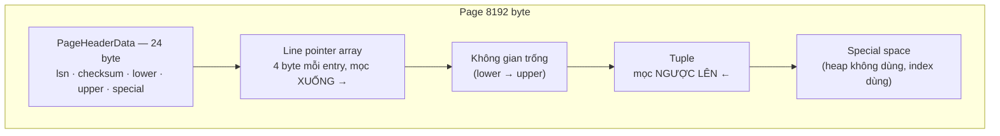

# Phần 02 — Storage layer

> **Mục tiêu:** biết một row thực sự nằm ở đâu trên đĩa, được sắp xếp ra sao trong một page
> 8KB, và vì sao những chi tiết đó quyết định hiệu năng.

> **Vì sao học phần này trước MVCC và Index:** MVCC được cài đặt bằng vài trường trong
> tuple header; bloat là hệ quả của cách tuple được sắp trong page; Index Only Scan phụ
> thuộc vào Visibility Map. Không nắm tầng storage thì ba phần sau chỉ còn là quy tắc học thuộc.

---

## 1. Một bảng trên đĩa là gì

### 1.1. Tìm file của một bảng

```sql
SELECT pg_relation_filepath('orders');
```

```text
 base/16385/16874
```

Đường dẫn này tính từ thư mục dữ liệu (`data_directory`). Xem thực tế trong container:

```text
-rw------- 1 postgres postgres 75063296  /var/lib/postgresql/data/base/16385/16874
-rw------- 1 postgres postgres    40960  /var/lib/postgresql/data/base/16385/16874_fsm
-rw------- 1 postgres postgres     8192  /var/lib/postgresql/data/base/16385/16874_vm
```

Một bảng không phải một file, mà là **một nhóm file** gọi là fork:

| Fork | Hậu tố | Nội dung | Kích thước ở ví dụ |
|---|---|---|---|
| main | (không có) | Dữ liệu thật — các page 8KB chứa tuple | 72 MB |
| fsm | `_fsm` | Free Space Map — page nào còn chỗ trống | 40 kB |
| vm | `_vm` | Visibility Map — page nào toàn tuple ai cũng thấy được | 8 kB |

```sql
SELECT pg_size_pretty(pg_relation_size('orders', 'main')) AS main,
       pg_size_pretty(pg_relation_size('orders', 'fsm'))  AS fsm,
       pg_size_pretty(pg_relation_size('orders', 'vm'))   AS vm;
```

```text
  main  |  fsm  |    vm
--------+-------+------------
 72 MB  | 40 kB | 8192 bytes
```

Chú ý tỷ lệ: Visibility Map chỉ **8 KB** cho một bảng 72 MB. Nó dùng **2 bit cho mỗi page**
của bảng. Bảng có 9.163 page nên VM cần `9163 × 2 / 8 ≈ 2.291` byte — vừa gọn trong một page
8KB duy nhất. Chính vì rẻ như vậy mà PostgreSQL có thể tra VM liên tục trong lúc chạy Index
Only Scan mà gần như không tốn gì.

### 1.2. `relfilenode` không phải `oid`

Con số `16874` trong đường dẫn là `relfilenode`, không phải `oid` của bảng. Chúng thường
bằng nhau khi bảng vừa được tạo, nhưng **`relfilenode` đổi** mỗi khi bảng được viết lại:

- `VACUUM FULL`
- `TRUNCATE`
- `REINDEX` (với index)
- `ALTER TABLE` làm đổi kiểu dữ liệu

Đây là lý do các thao tác đó cần `ACCESS EXCLUSIVE LOCK`: chúng tạo ra một file hoàn toàn
mới rồi tráo chỗ, chứ không sửa tại chỗ. Cũng vì vậy chúng cần **dung lượng trống bằng cỡ
bảng** — một chi tiết hay bị quên khi disk đã gần đầy.

Khi bảng vượt 1 GB, PostgreSQL cắt thành nhiều segment: `16874`, `16874.1`, `16874.2`…
Không có ý nghĩa logic gì, chỉ để tránh giới hạn kích thước file của hệ điều hành.

---

## 2. Bên trong một page 8KB

### 2.1. Bố cục



Điểm mấu chốt: **line pointer mọc từ trên xuống, tuple mọc từ dưới lên**, gặp nhau ở giữa.
Khi chúng gặp nhau thì page đầy.

Đọc page header thật:

```sql
SELECT * FROM page_header(get_raw_page('orders', 0));
```

```text
-[ RECORD 1 ]--------
lsn       | 0/3590860
checksum  | 0
flags     | 4
lower     | 456
upper     | 504
special   | 8192
pagesize  | 8192
version   | 4
prune_xid | 0
```

Cách đọc:

| Trường | Giá trị | Ý nghĩa |
|---|---:|---|
| `lower` | 456 | Line pointer array kết thúc ở byte 456 |
| `upper` | 504 | Vùng tuple bắt đầu ở byte 504 |
| `upper - lower` | **48** | Còn đúng 48 byte trống ở giữa |
| `special` | 8192 | Không có special space (heap không dùng) |
| `lsn` | 0/3590860 | Vị trí WAL của lần sửa gần nhất — Phần 09 |

Từ `lower` suy ra số line pointer: `(456 - 24) / 4 = 108`. Kiểm chứng:

```sql
SELECT count(*) FROM heap_page_items(get_raw_page('orders', 0));
```

```text
 108
```

Khớp. Page này chứa 108 tuple và chỉ còn 48 byte trống — nghĩa là gần như không thể nhét
thêm tuple nào nữa (tuple nhỏ nhất cũng cần 24 byte header cộng dữ liệu cộng 4 byte line
pointer).

**Hệ quả trực tiếp:** một `UPDATE` trên row nằm trong page này sẽ **không** đặt được version
mới vào cùng page, nên không thể là HOT update. Xem mục 5.

### 2.2. Đọc từng tuple

```sql
SELECT lp, lp_off, lp_len, t_xmin, t_xmax, t_ctid, t_hoff
FROM heap_page_items(get_raw_page('orders', 0)) LIMIT 4;
```

```text
 lp | lp_off | lp_len | t_xmin | t_xmax | t_ctid | t_hoff
----+--------+--------+--------+--------+--------+--------
  1 |   8120 |     72 |    773 |      0 | (0,1)  |     24
  2 |   8056 |     64 |    773 |      0 | (0,2)  |     24
  3 |   7984 |     72 |    773 |      0 | (0,3)  |     24
  4 |   7912 |     72 |    773 |      0 | (0,4)  |     24
```

| Cột | Ý nghĩa |
|---|---|
| `lp` | Số thứ tự line pointer — đây chính là phần thứ hai của `ctid` |
| `lp_off` | Tuple nằm ở byte thứ mấy trong page. Chú ý giảm dần: 8120 → 8056 → 7984 |
| `lp_len` | Độ dài tuple. Không đều nhau (72, 64) vì `numeric` là kiểu độ dài thay đổi |
| `t_xmin` | Transaction đã tạo ra version này |
| `t_xmax` | Transaction đã xóa/cập nhật version này. `0` = còn sống |
| `t_ctid` | Con trỏ tới version **mới hơn**. Trỏ về chính nó = đây là version mới nhất |
| `t_hoff` | Độ dài tuple header, tính cả padding. 24 byte khi không có NULL |

**`ctid` là địa chỉ vật lý của một row:** `(page, line pointer)`. Nó **không** ổn định —
mỗi `UPDATE` sinh ra version mới ở `ctid` khác. Đừng bao giờ lưu `ctid` như một khóa trong
application. Nhưng nó cực kỳ hữu ích khi debug:

```sql
SELECT ctid, id, status FROM orders WHERE id = 1;
```

```text
  ctid  | id |  status
--------+----+-----------
 (0,1)  |  1 | completed
```

### 2.3. `infomask` — nơi cất trạng thái của tuple

Cột `t_infomask` là một bitmap. Đừng giải mã bằng tay, `pageinspect` có sẵn hàm:

```sql
SELECT t_infomask,
       heap_tuple_infomask_flags(t_infomask, t_infomask2) AS co
FROM heap_page_items(get_raw_page('orders', 0)) LIMIT 1;
```

```text
 t_infomask |                                        co
------------+------------------------------------------------------------------------
      11010 | ("{HEAP_HASVARWIDTH,HEAP_XMIN_COMMITTED,HEAP_XMIN_INVALID,
                 HEAP_XMAX_INVALID,HEAP_UPDATED}",{HEAP_XMIN_FROZEN})
```

Đọc ra được cả tiểu sử của row này:

| Cờ | Nói lên điều gì |
|---|---|
| `HEAP_HASVARWIDTH` | Tuple có ít nhất một column độ dài thay đổi (`numeric`, `text`) |
| `HEAP_XMAX_INVALID` | `t_xmax` không có ý nghĩa — row chưa bị xóa hay cập nhật |
| `HEAP_UPDATED` | **Version này sinh ra từ một `UPDATE`**, không phải `INSERT` |
| `HEAP_XMIN_FROZEN` | Tuple đã được freeze — Phần 04 |

`HEAP_UPDATED` chính là dấu vết của câu `UPDATE orders SET total_amount = ...` trong script
seed ở Phần 00. Và `HEAP_XMIN_FROZEN` là dấu vết của `VACUUM FULL` chạy ngay sau đó.

Chú ý cặp cờ trông mâu thuẫn: `HEAP_XMIN_COMMITTED` **và** `HEAP_XMIN_INVALID` cùng bật.
Không phải lỗi — bật cả hai bit là quy ước để biểu diễn `HEAP_XMIN_FROZEN`. Đó là lý do nên
dùng `heap_tuple_infomask_flags()` thay vì tự dịch từng bit.

---

## 3. Kích thước một row: alignment padding

### 3.1. Thí nghiệm

Hai bảng, **cùng column, cùng kiểu, chỉ khác thứ tự khai báo**:

```sql
CREATE TABLE t_xau (a int2, b int8, c int2, d int8, e int2);
CREATE TABLE t_tot (b int8, d int8, a int2, c int2, e int2);

INSERT INTO t_xau SELECT 1,1,1,1,1 FROM generate_series(1, 100000);
INSERT INTO t_tot SELECT 1,1,1,1,1 FROM generate_series(1, 100000);
```

```text
 bang  | kich_thuoc | tuple_moi_page
-------+------------+----------------
 t_xau | 6672 kB    |            120
 t_tot | 5096 kB    |            157
```

**Chênh 31% dung lượng. Cùng dữ liệu.**

### 3.2. Vì sao

**Level 1 — Trực giác.** Xếp đồ vào vali. Cùng bộ đồ, xếp lộn xộn thì đầy vali, xếp gọn thì
còn chỗ. CPU cũng "khó tính" như vậy: nó muốn số 8 byte bắt đầu ở địa chỉ chia hết cho 8.

**Level 2 — Góc nhìn Backend Engineer.** Bảng nhỏ hơn 31% nghĩa là:

- Ít page hơn 31% → ít I/O hơn 31% khi quét bảng.
- Nhiều row hơn trong cùng `shared_buffers` → tỷ lệ cache hit cao hơn.
- Backup nhỏ hơn, replication ít WAL hơn.

Với bảng 500 GB, đây là 155 GB. Chỉ nhờ sắp lại thứ tự column.

**Level 3 — PostgreSQL Internals.** PostgreSQL sắp column theo đúng thứ tự khai báo và chèn
padding để mỗi giá trị bắt đầu đúng biên alignment của kiểu đó (`int2` cần biên 2, `int4`
biên 4, `int8` và `timestamptz` biên 8).

```text
t_xau:  a(int2) b(int8) c(int2) d(int8) e(int2)
        [aa][++++++] [bbbbbbbb] [cc][++++++] [dddddddd] [ee][++++++]
         2      6         8       2     6        8        2     6
        → 2+6+8+2+6+8+2+6 = 40 byte (còn bị MAXALIGN lên nữa)

t_tot:  b(int8) d(int8) a(int2) c(int2) e(int2)
        [bbbbbbbb][dddddddd][aa][cc][ee][++]
             8        8       2   2   2   2
        → 8+8+2+2+2+2 = 24 byte
```

`++` là byte padding bị bỏ đi. Ở `t_xau`, mỗi `int2` đứng trước một `int8` kéo theo 6 byte
padding.

### 3.3. Quy tắc thực hành

**Khai báo column theo thứ tự kích thước giảm dần**, rồi tới các kiểu độ dài thay đổi:

```sql
CREATE TABLE tot (
    id          bigint,       -- 8
    created_at  timestamptz,  -- 8
    total       numeric,      -- biến đổi, nhưng biên 4
    user_id     int,          -- 4
    status_code smallint,     -- 2
    is_active   boolean,      -- 1
    note        text          -- biến đổi
);
```

Kiểm tra kích thước thật của một row:

```sql
SELECT pg_column_size(t.*) FROM tot t LIMIT 1;
```

Đây là loại tối ưu hóa **miễn phí ở thời điểm thiết kế** và **rất đắt để sửa sau** (phải
viết lại toàn bộ bảng). Với bảng dự kiến lớn, đáng để làm ngay từ đầu. Với bảng vài nghìn
row thì không cần bận tâm.

---

## 4. TOAST — khi giá trị không vừa một page

### 4.1. Vấn đề

Một tuple **không được phép nằm tràn qua hai page**. Mà page chỉ có 8KB. Vậy làm sao lưu
một `text` dài 1 MB?

Câu trả lời là TOAST (The Oversized-Attribute Storage Technique). Khi tuple vượt khoảng
2 KB, PostgreSQL lần lượt:

1. **Nén** các column độ dài thay đổi.
2. Nếu vẫn còn quá lớn, **đẩy ra bảng TOAST phụ**, chia thành các chunk khoảng 2 KB, và để
   lại trong tuple gốc một con trỏ.

### 4.2. Thí nghiệm

```sql
CREATE TABLE t_toast (id int, mo_ta text, du_lieu text);

INSERT INTO t_toast VALUES (1, 'lặp lại 100k ký tự', repeat('a', 100000));
INSERT INTO t_toast VALUES (2, 'ngẫu nhiên 96k ký tự',
  (SELECT string_agg(md5(g::text || random()::text), '') FROM generate_series(1,3000) g));

SELECT id, length(du_lieu) AS so_ky_tu,
       pg_column_size(du_lieu) AS byte_thuc_luu,
       round(100.0 * pg_column_size(du_lieu) / length(du_lieu), 1) AS ty_le_pct
FROM t_toast ORDER BY id;
```

```text
 id |        mo_ta         | so_ky_tu | byte_thuc_luu | ty_le_pct
----+----------------------+----------+---------------+-----------
  1 | lặp lại 100k ký tự   |   100000 |          1156 |       1.2
  2 | ngẫu nhiên 96k ký tự |    96000 |         96000 |     100.0
```

```text
   chinh    | toast
------------+--------
 8192 bytes | 104 kB
```

Hai kết quả rất khác nhau từ hai giá trị gần bằng nhau về số ký tự:

- **Row 1:** 100.000 ký tự `'a'` nén còn **1.156 byte** (1,2%). Dưới ngưỡng 2 KB nên **ở lại
  trong page chính**, không đụng tới TOAST.
- **Row 2:** 96.000 ký tự gần như ngẫu nhiên, **không nén được** (100%). Bị đẩy nguyên vẹn
  ra bảng TOAST, tạo ra 104 kB ở đó.

Bảng chính vẫn chỉ 8.192 byte — đúng một page — vì cả hai row chỉ để lại con trỏ hoặc giá
trị đã nén nhỏ gọn.

**Bài học:** `length()` cho biết số ký tự, `pg_column_size()` cho biết số byte thật sự lưu.
Khi đánh giá dung lượng, chỉ `pg_column_size()` mới có ý nghĩa.

### 4.3. Bốn chiến lược lưu trữ

```sql
SELECT attname, attstorage FROM pg_attribute
WHERE attrelid = 't_toast'::regclass AND attnum > 0;
```

| `attstorage` | Tên | Nén | Đẩy ra ngoài | Dùng khi nào |
|---|---|---|---|---|
| `p` | PLAIN | Không | Không | Kiểu độ dài cố định (`int`, `timestamptz`) — mặc định, không đổi được |
| `x` | EXTENDED | Có | Có | Mặc định cho `text`, `jsonb`, `bytea` |
| `e` | EXTERNAL | **Không** | Có | Khi thường xuyên đọc **một phần** giá trị |
| `m` | MAIN | Có | Chỉ khi bắt buộc | Khi muốn giữ trong page chính bằng mọi giá |

`EXTERNAL` đáng chú ý hơn vẻ ngoài của nó. Với `EXTENDED`, muốn lấy vài ký tự đầu của một
`text` dài, PostgreSQL phải đọc **và giải nén toàn bộ** giá trị. Với `EXTERNAL` (không nén),
nó lấy đúng những chunk cần:

```sql
ALTER TABLE t ALTER COLUMN noi_dung SET STORAGE EXTERNAL;
```

Đánh đổi: tốn nhiều disk hơn. Hợp lý cho những column mà bạn hay dùng `substr()` hoặc
`left()`, ví dụ preview nội dung bài viết.

Từ PostgreSQL 14 có thể chọn thuật toán nén qua `default_toast_compression`: `pglz` (mặc
định) hoặc `lz4`. `lz4` nén và giải nén nhanh hơn nhiều, tỷ lệ nén thấp hơn một chút —
thường là lựa chọn tốt hơn cho workload đọc nhiều.

### 4.4. Chi phí ẩn của TOAST

Một `SELECT *` trên bảng có column TOAST là **hai lần đọc**: bảng chính, rồi bảng TOAST. Nếu
query của bạn không cần column đó, việc liệt kê column cụ thể thay vì `SELECT *` tiết kiệm
được toàn bộ phần đọc thứ hai.

Đây là một trong số ít trường hợp `SELECT *` gây hại thật sự về hiệu năng chứ không chỉ về
phong cách code.

---

## 5. HOT update và `fillfactor`

### 5.1. Vấn đề

Mỗi `UPDATE` tạo ra một version tuple mới ở vị trí vật lý mới. Mà index trỏ tới `ctid` —
địa chỉ vật lý. Vậy mỗi `UPDATE` phải cập nhật **tất cả** index của bảng, kể cả những index
trên column không hề bị sửa.

Bảng có 6 index thì một `UPDATE` một column thành 7 lần ghi. Rất đắt.

### 5.2. Lời giải: Heap-Only Tuple

Nếu **cả hai** điều kiện sau đúng, PostgreSQL bỏ qua việc cập nhật index:

1. Không column nào **đang được index** bị thay đổi.
2. Version mới đặt vừa **trong chính page đó**.

Khi đó version cũ được nối tới version mới bằng `t_ctid` ngay trong page, và index vẫn trỏ
tới line pointer cũ — đi theo chuỗi là tới được version mới. Đó là HOT: Heap-Only Tuple.

### 5.3. Thí nghiệm

Ba bảng giống hệt nhau, khác nhau ở `fillfactor` và ở việc column bị update có index hay không:

```sql
CREATE TABLE h100 (id int PRIMARY KEY, v int, pad text) WITH (fillfactor = 100);
CREATE TABLE h70  (id int PRIMARY KEY, v int, pad text) WITH (fillfactor = 70);
CREATE TABLE h70i (id int PRIMARY KEY, v int, pad text) WITH (fillfactor = 70);
CREATE INDEX ON h70i(v);          -- chỉ bảng này có index trên v

-- mỗi bảng 20.000 row, rồi:
UPDATE h100 SET v = v + 1;
UPDATE h70  SET v = v + 1;
UPDATE h70i SET v = v + 1;
```

```text
 relname | tong_update | hot_update | ty_le_hot_pct |  heap   | index_size
---------+-------------+------------+---------------+---------+------------
 h100    |       20000 |          0 |           0.0 | 3952 kB | 896 kB
 h70     |       20000 |       8424 |          42.1 | 4432 kB | 888 kB
 h70i    |       20000 |          0 |           0.0 | 4432 kB | 1216 kB
```

Ba dòng, ba bài học:

- **`h100` — 0% HOT.** `fillfactor = 100` nghĩa là page được nhét đầy khi insert, không chừa
  chỗ. Version mới không vừa nên phải sang page khác, và index buộc phải cập nhật.
- **`h70` — 42,1% HOT.** Chừa 30% chỗ trống, gần một nửa số update tránh được việc đụng index.
- **`h70i` — 0% HOT** dù `fillfactor = 70`. Vì `v` có index, điều kiện thứ nhất bị vi phạm.
  Hậu quả nhìn thấy ngay ở cột cuối: index phình lên **1216 kB** so với 888 kB của `h70`.

### 5.4. Khi nào chỉnh `fillfactor`

`fillfactor` mặc định của heap là **100**. Với bảng chỉ ghi thêm (log, event, audit trail),
đó là giá trị đúng — chừa chỗ trống chỉ tổ lãng phí.

Hạ xuống 70–90 khi bảng **bị update thường xuyên trên những column không có index** — ví dụ
bảng trạng thái, bảng counter, bảng session.

```sql
ALTER TABLE don_hang SET (fillfactor = 85);
-- fillfactor chỉ áp dụng cho page MỚI; muốn áp dụng cho dữ liệu cũ:
VACUUM FULL don_hang;   -- cần ACCESS EXCLUSIVE LOCK
```

Theo dõi hiệu quả:

```sql
SELECT relname,
       n_tup_upd,
       n_tup_hot_upd,
       round(100.0 * n_tup_hot_upd / NULLIF(n_tup_upd, 0), 1) AS ty_le_hot_pct
FROM pg_stat_user_tables
WHERE n_tup_upd > 0
ORDER BY n_tup_upd DESC;
```

Bảng bị update nhiều mà tỷ lệ HOT thấp là ứng viên cho hai việc: hạ `fillfactor`, và rà lại
xem có index nào thừa đang chặn HOT không.

Đây cũng là một lý do rất thực tế để **không tạo index bừa bãi**: mỗi index không chỉ tốn
disk và tốn thời gian ghi, nó còn có thể vô hiệu hóa HOT update trên toàn bộ bảng.

---

## 6. Free Space Map và Visibility Map

### 6.1. Free Space Map

FSM trả lời: *"cần chỗ cho một tuple 200 byte, page nào còn đủ?"*

Không có FSM, mỗi `INSERT` phải quét tuần tự để tìm chỗ. FSM là một cây, mỗi node giữ lượng
free space lớn nhất của nhánh dưới, nên tìm chỗ chỉ mất vài lần đọc.

FSM được cập nhật bởi **VACUUM**, không phải bởi `DELETE`. Đây là mắt xích quan trọng:

```text
DELETE  →  tuple thành dead, KHÔNG gian chưa được ghi vào FSM
VACUUM  →  ghi không gian trống vào FSM
INSERT  →  đọc FSM, tái sử dụng không gian đó
```

Bỏ VACUUM thì không gian trống có tồn tại nhưng **không ai biết** để dùng lại, và bảng cứ
mọc dài ra. Đây chính là cơ chế của bloat mà Phần 04 sẽ mổ xẻ.

```sql
SELECT * FROM pg_freespace('orders') WHERE avail > 0 LIMIT 5;
```

### 6.2. Visibility Map

VM giữ **2 bit cho mỗi page**:

| Bit | Ý nghĩa | Ai dùng |
|---|---|---|
| `all_visible` | Mọi tuple trong page này đều hiển thị với mọi transaction | **Index Only Scan** và VACUUM |
| `all_frozen` | Mọi tuple trong page này đã được freeze | VACUUM (bỏ qua page khi freeze) |

`all_visible` là điều kiện sống còn của Index Only Scan. Index chứa giá trị column nhưng
**không** chứa thông tin tuple đó có hiển thị với transaction hiện tại hay không — thông tin
đó nằm trong tuple header ở heap. Nên bình thường, đọc index xong vẫn phải về heap kiểm tra.

Trừ khi page đã `all_visible`: lúc đó khỏi cần kiểm tra, khỏi cần về heap.

Phần 00 đã đo được hậu quả khi VM trống:

| Trạng thái VM | Plan | Buffer đọc |
|---|---|---:|
| 0 / 9163 page all-visible | Bitmap Heap Scan | 195 |
| 9163 / 9163 page all-visible | Index Only Scan, `Heap Fetches: 0` | 20 |

Kiểm tra VM:

```sql
SELECT count(*) FILTER (WHERE all_visible) AS all_visible,
       count(*) FILTER (WHERE all_frozen)  AS all_frozen,
       count(*)                            AS tong_page
FROM pg_visibility_map('orders');
```

Và trong `EXPLAIN`, `Heap Fetches` là con số cần nhìn. `Heap Fetches: 0` nghĩa là VM đang
làm việc. `Heap Fetches` lớn nghĩa là "Index Only Scan" chỉ còn là cái tên — thường vì bảng
vừa bị ghi nhiều và autovacuum chưa theo kịp.

---

## 7. Những gì bạn nên rút ra từ phần này

1. Một bảng gồm ba fork: main, fsm, vm. VM cực nhỏ nhưng quyết định Index Only Scan.
2. `relfilenode` đổi sau `VACUUM FULL`/`TRUNCATE`/`REINDEX` — các thao tác đó viết lại file
   mới và cần chỗ trống bằng cỡ bảng.
3. Trong page, line pointer mọc xuống và tuple mọc lên; `upper - lower` là chỗ trống thật.
4. `ctid = (page, line pointer)` là địa chỉ vật lý, thay đổi sau mỗi `UPDATE`. Không dùng
   làm khóa.
5. Thứ tự khai báo column ảnh hưởng kích thước bảng — đo được 31% ở ví dụ trên.
6. TOAST nén trước, đẩy ra ngoài sau. `length()` và `pg_column_size()` là hai chuyện khác nhau.
7. HOT update cần **cả hai**: có chỗ trong page (`fillfactor`) và column bị sửa không có index.
8. FSM chỉ được cập nhật bởi VACUUM — đây là gốc rễ của bloat.

---

**Tiếp theo:** [lab.md](lab.md) — mổ từng page bằng `pageinspect`.
