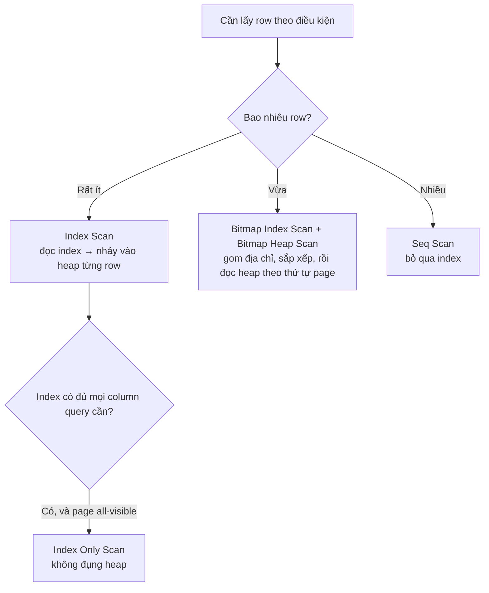

# Phần 05 — Index

> **Mục tiêu:** biết khi nào index giúp, khi nào index là gánh nặng, và vì sao PostgreSQL
> đôi khi từ chối dùng index bạn vừa tạo.

---

## 1. Index không phải lúc nào cũng nhanh hơn

### 1.1. Thí nghiệm: tìm ngưỡng planner bỏ index

Trên `lab_big` (1 triệu order), tạo index trên `user_id` rồi chạy cùng một dạng query với
độ chọn lọc tăng dần. Query phải đọc heap (`sum(total_amount)`) nên không dùng được Index
Only Scan:

```sql
CREATE INDEX idx_orders_user ON orders(user_id);
ANALYZE orders;

EXPLAIN (ANALYZE, BUFFERS)
SELECT sum(total_amount) FROM orders WHERE user_id <= <N>;
```

| Điều kiện | Số row | Tỷ lệ | Plan được chọn | Buffer đọc |
|---|---:|---:|---|---:|
| `user_id <= 100` | 22.486 | 2,25% | Bitmap Heap Scan | 8.407 |
| `user_id <= 1000` | 70.668 | 7,07% | Bitmap Heap Scan | 9.225 |
| `user_id <= 5000` | 158.129 | 15,81% | Bitmap Heap Scan | 9.310 |
| `user_id <= 10000` | 223.367 | 22,34% | Bitmap Heap Scan | 9.379 |
| `user_id <= 20000` | 315.397 | 31,54% | Bitmap Heap Scan | 9.486 |
| `user_id <= 60000` | 547.147 | 54,71% | **Parallel Seq Scan** | 9.163 |

Bảng `orders` có đúng **9.163 page**. Hãy nhìn dòng 31,54%: Bitmap Heap Scan đọc **9.486**
buffer — **nhiều hơn** cả việc quét toàn bộ bảng.

Đó là toàn bộ câu chuyện. Khi tỷ lệ row cần lấy đủ lớn, bạn sẽ chạm gần như mọi page của
bảng **dù đi bằng đường nào**. Lúc đó phần đọc index trở thành chi phí thuần túy cộng thêm.

Đọc tuần tự còn có hai lợi thế nữa mà index không có: hệ điều hành đọc trước (readahead)
hiệu quả, và PostgreSQL dùng được parallel worker.

### 1.2. Kết luận cần nhớ

> Index có lợi khi query lấy **một phần nhỏ** của bảng. "Nhỏ" ở đây thường là dưới 5–10%,
> và ngưỡng chính xác phụ thuộc vào correlation, kích thước row và cấu hình cost.

Đây là lý do câu "tạo index cho mọi column trong `WHERE`" là lời khuyên tồi.

---

## 2. Ba cách PostgreSQL dùng một B-tree



| Kiểu scan | Cách hoạt động | Dấu hiệu trong plan |
|---|---|---|
| **Index Scan** | Đọc index, mỗi entry nhảy ngay vào heap | `Index Scan using ...` |
| **Bitmap Heap Scan** | Gom hết địa chỉ vào bitmap, **sắp theo thứ tự page**, rồi đọc heap một lượt | `Bitmap Index Scan` + `Bitmap Heap Scan`, có `Heap Blocks:` |
| **Index Only Scan** | Lấy toàn bộ dữ liệu từ index, không đụng heap | `Heap Fetches: 0` |

Ví dụ thật, cùng bảng, chỉ khác độ chọn lọc:

```sql
-- 171 row → Index Scan
EXPLAIN (ANALYZE, BUFFERS) SELECT * FROM orders WHERE user_id = 42;
```

```text
 Index Scan using idx_orders_user on orders (actual rows=171 loops=1)
   Index Cond: (user_id = 42)
   Buffers: shared hit=176
```

**Vì sao Bitmap Heap Scan tồn tại:** Index Scan nhảy vào heap theo thứ tự của index, tức là
ngẫu nhiên theo vị trí vật lý. Với hàng chục nghìn row, đó là hàng chục nghìn lần đọc ngẫu
nhiên. Bitmap Heap Scan gom tất cả địa chỉ lại, **sắp xếp theo số page**, rồi đọc tuần tự —
biến truy cập ngẫu nhiên thành truy cập tuần tự.

Cái giá là phải đọc hết index trước khi trả row đầu tiên, nên nó không phù hợp với query có
`LIMIT` nhỏ.

Khi bitmap không đủ chỗ trong `work_mem`, PostgreSQL chuyển sang bitmap "lossy" — chỉ nhớ
số page thay vì từng row, rồi phải lọc lại toàn bộ page đó. Dấu hiệu:

```text
Heap Blocks: exact=1200 lossy=45000
```

`lossy` lớn là tín hiệu cần tăng `work_mem`. Phần 07 sẽ quay lại.

---

## 3. Composite index và quy tắc leftmost prefix

### 3.1. Thí nghiệm quan trọng nhất của phần này

```sql
CREATE INDEX idx_oi_composite ON order_items(order_id, product_id);
```

Ba câu query, cùng một index:

```sql
SELECT count(*) FROM order_items WHERE order_id = 500;                        -- A
SELECT count(*) FROM order_items WHERE product_id = 500;                      -- B
SELECT count(*) FROM order_items WHERE order_id = 500 AND product_id = 500;   -- C
```

Plan của A và B **trông giống hệt nhau**:

```text
-- A
 Aggregate
   ->  Index Only Scan using idx_oi_composite on order_items
         Index Cond: (order_id = 500)

-- B
 Aggregate
   ->  Index Only Scan using idx_oi_composite on order_items
         Index Cond: (product_id = 500)
```

Cùng tên index, cùng loại node, cùng có `Index Cond`. Nhưng nhìn `Buffers`:

| Query | Điều kiện | Buffer đọc |
|---|---|---:|
| A | `order_id = 500` (column đầu) | **7** |
| B | `product_id = 500` (column thứ hai) | **9.582** |
| C | cả hai | **6** |

**Chênh 1.370 lần.**

### 3.2. Vì sao

**Level 1 — Trực giác.** Danh bạ điện thoại sắp theo (họ, tên). Tìm "Nguyễn" thì mở đúng chỗ.
Tìm mọi người tên "An" bất kể họ thì phải lật từng trang — quyển danh bạ vẫn "được dùng",
nhưng bạn đọc hết nó.

**Level 2 — Backend Engineer.** Đây là cái bẫy nguy hiểm nhất khi đọc `EXPLAIN`: **thấy tên
index trong plan không có nghĩa là index đang giúp bạn.** Nếu chỉ nhìn tới dòng
`Index Only Scan using ...` rồi kết luận "index chạy tốt", bạn bỏ sót một query đọc 9.582
buffer thay vì 7.

> **Luôn đọc `Buffers`. Tên node có thể lừa bạn, số buffer thì không.**

**Level 3 — Internals.** B-tree sắp các entry theo thứ tự `(order_id, product_id)`. Với
`order_id = 500`, mọi entry khớp nằm liền kề nhau — PostgreSQL đi thẳng xuống leaf và đọc một
đoạn liên tục. Với `product_id = 500`, các entry khớp rải khắp index; PostgreSQL vẫn dùng
index (vì nó chứa đủ column để tránh đọc heap) nhưng phải **quét toàn bộ leaf** và lọc từng
entry.

### 3.3. Quy tắc thứ tự column

Một index trên `(a, b, c)` phục vụ hiệu quả:

| Điều kiện | Có seek được không |
|---|---|
| `a = ?` | Có |
| `a = ? AND b = ?` | Có |
| `a = ? AND b = ? AND c = ?` | Có |
| `a = ? AND c = ?` | Seek theo `a`, `c` chỉ dùng để lọc |
| `b = ?` | **Không** — phải quét toàn index |
| `c = ?` | **Không** |

Nguyên tắc sắp thứ tự:

1. **Column dùng với `=` đặt trước**, column dùng với khoảng (`>`, `<`, `BETWEEN`) đặt sau.
2. Trong nhóm `=`, đặt column có **selectivity cao** (nhiều giá trị khác nhau) lên trước.
3. Column chỉ dùng để `ORDER BY` đặt sau cùng.

Ví dụ, cho query:

```sql
SELECT * FROM orders
WHERE user_id = ? AND status = ? AND created_at > ?
ORDER BY created_at DESC;
```

Index đúng là `(user_id, status, created_at)` — hai điều kiện `=` trước, khoảng và sắp xếp sau.

---

## 4. Partial index

Chỉ index những row thỏa một điều kiện:

```sql
CREATE INDEX idx_full    ON orders(created_at);
CREATE INDEX idx_partial ON orders(created_at) WHERE status = 'cancelled';
```

```text
 indexrelname | kich_thuoc
--------------+------------
 idx_full     | 21 MB
 idx_partial  | 672 kB
```

**Nhỏ hơn 32 lần**, vì chỉ 3% order có `status = 'cancelled'`.

Lợi ích không chỉ là dung lượng:

- Index nhỏ hơn → nhiều tầng B-tree ít hơn → tra cứu nhanh hơn.
- Vừa trong cache dễ hơn.
- **`INSERT`/`UPDATE` lên row không thỏa điều kiện hoàn toàn không đụng tới index này.**

Điểm cuối quan trọng: partial index gần như miễn phí ở đường ghi cho phần lớn dữ liệu.

Các trường hợp dùng rất hợp lý:

```sql
-- Chỉ index bản ghi chưa xử lý (bảng hàng đợi)
CREATE INDEX ON cong_viec (tao_luc) WHERE trang_thai = 'pending';

-- Chỉ index bản ghi chưa xóa mềm
CREATE INDEX ON users (email) WHERE xoa_luc IS NULL;

-- Ràng buộc duy nhất có điều kiện
CREATE UNIQUE INDEX ON users (email) WHERE xoa_luc IS NULL;
```

Cái bẫy: **planner chỉ dùng partial index khi chứng minh được điều kiện query bao hàm điều
kiện index.** Query phải chứa `WHERE trang_thai = 'pending'` một cách tường minh; truyền qua
tham số `$1` thì planner không suy luận được.

---

## 5. Covering index với `INCLUDE`

Query lấy `user_id`, `total_amount`, `status`, lọc theo `user_id`.

**Với index thường trên `(user_id)`:**

```text
 Bitmap Heap Scan on orders (actual rows=171 loops=1)
   Recheck Cond: (user_id = 42)
   Heap Blocks: exact=170
   Buffers: shared hit=176
```

170 page heap phải đọc, chỉ để lấy hai column còn lại.

**Với covering index:**

```sql
CREATE INDEX idx_cover ON orders(user_id) INCLUDE (total_amount, status);
```

```text
 Index Only Scan using idx_cover on orders (actual rows=171 loops=1)
   Index Cond: (user_id = 42)
   Heap Fetches: 0
   Buffers: shared hit=4 read=4
```

**176 buffer → 8 buffer. Nhanh hơn 22 lần.**

Khác biệt giữa `INCLUDE` và thêm column vào index:

| | `(a, b)` | `(a) INCLUDE (b)` |
|---|---|---|
| Tìm theo `b` | Được (quét toàn index) | Không |
| Sắp xếp theo `b` | Được | Không |
| `b` nằm ở node trung gian | Có | **Không, chỉ ở leaf** |
| Kích thước index | Lớn hơn | Nhỏ hơn |
| `b` phải có toán tử B-tree | Có | **Không** |

Dùng `INCLUDE` khi column chỉ để **trả về**, không để tìm kiếm hay sắp xếp.

**Điều kiện sống còn:** Index Only Scan cần page `all-visible` trong Visibility Map. Nếu
`Heap Fetches` lớn hơn 0 đáng kể, autovacuum đang không theo kịp — quay lại Phần 04.

---

## 6. Vì sao PostgreSQL không dùng index của bạn

Sáu nguyên nhân, xếp theo mức độ hay gặp.

### 6.1. Query lấy quá nhiều row

Xem mục 1. Đây là hành vi **đúng**, không phải lỗi.

### 6.2. Có function bọc quanh column

```sql
SELECT count(*) FROM orders WHERE abs(user_id) = 42;
```

```text
 Parallel Seq Scan on orders    ← index bị bỏ qua
   Buffers: shared hit=890 read=522
```

Index lưu `user_id`, không lưu `abs(user_id)`. Cách sửa — expression index:

```sql
CREATE INDEX ON orders (abs(user_id));
```

Trường hợp hay gặp nhất trong thực tế:

```sql
-- Không dùng được index trên created_at
WHERE date_trunc('day', created_at) = '2026-08-09'

-- Dùng được
WHERE created_at >= '2026-08-09' AND created_at < '2026-08-10'
```

```sql
-- Không dùng được index trên email
WHERE lower(email) = 'a@b.com'

-- Dùng được: tạo expression index
CREATE INDEX ON users (lower(email));
```

### 6.3. Ép kiểu ngầm

```sql
SELECT count(*) FROM orders WHERE user_id::text = '42';
```

```text
 Parallel Seq Scan on orders
   Buffers: shared hit=1412
```

Ép kiểu **column** thì mất index. Ép kiểu **giá trị** thì không sao — `WHERE user_id = '42'`
vẫn dùng được index, vì PostgreSQL chuyển hằng số `'42'` sang `bigint`.

Đây là lỗi kinh điển khi ORM sinh sai kiểu tham số, và cũng là lý do so sánh `varchar` với
`text` hay `int` với `bigint` đôi khi gây bất ngờ.

### 6.4. Statistics lỗi thời

Planner ước lượng sai số row nên tính sai cost. Sửa: `ANALYZE <bảng>;`. Xem Phần 06.

### 6.5. Cấu hình cost không khớp phần cứng

`random_page_cost = 4` là mặc định lịch sử cho ổ cứng cơ. Trên SSD, truy cập ngẫu nhiên
không đắt hơn tuần tự nhiều như vậy. Để mặc định trên SSD khiến planner ngại dùng index.

```sql
ALTER SYSTEM SET random_page_cost = 1.1;   -- môi trường Phần 00 đã đặt sẵn
```

### 6.6. `LIMIT` nhỏ đánh lừa planner

`LIMIT 10` khiến planner nghĩ nó chỉ cần đọc một chút rồi dừng, nên chọn Index Scan trên một
index không chọn lọc. Nếu thực tế phải quét rất xa mới đủ 10 row, query chậm hơn nhiều so với
Seq Scan. Đây là một trong những sự cố khó chẩn đoán nhất — Phần 07.

---

## 7. Chi phí ghi của index

### 7.1. Đo thật

Ba bảng giống hệt, khác nhau số index. Cùng chèn 300.000 row:

```text
 0 index :  341,9 ms   —  heap 27 MB, index 0
 3 index :  732,8 ms   —  heap 27 MB, index 19 MB
 6 index : 1713,8 ms   —  heap 27 MB, index 54 MB
```

| Số index | Thời gian | So với không index | Dung lượng index |
|---:|---:|---:|---:|
| 0 | 342 ms | 1,0× | 0 |
| 3 | 733 ms | **2,1×** | 19 MB |
| 6 | 1.714 ms | **5,0×** | 54 MB |

Với 6 index, **index chiếm 54 MB trong khi dữ liệu chỉ 27 MB** — gấp đôi. Và `INSERT` chậm
gấp 5 lần.

### 7.2. Ba chi phí, không phải một

Mỗi index thêm vào phải trả:

1. **Thời gian ghi** — mỗi `INSERT` phải thêm entry vào mọi index.
2. **Dung lượng** — cả trên đĩa lẫn trong buffer cache, cạnh tranh chỗ với dữ liệu thật.
3. **Mất HOT update** — nếu index nằm trên column bị update, mọi update trên bảng đó không
   còn HOT nữa. Phần 02 đã đo: tỷ lệ HOT tụt từ 42,1% xuống 0%.

Chi phí thứ ba là chi phí bị bỏ qua nhiều nhất, và thường là chi phí lớn nhất, vì nó kéo
theo bloat và áp lực lên autovacuum.

### 7.3. Tìm index không ai dùng

```sql
SELECT s.relname AS bang,
       s.indexrelname AS index_name,
       s.idx_scan AS so_lan_dung,
       pg_size_pretty(pg_relation_size(s.indexrelid)) AS kich_thuoc
FROM pg_stat_user_indexes s
JOIN pg_index i ON i.indexrelid = s.indexrelid
WHERE s.idx_scan = 0
  AND NOT i.indisunique          -- giữ lại unique: chúng là ràng buộc, không chỉ là index
  AND NOT i.indisprimary
ORDER BY pg_relation_size(s.indexrelid) DESC;
```

Trước khi xóa, kiểm tra ba điều:

1. **Bộ đếm đã chạy đủ lâu chưa?** `pg_stat_reset()` hoặc restart làm mất số liệu. Kiểm tra
   `stats_reset` trong `pg_stat_database`.
2. **Có workload theo chu kỳ không?** Index chỉ dùng cho báo cáo cuối tháng sẽ có `idx_scan = 0`
   trong 29 ngày.
3. **Nó có đang phục vụ constraint không?** Unique và primary key không được xóa.

Cách an toàn để "xóa thử" trên PostgreSQL 15+:

```sql
ALTER INDEX idx_nghi_ngo SET (deduplicate_items = off);   -- không phải cách tắt index
```

Không có cách tắt index chính thức. Thực tế thường làm: xóa trong transaction, chạy thử
workload, `ROLLBACK` nếu có vấn đề — hoặc đơn giản là ghi lại câu `CREATE INDEX` trước khi xóa.

---

## 8. Các loại index khác B-tree

| Loại | Dùng cho | Đặc điểm |
|---|---|---|
| **B-tree** | `=`, `<`, `>`, `BETWEEN`, `ORDER BY`, prefix `LIKE 'abc%'` | Mặc định, phù hợp 90% trường hợp |
| **GIN** | `jsonb`, `array`, full-text search, trigram | Nhanh khi tra cứu, **chậm khi ghi** |
| **GiST** | Range, hình học, tìm lân cận, `EXCLUDE` constraint | Linh hoạt, hỗ trợ toán tử phức tạp |
| **BRIN** | Bảng rất lớn có **tương quan vật lý cao** | Cực nhỏ, chỉ hiệu quả khi dữ liệu sắp sẵn |
| **Hash** | Chỉ `=` | Hiếm khi hơn B-tree; từ PG10 mới an toàn với WAL |
| **SP-GiST** | Dữ liệu phân hoạch không đều (IP, điểm) | Chuyên biệt |

### 8.1. BRIN — nhỏ đến mức khó tin, nhưng có điều kiện

Bảng log 3 triệu row, 242 MB, chỉ `INSERT` theo thứ tự thời gian:

```sql
CREATE INDEX idx_nk_brin  ON nhat_ky USING brin(luc);
CREATE INDEX idx_nk_btree ON nhat_ky USING btree(luc);
```

```text
 indexrelname | kich_thuoc
--------------+------------
 idx_nk_brin  | 24 kB
 idx_nk_btree | 64 MB
```

**24 kB so với 64 MB — nhỏ hơn 2.700 lần.**

Và hiệu năng cho một query khoảng thời gian một ngày (86.401 row):

| Index | Plan | Buffer đọc |
|---|---|---:|
| B-tree (64 MB) | Index Only Scan | 1.131 |
| BRIN (24 kB) | Bitmap Heap Scan | **1.033** |

BRIN đọc **ít buffer hơn** dù nhỏ hơn 2.700 lần.

**Nhưng chỉ khi correlation cao.** BRIN lưu giá trị nhỏ nhất và lớn nhất cho mỗi nhóm 128
page. Nếu dữ liệu sắp theo đúng thứ tự vật lý, mỗi nhóm có khoảng giá trị hẹp và PostgreSQL
loại bỏ được hầu hết. Nếu dữ liệu xáo trộn, mọi nhóm đều chứa mọi giá trị và BRIN vô dụng.

```sql
SELECT attname, round(correlation::numeric, 4) AS correlation
FROM pg_stats WHERE tablename = 'nhat_ky' AND attname = 'luc';
```

```text
 attname | correlation
---------+-------------
 luc     |      1.0000
```

So sánh với bảng `orders` trong `lab_big`, vốn đã bị `UPDATE` rồi `VACUUM FULL`:

```text
  attname   | correlation
------------+-------------
 id         |      0.1023
 user_id    |     -0.0037
 created_at |     -0.0012
```

Correlation của `id` chỉ 0,1023 — và đúng như dự đoán, planner **từ chối** dùng BRIN trên
bảng đó dù đã tạo.

> **Quy tắc BRIN:** kiểm tra `pg_stats.correlation` trước. Trên 0,9 thì BRIN là lựa chọn
> tuyệt vời. Dưới 0,5 thì đừng.

Ứng viên điển hình: bảng log, bảng sự kiện, bảng time-series — những bảng chỉ ghi thêm theo
thời gian và gần như không update.

### 8.2. GIN cho JSONB và full-text

```sql
CREATE INDEX ON san_pham USING gin (thuoc_tinh);              -- jsonb_ops, mặc định
CREATE INDEX ON san_pham USING gin (thuoc_tinh jsonb_path_ops); -- nhỏ hơn, chỉ hỗ trợ @>
```

| | `jsonb_ops` | `jsonb_path_ops` |
|---|---|---|
| Toán tử hỗ trợ | `@>`, `?`, `?&`, `?|` | Chỉ `@>` |
| Kích thước | Lớn hơn | Nhỏ hơn đáng kể |

GIN ghi chậm. Giảm nhẹ bằng `fastupdate` (mặc định bật): các thay đổi được gom vào một danh
sách chờ rồi hợp nhất theo lô. Cái giá là thỉnh thoảng có một `INSERT` chậm bất thường khi
danh sách chờ được xử lý, và query phải quét thêm danh sách chờ đó.

---

## 9. Tạo và bảo trì index không gây downtime

```sql
CREATE INDEX CONCURRENTLY idx_ten ON bang(col);
REINDEX INDEX CONCURRENTLY idx_ten;
```

`CONCURRENTLY` không chặn đọc ghi, nhưng:

- **Chậm hơn**: quét bảng hai lượt.
- **Không chạy được trong transaction block** — nên nhiều công cụ migration cần cấu hình riêng.
- **Có thể thất bại và để lại index không hợp lệ.** Luôn kiểm tra sau:

```sql
SELECT indexrelid::regclass AS index_khong_hop_le
FROM pg_index WHERE NOT indisvalid;
```

Index không hợp lệ vẫn tốn chi phí ghi nhưng không được planner dùng — tệ nhất của cả hai
thế giới. Xóa và làm lại.

Kiểm tra tính toàn vẹn B-tree:

```sql
SELECT bt_index_check('orders_pkey');
```

---

## 10. Những gì bạn nên rút ra từ phần này

1. Index chỉ có lợi khi lấy phần nhỏ của bảng. Đo được: qua ~31%, Bitmap Heap Scan đọc nhiều
   buffer hơn cả Seq Scan.
2. **Thấy tên index trong plan không có nghĩa index đang giúp.** Đo được: cùng một plan
   `Index Only Scan`, 7 buffer so với 9.582 buffer.
3. Quy tắc leftmost prefix: index `(a, b)` không seek được theo `b`.
4. Partial index nhỏ hơn 32 lần trong ví dụ, và gần như miễn phí ở đường ghi.
5. `INCLUDE` biến Index Scan thành Index Only Scan: 176 → 8 buffer.
6. 6 index làm `INSERT` chậm 5 lần và tốn dung lượng gấp đôi dữ liệu.
7. Function hoặc ép kiểu bọc quanh **column** làm mất index; bọc quanh **giá trị** thì không.
8. BRIN nhỏ hơn B-tree 2.700 lần nhưng **chỉ dùng được khi `correlation` cao** — luôn kiểm
   tra `pg_stats.correlation` trước.

---

**Tiếp theo:** [lab.md](lab.md) — tự tay dựng lại từng phép đo ở trên.
