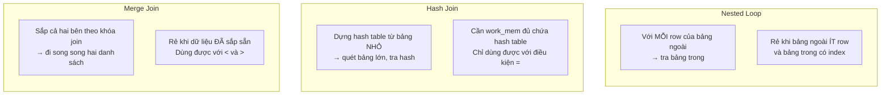

# Phần 06 — Query Planner & Optimizer

> **Mục tiêu:** dự đoán được PostgreSQL sẽ chọn plan nào **trước khi** chạy `EXPLAIN`, và
> biết vì sao nó chọn sai khi nó chọn sai.

---

## 1. Planner làm gì

Với một query có 3 bảng và vài index, số plan khả dĩ lên tới hàng nghìn. Planner phải:

1. Liệt kê các cách lấy dữ liệu từ mỗi bảng (Seq Scan, Index Scan, Bitmap…).
2. Liệt kê các cách ghép chúng lại (thứ tự join × thuật toán join).
3. **Ước lượng chi phí** từng phương án.
4. Chọn phương án rẻ nhất.

Bước 3 là nơi mọi thứ đúng hoặc sai. Và nó dựa hoàn toàn vào **statistics** — một bản tóm
tắt dữ liệu được lấy mẫu, không phải dữ liệu thật.

> **Toàn bộ Phần 06 gói trong một câu:** planner không biết dữ liệu của bạn, nó chỉ biết bản
> tóm tắt về dữ liệu của bạn. Query chậm bất thường gần như luôn là do bản tóm tắt đó sai.

---

## 2. Statistics

### 2.1. Đọc `pg_stats`

```sql
SELECT attname, n_distinct,
       most_common_vals::text  AS mcv,
       most_common_freqs::text AS tan_suat
FROM pg_stats WHERE tablename = 'users' AND attname = 'country_code';
```

```text
   attname    | n_distinct |       mcv        |                   tan_suat
--------------+------------+------------------+----------------------------------------------
 country_code |          5 | {VN,US,JP,SG,DE} | {0.6971,0.15113333,0.0785,0.05246667,0.0208}
```

Đây chính là phân bố 70/15/8/5/2 mà script seed ở Phần 00 cố ý tạo ra. Sai số so với thiết
kế dưới 0,5% — `ANALYZE` chỉ lấy mẫu, nhưng lấy mẫu tốt.

### 2.2. Bốn con số cần biết đọc

| Cột | Ý nghĩa |
|---|---|
| `n_distinct` | Số giá trị khác nhau. **Dương** = số tuyệt đối. **Âm** = tỷ lệ so với số row |
| `most_common_vals` | Danh sách giá trị hay gặp nhất (MCV list) |
| `most_common_freqs` | Tần suất tương ứng |
| `histogram_bounds` | Phân bố của phần **còn lại**, sau khi bỏ MCV |
| `correlation` | Mức tương quan giữa thứ tự logic và thứ tự vật lý, từ −1 tới 1 |

```sql
SELECT attname, n_distinct, round(correlation::numeric, 3) AS correlation
FROM pg_stats WHERE tablename = 'users';
```

```text
   attname    | n_distinct | correlation
--------------+------------+-------------
 country_code |          5 |       0.519
 status       |          3 |       0.727
 id           |         -1 |       1.000
 email        |         -1 |      -0.398
```

**`n_distinct = -1`** nghĩa là mọi giá trị đều khác nhau — đúng với `id` và `email`. Ký hiệu
âm rất hữu ích: nó tự co giãn khi bảng lớn lên, còn số tuyệt đối thì lỗi thời ngay.

**`correlation = 1.000`** của `id` nghĩa là thứ tự `id` trùng khớp thứ tự vật lý trên đĩa.
Con số này quyết định:

- Index Scan rẻ hay đắt (correlation cao → truy cập gần tuần tự).
- BRIN có dùng được không (Phần 05).

### 2.3. Selectivity: MCV cứu bạn

Với `country_code`, cả 5 giá trị đều nằm trong MCV list, nên planner biết chính xác tần suất
từng giá trị. Kết quả: ước lượng gần như hoàn hảo cho **mọi** giá trị.

Nếu một giá trị **không** nằm trong MCV list, planner phải dùng histogram hoặc giả định phân
bố đều — và đó là lúc sai số bắt đầu.

`default_statistics_target` (mặc định 100) quyết định MCV list dài bao nhiêu và histogram
chia bao nhiêu khoảng. Với column lệch nặng và nhiều giá trị:

```sql
ALTER TABLE orders ALTER COLUMN status SET STATISTICS 1000;
ANALYZE orders;
```

Đánh đổi: `ANALYZE` lâu hơn, planner mất nhiều thời gian hơn cho mỗi query. Chỉ tăng cho
column thật sự gây vấn đề, đừng tăng toàn cục.

---

## 3. Cost model — và cách tự kiểm chứng

### 3.1. Các tham số

| Tham số | Mặc định | Ý nghĩa |
|---|---:|---|
| `seq_page_cost` | 1.0 | Đọc một page tuần tự |
| `random_page_cost` | 4.0 | Đọc một page ngẫu nhiên |
| `cpu_tuple_cost` | 0.01 | Xử lý một tuple |
| `cpu_index_tuple_cost` | 0.005 | Xử lý một entry index |
| `cpu_operator_cost` | 0.0025 | Thực hiện một phép so sánh |
| `effective_cache_size` | 4GB | **Ước lượng** tổng cache, không cấp phát gì |

Các con số này **không có đơn vị**. Chúng chỉ có ý nghĩa **tương đối với nhau**, lấy
`seq_page_cost = 1` làm mốc.

### 3.2. Tự tính lại cost của một Seq Scan

Công thức:

```text
cost = relpages × seq_page_cost
     + reltuples × cpu_tuple_cost
     + reltuples × cpu_operator_cost × (số điều kiện lọc)
```

Kiểm chứng trên bảng `dia_chi` (900.000 row):

```sql
SELECT relpages, reltuples::bigint FROM pg_class WHERE relname = 'dia_chi';
```

```text
 relpages | reltuples
----------+-----------
     8738 |    900000
```

**Không có điều kiện:**

```sql
EXPLAIN SELECT * FROM dia_chi;
```

```text
 Seq Scan on dia_chi  (cost=0.00..17738.00 rows=900000 width=47)
```

Tự tính: `8738 × 1.0 + 900000 × 0.01 = 8738 + 9000 = 17738` ✓ **Khớp chính xác.**

**Có một điều kiện:**

```sql
EXPLAIN SELECT * FROM dia_chi WHERE quoc_gia = 'VN';
```

```text
 Seq Scan on dia_chi  (cost=0.00..19988.00 rows=298440 width=47)
   Filter: (quoc_gia = 'VN'::text)
```

Tự tính: `17738 + 900000 × 0.0025 = 17738 + 2250 = 19988` ✓ **Khớp chính xác.**

Cost model không phải hộp đen. Nó là số học, và bạn kiểm chứng được từng đồng.

### 3.3. Hai con số trong `cost=0.00..19988.00`

| | Ý nghĩa |
|---|---|
| Số đầu (startup cost) | Chi phí trước khi trả ra row **đầu tiên** |
| Số sau (total cost) | Chi phí để trả ra **toàn bộ** row |

Seq Scan có startup cost = 0 — trả row đầu ngay. Sort có startup cost rất cao — phải đọc và
sắp xếp hết mới trả được row đầu tiên.

Đây là lý do `LIMIT 10` thay đổi hoàn toàn cục diện: với `LIMIT`, planner tối ưu theo
**startup cost** thay vì total cost, nên nó ưu tiên plan trả row sớm — kể cả khi plan đó tệ
hơn nếu phải chạy hết.

### 3.4. `random_page_cost` trên SSD

Mặc định `random_page_cost = 4.0` phản ánh ổ cứng cơ, nơi tìm kiếm ngẫu nhiên đắt gấp 4 lần
đọc tuần tự. Trên SSD, tỷ lệ đó gần 1,1–1,5.

Để mặc định trên SSD khiến planner **ngại dùng index** một cách có hệ thống. Môi trường
Phần 00 đã đặt `random_page_cost = 1.1`.

`effective_cache_size` cũng ảnh hưởng lớn: đặt quá thấp khiến planner nghĩ mỗi lần đọc index
đều phải xuống đĩa. Giá trị thường dùng là 50–75% RAM của máy.

### 3.5. Cost không phải thời gian

Đo thật: cùng một query join `orders` với `order_items`, ép hai thuật toán khác nhau:

| Plan | Cost ước lượng | Thời gian thật | Buffer |
|---|---:|---:|---:|
| Merge Join (planner tự chọn) | 111.834 | 1.252 ms | 1.011.998 |
| Nested Loop (bị ép) | 445.848 | 1.169 ms | 2.413.767 |

Planner cho rằng Nested Loop đắt gấp **4 lần**, nhưng thời gian thực tế **gần bằng nhau**.

Vì sao? Cost model giả định một tỷ lệ nhất định phải đọc từ đĩa. Ở đây toàn bộ dữ liệu đã
nằm trong cache, nên phần lớn chi phí mà model tính không xảy ra.

> **Cost là đơn vị nội bộ để so sánh các phương án, không phải dự báo thời gian.** Khi debug,
> đừng so cost với cost giữa hai query khác nhau — chỉ so `actual time` và `Buffers`.

---

## 4. Cardinality: nơi mọi thứ đổ vỡ

### 4.1. Giả định độc lập

PostgreSQL mặc định giả định các column **độc lập với nhau**. Với hai điều kiện:

```text
selectivity(A AND B) = selectivity(A) × selectivity(B)
```

Giả định này sai bất cứ khi nào hai column có quan hệ — mà trong dữ liệu thật thì rất hay có:
thành phố và quốc gia, mã bưu chính và tỉnh, model và hãng xe, danh mục và nhà cung cấp.

### 4.2. Thí nghiệm

Bảng 900.000 row, `thanh_pho` **quyết định hoàn toàn** `quoc_gia`:

```sql
CREATE TABLE dia_chi (id int, quoc_gia text, thanh_pho text, ghi_chu text);
INSERT INTO dia_chi
SELECT g,
       (ARRAY['VN','JP','US'])[1 + g % 3],
       (ARRAY['Ha Noi','Tokyo','New York'])[1 + g % 3],
       md5(g::text)
FROM generate_series(1, 900000) g;
ANALYZE dia_chi;
```

| Query | Ước lượng | Thực tế | Sai số |
|---|---:|---:|---:|
| `WHERE quoc_gia = 'VN'` | 300.900 | 300.000 | **0,3%** |
| `WHERE quoc_gia = 'VN' AND thanh_pho = 'Ha Noi'` | **100.601** | 300.000 | **sai 3 lần** |

Một column thì chính xác tuyệt đối. Hai column phụ thuộc thì hụt 3 lần — vì planner nhân hai
selectivity `1/3 × 1/3 = 1/9`, trong khi thực tế điều kiện thứ hai **không lọc thêm gì cả**.

### 4.3. Cách sửa: `CREATE STATISTICS`

```sql
CREATE STATISTICS st_dia_chi (dependencies, ndistinct)
ON quoc_gia, thanh_pho FROM dia_chi;
ANALYZE dia_chi;
```

```text
 Seq Scan on dia_chi  (cost=0.00..22238.00 rows=298440) (actual rows=300000 loops=1)
   Filter: ((quoc_gia = 'VN'::text) AND (thanh_pho = 'Ha Noi'::text))
```

**298.440 so với 300.000 — sai 0,5%.** Từ sai 3 lần xuống gần như chính xác.

Ba loại extended statistics:

| Loại | Giải quyết | Dùng khi |
|---|---|---|
| `dependencies` | Phụ thuộc hàm giữa các column | `WHERE a = ? AND b = ?` với a → b |
| `ndistinct` | Số tổ hợp giá trị khác nhau | `GROUP BY a, b` |
| `mcv` | Danh sách tổ hợp hay gặp | Phân bố lệch trên tổ hợp column |

### 4.4. Vì sao sai số cardinality nguy hiểm

Sai 3 lần ở một Seq Scan chỉ làm cost lệch chút ít. Nhưng sai số **nhân lên qua từng tầng join**.

Nếu planner nghĩ một node trả 100 row mà thực tế trả 300.000, nó có thể chọn **Nested Loop**
— hợp lý với 100 row, thảm họa với 300.000 row. Rồi nó lại dùng con số sai đó để ước lượng
tầng trên.

> Đây là cơ chế đằng sau gần như mọi sự cố "query đột nhiên chậm 100 lần": không phải dữ liệu
> tăng gấp 100, mà là một ước lượng sai làm đổ cả chuỗi quyết định.

Cách phát hiện trong `EXPLAIN ANALYZE`: tìm node có `rows=` (ước lượng) lệch nhiều so với
`actual rows=`. Phần 07 sẽ dạy đọc kỹ.

---

## 5. Ba thuật toán join

### 5.1. Cách hoạt động



| | Nested Loop | Hash Join | Merge Join |
|---|---|---|---|
| Chi phí | `N_ngoài × chi_phí_tra_cứu` | `N_nhỏ + N_lớn` | `sort + N_trái + N_phải` |
| Cần index | Rất nên có ở bảng trong | Không | Không, nhưng index sắp sẵn thì tốt |
| Cần `work_mem` | Không | **Có** | Có (để sort) |
| Toán tử | Bất kỳ | Chỉ `=` | `=`, `<`, `>` |
| Trả row đầu tiên | **Ngay** | Sau khi dựng xong hash | Sau khi sort xong |
| Rủi ro | **Nổ khi ước lượng sai** | Spill to disk | Sort tốn kém |

### 5.2. Đo thật

Query: `orders` join `users`, lọc `country_code = 'DE'` (2% số user).

| Thuật toán | Cost | Thời gian | Buffer |
|---|---:|---:|---:|
| **Nested Loop** (planner chọn) | 9.291 | **16,4 ms** | 14.273 |
| Hash Join (bị ép) | 24.057 | 70,9 ms | 3.682 |
| Merge Join (bị ép) | 24.359 | 63,5 ms | 3.682 |

Planner chọn đúng: Nested Loop nhanh hơn 4 lần.

Chú ý điều phản trực giác: Nested Loop đọc **nhiều buffer nhất** (14.273 so với 3.682) nhưng
vẫn nhanh nhất. Vì toàn bộ số buffer đó đều là `shared hit` — lấy từ cache, gần như miễn phí.
Còn Hash Join phải dựng hash table cho toàn bộ bảng, một chi phí CPU không xuất hiện trong
cột buffer.

> **Bài học: đừng tối ưu theo một chỉ số duy nhất.** Buffer thấp không đồng nghĩa với nhanh.

### 5.3. Khi nào Nested Loop thành thảm họa

Nested Loop chỉ rẻ khi bảng ngoài **thật sự** ít row. Chi phí là
`số_row_ngoài × chi_phí_một_lần_tra_cứu`.

Nếu planner ước lượng bảng ngoài có 50 row mà thực tế có 500.000, chi phí nhân lên **10.000
lần**. Đây là kịch bản của gần như mọi sự cố "query chạy 6 tiếng không xong".

Dấu hiệu trong `EXPLAIN ANALYZE`:

```text
->  Nested Loop  (cost=... rows=50) (actual rows=500000 loops=1)
      ->  Index Scan ... (actual rows=1 loops=500000)
                                            ^^^^^^^^^^^^
```

**`loops` rất lớn ở node bên trong** là dấu hiệu không thể nhầm lẫn.

Cách xử lý khẩn cấp trên production:

```sql
SET enable_nestloop = off;    -- chỉ trong session, để chữa cháy
```

Cách xử lý gốc rễ: sửa ước lượng — `ANALYZE`, tăng `STATISTICS`, hoặc `CREATE STATISTICS`.

---

## 6. Thứ tự join

Với `n` bảng có tới `n!` thứ tự join khả dĩ. Planner dùng quy hoạch động để duyệt.

Khi số bảng vượt `geqo_threshold` (mặc định 12), PostgreSQL chuyển sang **GEQO** — thuật toán
di truyền, tìm lời giải "đủ tốt" thay vì tối ưu.

Hệ quả thực tế: với query hơn 12 bảng, **plan có thể khác nhau giữa các lần chạy**. Nếu bạn
gặp query lớn lúc nhanh lúc chậm không rõ lý do, kiểm tra số bảng:

```sql
SET geqo = off;             -- tắt, chấp nhận thời gian lập plan lâu hơn
SET join_collapse_limit = 20;
```

Hai tham số liên quan:

- `join_collapse_limit` (8): số bảng tối đa mà planner được tự do sắp xếp lại khi query viết
  bằng `JOIN` tường minh.
- `from_collapse_limit` (8): tương tự cho subquery.

Đặt cả hai bằng 1 sẽ buộc PostgreSQL join **đúng theo thứ tự bạn viết** — một cách ép plan
thô nhưng đôi khi cần trong tình huống khẩn cấp.

---

## 7. Parallel query

### 7.1. Điều kiện kích hoạt

| Tham số | Mặc định | Ý nghĩa |
|---|---:|---|
| `max_parallel_workers_per_gather` | 2 | Số worker tối đa cho một node Gather |
| `min_parallel_table_scan_size` | 8MB | Bảng nhỏ hơn thì không parallel |
| `parallel_setup_cost` | 1000 | Chi phí khởi tạo worker |
| `parallel_tuple_cost` | 0.1 | Chi phí chuyển một row từ worker về leader |

Số worker mặc định tăng theo **logarit** kích thước bảng, không tuyến tính: bảng gấp 3 lần
mới thêm một worker.

Ép số worker cho một bảng cụ thể:

```sql
ALTER TABLE orders SET (parallel_workers = 4);
```

### 7.2. Đọc plan parallel cho đúng

```text
 ->  Parallel Seq Scan on orders (actual rows=10000 loops=3)
       Rows Removed by Filter: 323333
```

**`actual rows` là trung bình mỗi lần lặp, không phải tổng.** Tổng thật là `10000 × 3 = 30.000`.

Đây là lỗi đọc plan phổ biến nhất với parallel query. Nếu quên nhân với `loops`, bạn sẽ kết
luận sai rằng planner ước lượng lệch.

### 7.3. Khi nào parallel làm chậm đi

- Query trả ít row nhưng phải khởi tạo worker (chi phí cố định ~1000 cost).
- Nhiều query parallel chạy đồng thời làm cạn `max_parallel_workers` toàn cluster.
- Trong container, `/dev/shm` quá nhỏ gây lỗi — lý do `shm_size: 1gb` ở Phần 00.

---

## 8. CTE và subquery

### 8.1. CTE được inline từ PostgreSQL 12

```sql
WITH d AS (SELECT id, user_id FROM orders)
SELECT * FROM d WHERE user_id = 42;
```

```text
 Gather
   Workers Planned: 2
   ->  Parallel Seq Scan on orders
         Filter: (user_id = 42)
```

Điều kiện được đẩy vào trong, và còn dùng được parallel.

```sql
WITH d AS MATERIALIZED (SELECT id, user_id FROM orders)
SELECT * FROM d WHERE user_id = 42;
```

```text
 CTE Scan on d
   Filter: (user_id = 42)
   CTE d
     ->  Seq Scan on orders          ← vật chất hóa TOÀN BỘ 1 triệu row trước
```

### 8.2. Khi nào dùng `MATERIALIZED`

Chỉ khi CTE được tham chiếu **nhiều lần** và việc tính lại đắt hơn việc lưu trữ, hoặc khi CTE
có side effect (`INSERT ... RETURNING`).

Lời khuyên cũ "dùng CTE để ép thứ tự thực thi" đã lỗi thời từ PostgreSQL 12. Khi nâng cấp từ
version cũ, các query dựa vào hành vi fence cũ **có thể chậm đi** — cần rà lại.

---

## 9. Công cụ chẩn đoán planner

```sql
-- Xem plan mà không chạy
EXPLAIN (COSTS ON, VERBOSE) <query>;

-- Xem tham số nào đang khác mặc định
EXPLAIN (SETTINGS) <query>;

-- Ép planner tránh một chiến lược, ĐỂ CHẨN ĐOÁN, không phải để sửa
SET enable_seqscan   = off;
SET enable_nestloop  = off;
SET enable_hashjoin  = off;
SET enable_mergejoin = off;
SET enable_indexscan = off;
RESET ALL;
```

Quy trình chuẩn khi nghi planner chọn sai:

1. Chạy `EXPLAIN (ANALYZE, BUFFERS)`, tìm node có `rows` lệch nhiều nhất so với `actual rows`.
2. Đi từ node đó xuống dưới — sai số bắt nguồn từ node thấp nhất bị lệch.
3. Nếu là điều kiện trên một column: `ANALYZE`, rồi tăng `STATISTICS`.
4. Nếu là điều kiện trên nhiều column: `CREATE STATISTICS`.
5. Ép plan khác bằng `enable_*` để **xác nhận** plan kia thật sự tốt hơn.
6. Sửa gốc rễ, rồi bỏ `enable_*` đi.

> **`enable_*` không bao giờ là giải pháp cuối cùng.** Chúng là công cụ chẩn đoán. Để chúng
> trong code production nghĩa là bạn đã đóng băng một quyết định mà planner lẽ ra phải tự
> điều chỉnh khi dữ liệu thay đổi.

---

## 10. Những gì bạn nên rút ra từ phần này

1. Planner chỉ biết **bản tóm tắt** dữ liệu. Sự cố hiệu năng thường là sự cố statistics.
2. Cost model là số học kiểm chứng được: `8738 + 9000 = 17738` khớp chính xác.
3. Cost **không phải** thời gian. Đo được: cost chênh 4 lần nhưng thời gian gần bằng nhau.
4. Planner giả định các column độc lập. Với column phụ thuộc, ước lượng hụt 3 lần trong ví dụ.
5. `CREATE STATISTICS` đưa sai số từ 3 lần về 0,5%.
6. Sai số cardinality **nhân lên qua từng tầng join** — đó là cơ chế của "query chậm 100 lần".
7. `loops` lớn ở node trong của Nested Loop là dấu hiệu ước lượng sai.
8. Với parallel query, `actual rows` là **trung bình mỗi loop**, phải nhân với `loops`.
9. `n_distinct` âm là tỷ lệ, dương là số tuyệt đối.
10. `enable_*` là công cụ chẩn đoán, không phải cách sửa.

---

**Tiếp theo:** [lab.md](lab.md) — tự tay tái hiện từng phép đo.
