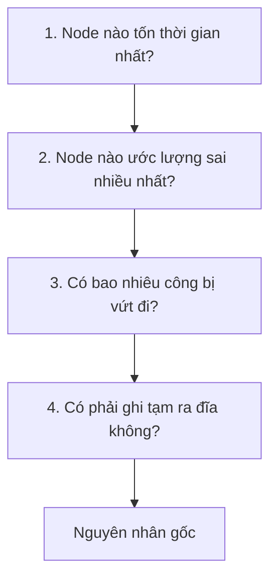
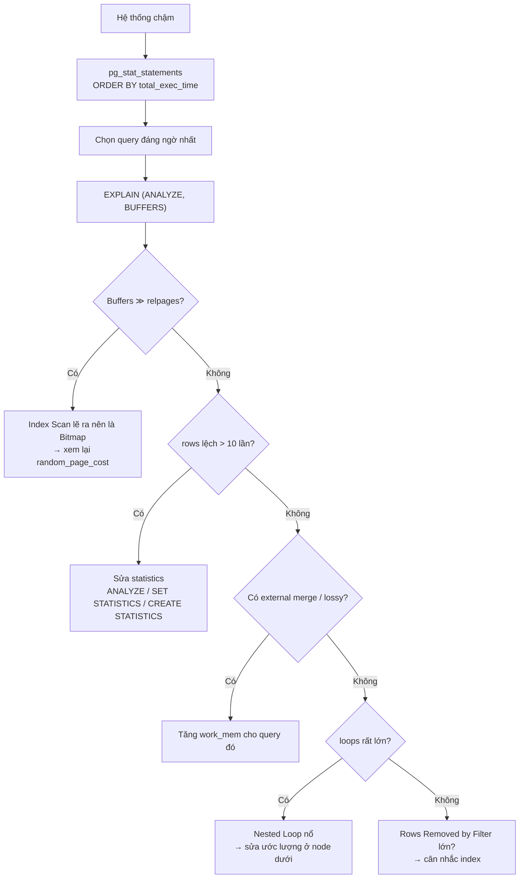

# Phần 07 — Đọc EXPLAIN chuyên sâu

> **Mục tiêu:** nhìn một Execution Plan và chỉ ra được chỗ bệnh trong vòng một phút.

---

## 1. Bốn câu hỏi khi nhìn một plan

Đừng đọc plan từ trên xuống như đọc văn bản. Hãy hỏi bốn câu, theo thứ tự:



| Câu hỏi | Nhìn vào đâu |
|---|---|
| Tốn thời gian nhất | `actual time` — nhớ trừ thời gian của node con |
| Ước lượng sai nhất | `rows=` (ước lượng) so với `actual rows=` × `loops` |
| Công bị vứt đi | `Rows Removed by Filter`, `Heap Fetches` |
| Ghi tạm ra đĩa | `Sort Method: external`, `lossy`, `temp read/written` |

---

## 2. Các option của `EXPLAIN`

```sql
EXPLAIN (ANALYZE, BUFFERS, VERBOSE, SETTINGS, WAL, FORMAT TEXT) <query>;
```

| Option | Cho biết gì | Khi nào cần |
|---|---|---|
| `ANALYZE` | **Chạy thật** và đo thời gian, số row thực tế | Luôn luôn, trừ khi sợ side effect |
| `BUFFERS` | Số page đọc/ghi ở từng node | **Luôn luôn** — quan trọng ngang `ANALYZE` |
| `VERBOSE` | Danh sách column output, tên schema | Khi query có nhiều bảng cùng tên column |
| `SETTINGS` | Tham số nào đang khác mặc định | Khi plan khác nhau giữa hai môi trường |
| `WAL` | Lượng WAL sinh ra | Khi tối ưu câu ghi |
| `COSTS OFF` | Bỏ cột cost cho dễ đọc | Khi chỉ quan tâm cấu trúc plan |
| `TIMING OFF` | Bỏ đo thời gian từng node | Khi việc đo làm nhiễu kết quả |

> **`EXPLAIN ANALYZE` thực sự thi hành câu lệnh**, kể cả `UPDATE`, `DELETE`, `INSERT`. Muốn
> xem plan của câu ghi mà không muốn nó xảy ra:
>
> ```sql
> BEGIN;
> EXPLAIN (ANALYZE, BUFFERS) UPDATE orders SET status = 'x' WHERE id < 100;
> ROLLBACK;
> ```

---

## 3. `Buffers` — chỉ số bị bỏ qua nhiều nhất

### 3.1. Bốn con số

```text
Buffers: shared hit=101664 read=323 dirtied=834 written=837, temp read=171 written=171
```

| Con số | Ý nghĩa |
|---|---|
| `shared hit` | Tìm thấy trong `shared_buffers` — gần như miễn phí |
| `shared read` | Không có trong `shared_buffers`, phải đi xuống tầng dưới |
| `shared dirtied` | Số page bị query này làm bẩn (sẽ phải ghi xuống đĩa sau) |
| `shared written` | Số page **chính query này** phải tự ghi xuống đĩa |
| `temp read/written` | **Ghi tạm ra đĩa** — dấu hiệu thiếu `work_mem` |

Hai điều hay bị hiểu sai:

1. **`shared read` không có nghĩa là đã chạm đĩa vật lý.** PostgreSQL không dùng direct I/O,
   nên page rất có thể lấy từ OS page cache. Muốn biết chắc, nhìn `I/O Timings` (cần
   `track_io_timing = on`).

2. **`shared written` lớn là dấu hiệu xấu.** Nó nghĩa là backend phải tự ghi buffer bẩn thay
   vì để `background writer` làm — thường vì `shared_buffers` quá nhỏ hoặc checkpoint quá thưa.

### 3.2. Buffer nói thật khi tên node nói dối

Đây là ví dụ đo thật trên `lab_big`, cùng một query lấy 315.397 row (31,5% bảng):

```sql
SELECT sum(total_amount) FROM orders WHERE user_id <= 20000;
```

| Plan | Buffer | Thời gian |
|---|---:|---:|
| **Index Scan** (planner tự chọn) | **314.799** | 358 ms |
| Bitmap Heap Scan (bị ép) | **9.486** | 59 ms |

Bảng `orders` chỉ có **9.163 page**. Index Scan đọc 314.799 buffer — tức là **mỗi page được
đọc lại trung bình 34 lần**.

Đó là bản chất của Index Scan trên column không tương quan: nó nhảy vào heap theo thứ tự của
index, và cùng một page bị ghé đi ghé lại. Bitmap Heap Scan gom địa chỉ, sắp theo số page, rồi
đọc mỗi page **đúng một lần**.

> **Quy tắc chẩn đoán:** nếu `Buffers` của một node lớn hơn nhiều lần `relpages` của bảng, node
> đó đang đọc lại cùng những page. Đây gần như luôn là Index Scan lẽ ra nên là Bitmap Heap Scan.

```sql
SELECT relpages FROM pg_class WHERE relname = 'orders';   -- 9163
```

Con số này nên là thứ bạn tra ngay khi thấy `Buffers` bất thường.

---

## 4. Ước lượng sai: `rows` so với `actual rows`

### 4.1. Cách đọc đúng

```text
->  Parallel Seq Scan on orders (cost=... rows=125000) (actual rows=10000 loops=3)
```

**`actual rows` là trung bình mỗi lần lặp.** Tổng thật = `actual rows × loops` = 30.000.

Quên nhân với `loops` là lỗi đọc plan phổ biến nhất. Nó khiến bạn kết luận sai rằng planner
lệch 12 lần trong khi thực tế nó lệch 4 lần.

### 4.2. Ngưỡng đáng lo

| Tỷ lệ lệch | Đánh giá |
|---|---|
| Dưới 2 lần | Bình thường, không cần làm gì |
| 2–10 lần | Đáng xem, nhất là nếu node đó nằm dưới một join |
| Trên 10 lần | **Nguyên nhân gốc gần như chắc chắn nằm ở đây** |

### 4.3. Đi từ dưới lên

Sai số **nhân lên qua từng tầng**. Nếu node lá ước lượng 100 row mà thực tế 300.000, mọi
node phía trên đều nhận con số sai đó làm đầu vào.

Vì vậy: tìm node **thấp nhất** bị lệch nhiều, sửa ở đó. Các tầng trên thường tự khỏi.

Nguyên nhân và cách sửa (chi tiết ở Phần 06):

| Nguyên nhân | Cách sửa |
|---|---|
| Statistics lỗi thời | `ANALYZE <bảng>` |
| Column lệch nặng, MCV list quá ngắn | `ALTER TABLE ... ALTER COLUMN ... SET STATISTICS 1000` |
| Nhiều column phụ thuộc nhau | `CREATE STATISTICS ... (dependencies)` |
| Điều kiện phức tạp planner không hiểu | Viết lại query, hoặc thêm expression index |

---

## 5. `Rows Removed by Filter` — công bị vứt đi

```text
->  Parallel Seq Scan on orders (actual rows=10000 loops=3)
      Filter: (status = 'cancelled'::text)
      Rows Removed by Filter: 323333
```

Mỗi worker đọc 333.333 row rồi **vứt đi 323.333 row**. Chỉ 3% số row đọc lên là có ích.

Con số này trả lời câu hỏi: *"PostgreSQL đang làm bao nhiêu việc vô ích?"*

| Tình huống | Cách xử lý |
|---|---|
| `Rows Removed` lớn ở Seq Scan | Cân nhắc index trên column trong `Filter` |
| `Rows Removed` lớn ở Index Scan | Index sai thứ tự column, hoặc thiếu column trong index |
| `Rows Removed` lớn ở node join | Điều kiện join sai, hoặc thiếu điều kiện lọc trước khi join |

Nhưng nhớ Phần 05: nếu tỷ lệ row cần lấy vượt khoảng 10%, index **không** giúp được. Lúc đó
`Rows Removed by Filter` lớn là điều bình thường và không sửa được bằng index.

---

## 6. Ghi tạm ra đĩa

### 6.1. `Sort Method` — dấu hiệu rõ nhất của thiếu `work_mem`

Cùng một query sắp xếp 1 triệu row, chỉ khác `work_mem`:

**`work_mem = 4MB` (mặc định):**

```text
 Sort (actual rows=1000000 loops=1)
   Sort Key: total_amount
   Sort Method: external merge  Disk: 55408kB
   Buffers: shared hit=9166, temp read=13846 written=13867
   I/O Timings: temp read=13.356 write=51.898
```

**`work_mem = 256MB`:**

```text
 Sort (actual rows=1000000 loops=1)
   Sort Key: total_amount
   Sort Method: quicksort  Memory: 85677kB
   Buffers: shared hit=9166
```

| | `Sort Method` | Ghi tạm |
|---|---|---|
| `work_mem = 4MB` | `external merge  Disk: 55408kB` | 13.867 block ghi ra đĩa |
| `work_mem = 256MB` | `quicksort  Memory: 85677kB` | Không |

Ba điều đọc ra:

1. **`external merge` là từ khóa cần tìm.** Thấy nó nghĩa là query đang ghi ra đĩa.
2. **`Disk: 55408kB` cho biết cần bao nhiêu.** Nhưng đừng đặt `work_mem = 55MB` — sort trong
   bộ nhớ cần **nhiều hơn** dữ liệu thô (ở đây là 85.677kB). Con số `Disk` là mức tối thiểu,
   không phải mức đủ.
3. **`temp written=13867`** xác nhận từ phía I/O.

### 6.2. Cẩn thận khi tăng `work_mem`

`work_mem` là giới hạn cho **mỗi node**, không phải mỗi query. Query có 3 node sort, chạy với
2 parallel worker, có thể dùng tới `3 × 3 × work_mem`.

Cách an toàn: đặt ở mức session cho đúng query cần, thay vì tăng toàn cục.

```sql
SET LOCAL work_mem = '256MB';   -- chỉ trong transaction hiện tại
```

Hoặc theo role:

```sql
ALTER ROLE bao_cao SET work_mem = '512MB';   -- user chạy báo cáo
```

### 6.3. `Heap Blocks: lossy` — bitmap tràn `work_mem`

Cùng một Bitmap Heap Scan lấy 315.397 row:

**`work_mem = 64kB`:**

```text
 ->  Bitmap Heap Scan on orders (actual rows=315397 loops=1)
       Heap Blocks: exact=887 lossy=8276
 Execution Time: 59.063 ms
```

**`work_mem = 16MB`:**

```text
 ->  Bitmap Heap Scan on orders (actual rows=315397 loops=1)
       Heap Blocks: exact=9163
 Execution Time: 50.406 ms
```

Khi bitmap không đủ chỗ, PostgreSQL chuyển một phần sang chế độ **lossy**: chỉ nhớ *"page này
có row khớp"* thay vì nhớ từng row. Sau đó phải đọc toàn bộ row trong page đó và lọc lại.

`lossy` lớn hơn `exact` nhiều là tín hiệu cần tăng `work_mem`.

### 6.4. Bảng tra nhanh các dấu hiệu

| Dấu hiệu trong plan | Nghĩa là gì | Xử lý |
|---|---|---|
| `Sort Method: external merge  Disk: ...` | Sort tràn ra đĩa | Tăng `work_mem` |
| `Sort Method: top-N heapsort` | Có `LIMIT`, PostgreSQL tối ưu tốt | Không cần làm gì |
| `Heap Blocks: ... lossy=...` | Bitmap tràn `work_mem` | Tăng `work_mem` |
| `Batches: 4  Memory Usage: ...` ở Hash | Hash join tràn ra đĩa | Tăng `work_mem` |
| `temp read/written` khác 0 | Có ghi tạm ở đâu đó | Tìm node gây ra |
| `Heap Fetches: <số lớn>` | Index Only Scan phải về heap | `VACUUM` bảng |
| `loops=<số rất lớn>` | Nested Loop chạy quá nhiều vòng | Sửa ước lượng |
| `Buffers` ≫ `relpages` | Đọc lại cùng page nhiều lần | Xem lại Index Scan vs Bitmap |
| `Rows Removed by Filter` lớn | Đọc nhiều, dùng ít | Cân nhắc index |
| `shared written` lớn | Backend phải tự ghi buffer | Xem `shared_buffers`, checkpoint |

---

## 7. Đo lượng WAL của câu ghi

```sql
EXPLAIN (ANALYZE, BUFFERS, WAL)
INSERT INTO wal_t SELECT g, md5(g::text) FROM generate_series(1, 100000) g;
```

```text
 Insert on wal_t (actual rows=0 loops=1)
   Buffers: shared hit=101664 dirtied=834 written=837, temp read=171 written=171
   WAL: records=100000 bytes=9200000
```

**9.200.000 byte WAL cho 100.000 row — 92 byte mỗi row.**

Con số này quan trọng vì WAL quyết định:

- Lượng dữ liệu phải truyền sang replica (Phần 10).
- Tần suất checkpoint (Phần 09).
- Dung lượng WAL archive cần giữ cho PITR.

Dùng `WAL` để so sánh các cách viết khác nhau. Ví dụ, `COPY` sinh ít WAL hơn nhiều so với
`INSERT` từng dòng; `UPDATE` một column sinh ít WAL hơn `UPDATE` cả row khi bảng có TOAST.

Chú ý `full page images` trong output: ngay sau mỗi checkpoint, lần ghi đầu tiên vào mỗi page
phải ghi **toàn bộ page 8KB** vào WAL (`full_page_writes`). Đó là lý do lượng WAL tăng vọt
ngay sau checkpoint — Phần 09.

---

## 8. Đọc thời gian cho đúng

### 8.1. Thời gian là tích lũy

```text
Hash Join (actual time=120.5..350.2 rows=50000 loops=1)
  ->  Seq Scan on a (actual time=0.01..80.1 rows=100000 loops=1)
  ->  Hash (actual time=118.9..118.9 rows=20000 loops=1)
        ->  Seq Scan on b (actual time=0.01..95.3 rows=20000 loops=1)
```

`actual time=120.5..350.2` nghĩa là: row đầu tiên ra ở mili-giây 120,5, row cuối cùng ở 350,2.
Con số này **bao gồm cả thời gian của các node con**.

Thời gian **riêng** của node Hash Join = `350.2 − 80.1 − 118.9 ≈ 151 ms`.

### 8.2. Nhân với `loops`

```text
->  Index Scan using idx on t (actual time=0.02..0.15 rows=3 loops=50000)
```

Thời gian thật của node này = `0.15 × 50000 = 7.500 ms`, không phải 0,15 ms.

**Đây là cách một node trông vô hại lại chiếm 90% thời gian query.** Luôn nhân với `loops`.

### 8.3. `TIMING OFF` khi việc đo làm nhiễu

Trên một số hệ thống, việc đọc đồng hồ ở mỗi node tốn đáng kể — plan có hàng triệu lần lặp
có thể chậm gấp đôi chỉ vì `ANALYZE`. Khi nghi ngờ:

```sql
EXPLAIN (ANALYZE, BUFFERS, TIMING OFF) <query>;
```

Vẫn có `actual rows` và `Buffers`, chỉ mất thời gian từng node. `Execution Time` tổng vẫn chính xác.

---

## 9. `auto_explain` — bắt plan trên production

Chạy `EXPLAIN` tay khi sự cố đã qua thường vô ích: cache đã ấm, statistics đã đổi, tham số đã
khác. `auto_explain` ghi lại plan **của chính lần chạy chậm đó**.

Môi trường Phần 00 đã bật sẵn:

```conf
shared_preload_libraries = 'pg_stat_statements,auto_explain'
auto_explain.log_min_duration = '200ms'
auto_explain.log_analyze = on
auto_explain.log_buffers = on
auto_explain.log_nested_statements = on
```

| Tham số | Lưu ý |
|---|---|
| `log_min_duration` | Ngưỡng ghi log. Trên production thường 500ms–2s |
| `log_analyze` | Bật thì có số liệu thật, nhưng **thêm chi phí đo cho mọi query** |
| `log_timing` | Tắt riêng cái này giảm chi phí nhiều mà vẫn giữ `rows` và `Buffers` |
| `log_nested_statements` | Bắt cả query bên trong function và trigger |
| `log_min_duration` = 0 | **Đừng làm trên production** — ghi mọi query |

Cấu hình production hợp lý:

```conf
auto_explain.log_min_duration = '1s'
auto_explain.log_analyze = on
auto_explain.log_timing = off        # giảm chi phí đo
auto_explain.log_buffers = on
```

---

## 10. `pg_stat_statements` — tìm query đáng quan tâm

`auto_explain` cho biết **vì sao** một query chậm. `pg_stat_statements` cho biết **query nào**
đáng quan tâm.

```sql
SELECT round(total_exec_time::numeric, 0)      AS tong_ms,
       calls,
       round(mean_exec_time::numeric, 2)       AS trung_binh_ms,
       round(stddev_exec_time::numeric, 2)     AS do_lech,
       rows,
       round(100.0 * shared_blks_hit /
             NULLIF(shared_blks_hit + shared_blks_read, 0), 1) AS cache_hit_pct,
       left(regexp_replace(query, '\s+', ' ', 'g'), 60) AS query
FROM pg_stat_statements
ORDER BY total_exec_time DESC
LIMIT 20;
```

Cách đọc:

| Cột | Ý nghĩa |
|---|---|
| `total_exec_time` | **Sắp xếp theo cột này.** Query 10ms chạy 1 triệu lần tệ hơn query 5 giây chạy 10 lần |
| `mean_exec_time` | Thời gian trung bình một lần |
| `stddev_exec_time` | **Độ lệch lớn = cùng một query đang chạy hai plan khác nhau** |
| `rows / calls` | Số row trung bình trả về. Rất lớn thường nghĩa là thiếu `LIMIT` |
| `cache_hit_pct` | Dưới 95% trên query nóng là dấu hiệu thiếu RAM |

`stddev_exec_time` lớn bất thường là manh mối trực tiếp của vấn đề generic plan đã gặp ở
Phần 01: cùng một query id nhưng lúc chạy custom plan lúc chạy generic plan.

Reset để đo một khoảng thời gian cụ thể:

```sql
SELECT pg_stat_statements_reset();
```

---

## 11. Quy trình chẩn đoán hoàn chỉnh



Trên production, thêm một bước đầu tiên: bật `auto_explain` để bắt plan thật thay vì đoán.

---

## 12. Những gì bạn nên rút ra từ phần này

1. **Luôn dùng `BUFFERS`.** Nó quan trọng ngang `ANALYZE`.
2. `Buffers` lớn hơn nhiều lần `relpages` nghĩa là đang đọc lại cùng page — đo được: 314.799
   buffer trên bảng chỉ có 9.163 page.
3. `actual rows` là **trung bình mỗi loop**. Luôn nhân với `loops`.
4. Thời gian trong plan là **tích lũy**; thời gian riêng của node phải trừ đi node con.
5. `external merge  Disk:` là dấu hiệu thiếu `work_mem`. Nhưng đặt `work_mem` bằng con số
   `Disk` là chưa đủ — sort trong bộ nhớ cần nhiều hơn (55 MB trên đĩa cần 85 MB trong RAM).
6. `Heap Blocks: lossy` lớn cũng là thiếu `work_mem`.
7. `Heap Fetches` lớn trong Index Only Scan nghĩa là autovacuum không theo kịp.
8. `stddev_exec_time` lớn trong `pg_stat_statements` là manh mối của generic plan.
9. `EXPLAIN ANALYZE` **chạy thật** — bọc câu ghi trong `BEGIN`/`ROLLBACK`.
10. Planner **có thể chọn sai**. Đo được một trường hợp Index Scan chậm hơn Bitmap 6 lần.

---

**Tiếp theo:** [lab.md](lab.md) — tự tay tạo ra từng dấu hiệu bệnh.
