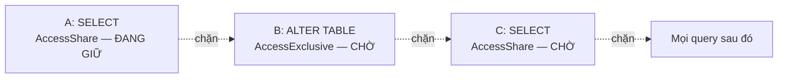

# Phần 08 — Lock & Concurrency

> **Mục tiêu:** giải thích được vì sao một lệnh `ALTER TABLE` làm treo toàn bộ hệ thống, và
> biết tìm ra ai đang chặn ai trong vòng 30 giây.

---

## 1. MVCC không loại bỏ lock, nó chỉ loại bỏ lock khi đọc

Phần 03 đã nói: đọc không chặn ghi, ghi không chặn đọc. Điều đó **vẫn đúng**, nhưng nó chỉ nói
về dữ liệu. Còn hai loại lock khác vẫn tồn tại và vẫn gây sự cố:

| Loại | Bảo vệ cái gì | Ai chạm tới |
|---|---|---|
| **Table-level lock** | Cấu trúc bảng | Mọi câu lệnh, kể cả `SELECT` |
| **Row-level lock** | Một row cụ thể khi ghi | `UPDATE`, `DELETE`, `SELECT FOR UPDATE` |

Sự cố lock trên production hầu như luôn là loại thứ nhất, và hầu như luôn do một câu DDL.

---

## 2. Table-level lock

### 2.1. Tám mức lock

Đừng học thuộc ma trận xung đột. Hãy nhớ **quy tắc sinh ra nó**:

```text
Hai lock xung đột khi cả hai đều muốn thay đổi thứ mà bên kia đang dựa vào.
```

| Mức lock | Câu lệnh điển hình | Chặn cái gì |
|---|---|---|
| `ACCESS SHARE` | `SELECT` | Chỉ chặn `ACCESS EXCLUSIVE` |
| `ROW SHARE` | `SELECT FOR UPDATE` | `EXCLUSIVE`, `ACCESS EXCLUSIVE` |
| `ROW EXCLUSIVE` | `INSERT`, `UPDATE`, `DELETE` | `SHARE` trở lên |
| `SHARE UPDATE EXCLUSIVE` | `VACUUM`, `ANALYZE`, `CREATE INDEX CONCURRENTLY` | Chính nó và cao hơn |
| `SHARE` | `CREATE INDEX` (không `CONCURRENTLY`) | Mọi thao tác ghi |
| `SHARE ROW EXCLUSIVE` | `CREATE TRIGGER` | Gần như tất cả |
| `EXCLUSIVE` | `REFRESH MATERIALIZED VIEW CONCURRENTLY` | Mọi thứ trừ `SELECT` |
| `ACCESS EXCLUSIVE` | `ALTER TABLE`, `DROP`, `TRUNCATE`, `VACUUM FULL`, `REINDEX` | **Tất cả, kể cả `SELECT`** |

Hai điều đáng nhớ:

- **`ACCESS SHARE` và `ROW EXCLUSIVE` không xung đột nhau.** Nghĩa là `SELECT` và `UPDATE`
  chạy song song thoải mái ở mức bảng.
- **`ACCESS EXCLUSIVE` xung đột với tất cả**, kể cả `SELECT`.

### 2.2. Lock queue — cơ chế gây sự cố thật sự

Đây là phần quan trọng nhất của Phần 08, và cũng là phần bị hiểu sai nhiều nhất.

PostgreSQL xếp hàng lock theo **FIFO**. Một transaction đang chờ sẽ **chặn tất cả những
transaction phía sau nó**, kể cả khi chúng hoàn toàn tương thích với transaction đang giữ lock.

Thí nghiệm đo thật:

- **A:** `BEGIN; SELECT count(*) FROM lq;` — giữ `AccessShareLock`, chưa commit.
- **B:** `ALTER TABLE lq ADD COLUMN moi int;` — xin `AccessExclusiveLock`, phải chờ A.
- **C:** `SELECT count(*) FROM lq;` — chỉ xin `AccessShareLock`.

```text
 pid | state  |        mode         | granted | bi_chan_boi
-----+--------+---------------------+---------+-------------
 926 | active | AccessShareLock     | t       | {}
 932 | active | AccessExclusiveLock | f       | {926}
 946 | active | AccessShareLock     | f       | {932}
```

**Đọc kỹ dòng cuối.** C chỉ xin `AccessShareLock` — hoàn toàn tương thích với
`AccessShareLock` mà A đang giữ. Về lý thuyết C chạy được ngay. Nhưng C **bị chặn bởi B**
(pid 932), không phải bởi A.

C hết thời gian chờ:

```text
ERROR:  canceling statement due to lock timeout
```



> **Đây là cơ chế đằng sau gần như mọi sự cố 'deploy migration làm sập API'.** Không phải
> `ALTER TABLE` chậm. Nó chỉ cần chờ **một** transaction cũ, và trong lúc chờ, nó biến thành
> nút thắt chặn toàn bộ traffic đọc phía sau.

### 2.3. Cách phòng

**1. Luôn đặt `lock_timeout` trước DDL:**

```sql
SET lock_timeout = '3s';
ALTER TABLE orders ADD COLUMN ghi_chu text;
```

Nếu không lấy được lock trong 3 giây, câu lệnh **tự hủy** thay vì xếp hàng và kéo theo cả hệ
thống. Thà migration thất bại và thử lại, còn hơn API sập 4 phút.

**2. Thử lại có backoff** — công cụ migration tốt đều hỗ trợ.

**3. Kiểm tra transaction dài trước khi deploy:**

```sql
SELECT pid, now() - xact_start AS tuoi, state, left(query, 60)
FROM pg_stat_activity
WHERE state <> 'idle' AND now() - xact_start > interval '30 seconds'
ORDER BY xact_start;
```

**4. Biết thao tác nào rẻ, thao tác nào đắt:**

| Thao tác | Lock | Có quét bảng không |
|---|---|---|
| `ADD COLUMN` (không default) | `ACCESS EXCLUSIVE` | **Không** — chỉ sửa catalog |
| `ADD COLUMN ... DEFAULT <hằng>` | `ACCESS EXCLUSIVE` | Không (từ PostgreSQL 11) |
| `ADD COLUMN ... DEFAULT <hàm>` | `ACCESS EXCLUSIVE` | **Có** — viết lại cả bảng |
| `DROP COLUMN` | `ACCESS EXCLUSIVE` | Không |
| `ALTER COLUMN TYPE` | `ACCESS EXCLUSIVE` | **Có** — viết lại cả bảng |
| `SET NOT NULL` | `ACCESS EXCLUSIVE` | **Có** — trừ khi đã có `CHECK` hợp lệ |
| `ADD CONSTRAINT ... NOT VALID` | `ACCESS EXCLUSIVE` | Không |
| `VALIDATE CONSTRAINT` | `SHARE UPDATE EXCLUSIVE` | Có, nhưng **không chặn đọc ghi** |
| `CREATE INDEX` | `SHARE` | Có, chặn ghi |
| `CREATE INDEX CONCURRENTLY` | `SHARE UPDATE EXCLUSIVE` | Có, **không chặn** |

Điểm mấu chốt: kể cả thao tác "không quét bảng" vẫn cần `ACCESS EXCLUSIVE` trong **một khoảnh
khắc**. Khoảnh khắc đó vô hại — trừ khi nó phải xếp hàng chờ.

Mẫu an toàn cho `NOT NULL`:

```sql
-- Bước 1: thêm constraint không kiểm tra ngay (nhanh)
ALTER TABLE orders ADD CONSTRAINT ghi_chu_nn CHECK (ghi_chu IS NOT NULL) NOT VALID;

-- Bước 2: kiểm tra dần, KHÔNG chặn đọc ghi
ALTER TABLE orders VALIDATE CONSTRAINT ghi_chu_nn;
```

Phần 13 sẽ có checklist migration đầy đủ.

---

## 3. Row-level lock

### 3.1. Bốn mức

| Mức | Câu lệnh | Xung đột với |
|---|---|---|
| `FOR KEY SHARE` | Trigger kiểm tra foreign key | `FOR UPDATE` |
| `FOR SHARE` | `SELECT ... FOR SHARE` | `FOR UPDATE`, `FOR NO KEY UPDATE` |
| `FOR NO KEY UPDATE` | `UPDATE` không đụng khóa | `FOR SHARE` trở lên |
| `FOR UPDATE` | `SELECT ... FOR UPDATE`, `DELETE` | Tất cả |

`FOR KEY SHARE` chính là lock mà bạn đã nhìn thấy trong `pg_stat_statements` ở Phần 00:

```sql
SELECT $2 FROM ONLY "public"."orders" x WHERE "id" = $1 FOR KEY SHARE OF x
```

3,4 triệu lần gọi — mỗi row `order_items` và `payments` được insert đều phải khóa row cha để
nó không bị xóa giữa chừng.

### 3.2. Row lock không nằm trong `pg_locks`

Đây là chi tiết gây bối rối. Row lock được lưu **trong chính tuple** (trường `t_xmax` cùng
`infomask`), không phải trong bảng lock của shared memory. Lý do: bảng lock có kích thước cố
định, không thể chứa hàng triệu row lock.

Hệ quả khi debug: `pg_locks` chỉ hiện lock ở mức bảng và mức transaction. Muốn biết ai đang
chờ row nào, phải nhìn `pg_stat_activity.wait_event`:

```sql
SELECT pid, wait_event_type, wait_event, left(query, 50)
FROM pg_stat_activity WHERE wait_event_type = 'Lock';
```

`wait_event = 'transactionid'` nghĩa là đang chờ một transaction khác kết thúc — tức là chờ
row lock.

---

## 4. Deadlock

### 4.1. Tái hiện

Hai transaction khóa hai row theo **thứ tự ngược nhau**:

```sql
-- A
BEGIN;
UPDATE tk SET so_du = so_du - 10 WHERE id = 1;
-- ... rồi
UPDATE tk SET so_du = so_du + 10 WHERE id = 2;

-- B (đồng thời)
BEGIN;
UPDATE tk SET so_du = so_du - 10 WHERE id = 2;
-- ... rồi
UPDATE tk SET so_du = so_du + 10 WHERE id = 1;
```

Kết quả đo thật:

```text
ERROR:  deadlock detected
DETAIL:  Process 871 waits for ShareLock on transaction 835; blocked by process 877.
HINT:  See server log for query details.
```

Và trong server log:

```text
DETAIL:  Process 871 waits for ShareLock on transaction 835; blocked by process 877.
	Process 877 waits for ShareLock on transaction 834; blocked by process 871.
	Process 871: BEGIN; UPDATE tk SET so_du=so_du-10 WHERE id=1; ... WHERE id=2; COMMIT;
	Process 877: BEGIN; UPDATE tk SET so_du=so_du-10 WHERE id=2; ... WHERE id=1; COMMIT;
CONTEXT:  while updating tuple (0,2) in relation "tk"
```

**Server log có đủ cả hai câu lệnh và chỉ rõ vòng lặp.** Thông báo mà client nhận được chỉ có
một nửa — nên khi điều tra deadlock, luôn đọc server log.

### 4.2. Cơ chế phát hiện

PostgreSQL **không** kiểm tra deadlock liên tục — quá tốn kém. Nó chờ `deadlock_timeout`
(mặc định 1 giây) rồi mới dựng đồ thị chờ và tìm chu trình.

Hệ quả: mọi deadlock đều mất **ít nhất 1 giây** để được phát hiện.

Đừng hạ `deadlock_timeout` xuống thấp để "phát hiện nhanh hơn" — mọi lần chờ lock bình thường
cũng sẽ kích hoạt việc kiểm tra tốn kém đó.

### 4.3. Phòng deadlock

**1. Luôn khóa theo cùng một thứ tự.** Đây là biện pháp hiệu quả nhất:

```sql
-- Thay vì khóa theo thứ tự nghiệp vụ, khóa theo thứ tự id
UPDATE tk SET so_du = so_du + delta
WHERE id IN (:a, :b)
ORDER BY id;                -- luôn tăng dần
```

Với chuyển tiền:

```sql
BEGIN;
SELECT * FROM tk WHERE id IN (:tu, :den) ORDER BY id FOR UPDATE;
-- giờ mới cập nhật
COMMIT;
```

**2. Giữ transaction ngắn.** Deadlock cần hai transaction chồng lấn thời gian.

**3. Gom thao tác vào một câu lệnh** khi được — một câu `UPDATE ... WHERE id IN (...)` khóa
theo thứ tự nội bộ nhất quán.

**4. Luôn có retry.** Deadlock không thể loại bỏ hoàn toàn:

```python
# Mã lỗi 40P01 = deadlock_detected
for lan in range(3):
    try:
        chay_transaction()
        break
    except DeadlockDetected:
        time.sleep(0.05 * 2**lan)
```

### 4.4. Deadlock do thiếu index trên foreign key

Trường hợp khó hiểu nhất, và liên quan trực tiếp tới schema của giáo trình này.

Khi xóa một row ở bảng cha, PostgreSQL phải kiểm tra bảng con xem có row nào tham chiếu tới
không. **Nếu bảng con không có index trên cột foreign key, nó phải quét toàn bộ bảng con** —
trong lúc đang giữ lock.

Schema ở Phần 00 cố tình không có index trên `order_items.order_id`. Một câu
`DELETE FROM orders WHERE id = ?` sẽ quét toàn bộ 2,5 triệu row của `order_items`.

Đây là lý do quy tắc **"luôn tạo index trên cột foreign key"** tồn tại, và Phần 05 đã đo được
chi phí của việc thiếu nó.

---

## 5. Advisory lock

Lock do **bạn** định nghĩa ý nghĩa, PostgreSQL chỉ giữ giùm. Không gắn với bảng hay row nào.

```sql
-- Lock theo transaction: tự nhả khi COMMIT/ROLLBACK
SELECT pg_advisory_xact_lock(12345);

-- Lock theo session: phải tự nhả
SELECT pg_advisory_lock(12345);
SELECT pg_advisory_unlock(12345);

-- Không chờ, trả về true/false ngay
SELECT pg_try_advisory_xact_lock(12345);
```

Dùng khi cần đảm bảo **chỉ một tiến trình làm một việc**:

```sql
-- Chỉ một instance được chạy job này
SELECT pg_try_advisory_xact_lock(hashtext('job_tong_hop_hang_ngay'));
```

Ưu điểm so với row lock: không cần bảng, không tạo dead tuple, tự nhả khi transaction kết thúc.

**Cảnh báo:** `pg_advisory_lock` (mức session) **không tương thích với transaction pooling**
của PgBouncer — connection bạn nhả lock có thể không phải connection đã lấy nó. Luôn ưu tiên
bản `_xact_`. Phần 11 sẽ nói kỹ.

---

## 6. Job queue với `SKIP LOCKED`

### 6.1. Vấn đề

Nhiều worker cùng lấy việc từ một bảng. Cách viết ngây thơ khiến chúng chờ nhau.

Đo thật, hai worker cùng lấy 2 job:

**Không có `SKIP LOCKED`:**

```sql
BEGIN;
SELECT id FROM hang_doi WHERE trang_thai = 'pending'
ORDER BY id LIMIT 2 FOR UPDATE;
```

```text
  W1 lấy: 1  2
  W2: ERROR: canceling statement due to lock timeout
```

Worker 2 **chờ** worker 1 xong, dù còn 8 job chưa ai đụng tới.

**Có `SKIP LOCKED`:**

```sql
BEGIN;
SELECT id FROM hang_doi WHERE trang_thai = 'pending'
ORDER BY id LIMIT 2 FOR UPDATE SKIP LOCKED;
```

```text
  W1 lấy: 1  2
  W2 lấy: 3  4
```

Worker 2 **bỏ qua** row đang bị khóa và lấy job kế tiếp ngay.

### 6.2. Mẫu job queue hoàn chỉnh

```sql
UPDATE hang_doi
SET trang_thai = 'processing', bat_dau_luc = now()
WHERE id IN (
    SELECT id FROM hang_doi
    WHERE trang_thai = 'pending'
    ORDER BY id
    LIMIT 10
    FOR UPDATE SKIP LOCKED
)
RETURNING id, payload;
```

Bốn điểm cần chú ý:

1. **`FOR UPDATE SKIP LOCKED` nằm trong subquery**, không phải câu ngoài.
2. **`ORDER BY`** đảm bảo xử lý theo thứ tự và giảm nguy cơ deadlock.
3. **`RETURNING`** lấy việc và đánh dấu trong **một** câu lệnh — không có khoảng hở.
4. **Partial index** cho hiệu năng:

```sql
CREATE INDEX ON hang_doi (id) WHERE trang_thai = 'pending';
```

Partial index ở đây rất đáng giá: bảng hàng đợi thường có hàng triệu job đã xong và chỉ vài
nghìn đang chờ. Index đầy đủ sẽ khổng lồ và vô dụng; partial index nhỏ gọn và luôn nóng trong
cache (xem Phần 05).

### 6.3. Khi nào **không** nên dùng PostgreSQL làm hàng đợi

Job queue trên PostgreSQL rất tốt tới một ngưỡng nhất định. Ngưỡng đó nằm ở chỗ:

- Mỗi lần lấy và cập nhật job tạo dead tuple → autovacuum phải chạy liên tục (Phần 04).
- Với hàng nghìn job mỗi giây, bảng hàng đợi bloat nhanh hơn tốc độ vacuum.

Dấu hiệu cần chuyển sang hệ thống chuyên dụng: bảng hàng đợi nhỏ về số row nhưng lớn về dung
lượng, và `n_dead_tup` luôn cao dù autovacuum chạy liên tục.

---

## 7. Chẩn đoán lock

### 7.1. Câu query cần thuộc

```sql
SELECT a.pid,
       a.state,
       a.wait_event_type,
       a.wait_event,
       pg_blocking_pids(a.pid)          AS bi_chan_boi,
       now() - a.xact_start             AS transaction_tuoi,
       left(a.query, 60)                AS query
FROM pg_stat_activity a
WHERE a.backend_type = 'client backend'
  AND cardinality(pg_blocking_pids(a.pid)) > 0
ORDER BY a.xact_start;
```

`pg_blocking_pids()` là hàm quan trọng nhất. Nó trả về mảng pid đang chặn pid này — đi ngược
mảng đó là tới thủ phạm gốc.

### 7.2. Xem lock ở mức bảng

```sql
SELECT l.pid, l.mode, l.granted,
       l.relation::regclass AS bang,
       left(a.query, 50)    AS query
FROM pg_locks l
JOIN pg_stat_activity a ON a.pid = l.pid
WHERE l.relation IS NOT NULL
ORDER BY l.relation, l.granted DESC;
```

Sắp `granted DESC` để dòng đầu là người đang **giữ** lock, các dòng sau là người đang **chờ**.

### 7.3. Xử lý khẩn cấp

```sql
-- Hủy câu lệnh, giữ connection
SELECT pg_cancel_backend(<pid>);

-- Ngắt hẳn connection (mạnh tay hơn)
SELECT pg_terminate_backend(<pid>);
```

Luôn thử `pg_cancel_backend` trước. `pg_terminate_backend` làm mất cả transaction đang chạy dở.

### 7.4. Phòng ngừa ở mức cấu hình

```sql
-- Không câu lệnh nào chờ lock quá 5 giây
ALTER SYSTEM SET lock_timeout = '5s';

-- Không câu lệnh nào chạy quá 30 giây (đặt ở mức role cho API)
ALTER ROLE api_user SET statement_timeout = '30s';

-- Tự hủy transaction nằm không quá 5 phút
ALTER SYSTEM SET idle_in_transaction_session_timeout = '5min';

SELECT pg_reload_conf();
```

Ba tham số này là biện pháp phòng thủ rẻ nhất và hiệu quả nhất cho một cluster production.
Đặc biệt `idle_in_transaction_session_timeout` — nó chặn đứng cả sự cố lock lẫn sự cố bloat
mà Phần 04 đã mô tả.

Ghi lại mọi lần chờ lock để điều tra sau (môi trường Phần 00 đã bật):

```conf
log_lock_waits = on
deadlock_timeout = 1s      # cũng là ngưỡng để ghi log lock wait
```

---

## 8. Những gì bạn nên rút ra từ phần này

1. Lock queue theo **FIFO**: một transaction đang chờ chặn tất cả phía sau, kể cả những
   transaction tương thích với người đang giữ lock. Đo được: `SELECT` bị chặn bởi `ALTER TABLE`
   đang chờ, chứ không phải bởi `SELECT` đang giữ lock.
2. **Luôn `SET lock_timeout` trước DDL.** Thà migration thất bại còn hơn API sập.
3. `ACCESS EXCLUSIVE` xung đột với tất cả, kể cả `SELECT`.
4. Row lock **không** nằm trong `pg_locks` — nó nằm trong tuple. Nhìn `wait_event` thay vì.
5. Deadlock mất **ít nhất `deadlock_timeout`** (1 giây) để phát hiện. Đừng hạ tham số này.
6. Server log chứa **cả hai** câu lệnh gây deadlock; thông báo cho client chỉ có một nửa.
7. Phòng deadlock hiệu quả nhất: luôn khóa theo cùng một thứ tự (thường là `ORDER BY id`).
8. Thiếu index trên foreign key khiến `DELETE` ở bảng cha quét toàn bộ bảng con trong lúc giữ lock.
9. `SKIP LOCKED` là nền tảng của job queue: worker lấy việc khác thay vì chờ.
10. `pg_advisory_xact_lock` an toàn với connection pooler; bản mức session thì không.

---

**Tiếp theo:** [lab.md](lab.md) — tự tay dựng lock queue, deadlock, và job queue.
