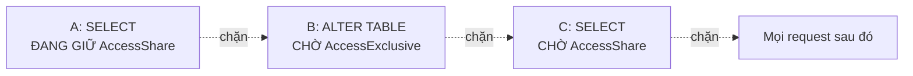

# Phần 08 — Lab: dựng lock queue, deadlock và job queue

> Cần **hai hoặc ba terminal**. Ký hiệu **A**, **B**, **C** là ba session `psql` riêng.
> Mở bằng `make psql` ở ba cửa sổ.

---

## Bài 1 — Lock queue: một `ALTER TABLE` chặn cả hệ thống

Bài quan trọng nhất của Phần 08.

Chuẩn bị:

```sql
DROP TABLE IF EXISTS lq;
CREATE TABLE lq (id int PRIMARY KEY, v text);
INSERT INTO lq VALUES (1, 'a');
```

**Terminal A** — mở transaction đọc rồi bỏ đó:

```sql
BEGIN;
SELECT count(*) FROM lq;
-- KHÔNG commit
```

A đang giữ `AccessShareLock`. Hoàn toàn vô hại.

**Terminal B** — chạy migration:

```sql
ALTER TABLE lq ADD COLUMN moi int;
```

B **treo**. Nó xin `AccessExclusiveLock`, xung đột với A.

Tới đây mọi thứ vẫn "hợp lý". Bây giờ mới là phần đáng sợ.

**Terminal C** — chỉ đọc, không sửa gì:

```sql
SELECT count(*) FROM lq;
```

**C cũng treo.**

C chỉ xin `AccessShareLock` — thứ hoàn toàn tương thích với `AccessShareLock` mà A đang giữ.
Về lý thuyết C phải chạy được ngay.

Mở terminal thứ tư (hoặc dùng A nếu bạn muốn giữ 3 terminal) và nhìn hàng đợi:

```sql
SELECT a.pid, a.state, l.mode, l.granted,
       pg_blocking_pids(a.pid) AS bi_chan_boi,
       left(a.query, 38) AS query
FROM pg_stat_activity a
JOIN pg_locks l ON l.pid = a.pid
WHERE l.relation = 'lq'::regclass
ORDER BY l.granted DESC, a.pid;
```

```text
 pid | state  |        mode         | granted | bi_chan_boi |         query
-----+--------+---------------------+---------+-------------+------------------------
 926 | active | AccessShareLock     | t       | {}          | BEGIN; SELECT count(*)…
 932 | active | AccessExclusiveLock | f       | {926}       | ALTER TABLE lq ADD COL…
 946 | active | AccessShareLock     | f       | {932}       | SELECT count(*) FROM lq
```

**Đọc cột `bi_chan_boi`:**

- B (932) bị chặn bởi A (926) — hợp lý.
- C (946) bị chặn bởi **B (932)**, không phải bởi A.

C xếp hàng **sau** B. PostgreSQL cấp lock theo FIFO, và một transaction đang chờ sẽ chặn tất
cả những transaction phía sau nó.



> **Đây là cơ chế đằng sau 'deploy migration làm sập API'.** `ALTER TABLE` không hề chậm — nó
> chỉ cần chờ **một** transaction cũ, và trong lúc chờ, nó biến thành nút thắt chặn toàn bộ
> traffic đọc.

**Terminal A:** `ROLLBACK;` — mọi thứ thông ngay lập tức.

### Cách phòng: `lock_timeout`

Làm lại thí nghiệm, nhưng B chạy:

```sql
SET lock_timeout = '3s';
ALTER TABLE lq ADD COLUMN moi2 int;
```

```text
ERROR:  canceling statement due to lock timeout
```

B tự bỏ cuộc sau 3 giây. C **không bao giờ bị chặn**.

> Thà migration thất bại và thử lại, còn hơn API sập 4 phút. **Luôn đặt `lock_timeout` trước
> mọi câu DDL.**

---

## Bài 2 — Deadlock

**Terminal A:**

```sql
DROP TABLE IF EXISTS tk;
CREATE TABLE tk (id int PRIMARY KEY, so_du int);
INSERT INTO tk VALUES (1, 100), (2, 100);

BEGIN;
UPDATE tk SET so_du = so_du - 10 WHERE id = 1;
```

**Terminal B:**

```sql
BEGIN;
UPDATE tk SET so_du = so_du - 10 WHERE id = 2;
```

Chưa ai chặn ai — hai row khác nhau.

**Terminal A:**

```sql
UPDATE tk SET so_du = so_du + 10 WHERE id = 2;    -- treo, chờ B
```

**Terminal B:**

```sql
UPDATE tk SET so_du = so_du + 10 WHERE id = 1;    -- treo, chờ A → vòng lặp
```

Sau khoảng 1 giây:

```text
ERROR:  deadlock detected
DETAIL:  Process 871 waits for ShareLock on transaction 835; blocked by process 877.
HINT:  See server log for query details.
```

PostgreSQL hủy **một** transaction để phá vòng; transaction còn lại chạy tiếp bình thường.

### Đọc server log — nơi có đủ thông tin

Thông báo gửi cho client chỉ có một nửa câu chuyện. Chạy `make logs`:

```text
DETAIL:  Process 871 waits for ShareLock on transaction 835; blocked by process 877.
	Process 877 waits for ShareLock on transaction 834; blocked by process 871.
	Process 871: BEGIN; UPDATE tk SET so_du=so_du-10 WHERE id=1; ... WHERE id=2; COMMIT;
	Process 877: BEGIN; UPDATE tk SET so_du=so_du-10 WHERE id=2; ... WHERE id=1; COMMIT;
CONTEXT:  while updating tuple (0,2) in relation "tk"
```

Server log có **cả hai** câu lệnh và chỉ rõ vòng lặp. Khi điều tra deadlock trên production,
luôn bắt đầu từ đây.

### Vì sao mất khoảng 1 giây

PostgreSQL không kiểm tra deadlock liên tục — quá tốn kém. Nó chờ hết `deadlock_timeout`
(mặc định 1 giây) rồi mới dựng đồ thị chờ và tìm chu trình.

```sql
SHOW deadlock_timeout;
```

Đừng hạ giá trị này để "phát hiện nhanh hơn": mọi lần chờ lock **bình thường** cũng sẽ kích
hoạt việc kiểm tra tốn kém đó.

### Phòng: khóa theo cùng thứ tự

Làm lại nhưng cả hai session cùng khóa theo thứ tự `id` tăng dần:

```sql
-- Cả A và B đều chạy:
BEGIN;
SELECT * FROM tk WHERE id IN (1, 2) ORDER BY id FOR UPDATE;
UPDATE tk SET so_du = so_du - 10 WHERE id = 1;
UPDATE tk SET so_du = so_du + 10 WHERE id = 2;
COMMIT;
```

Không còn deadlock. Session thứ hai chỉ **chờ** rồi chạy tiếp.

---

## Bài 3 — Row lock không nằm trong `pg_locks`

**Terminal A:**

```sql
BEGIN;
UPDATE tk SET so_du = so_du - 1 WHERE id = 1;
-- không commit
```

**Terminal B:**

```sql
UPDATE tk SET so_du = so_du - 1 WHERE id = 1;    -- treo
```

**Terminal C** — tìm row lock trong `pg_locks`:

```sql
SELECT pid, mode, granted, relation::regclass
FROM pg_locks WHERE relation = 'tk'::regclass;
```

Bạn **không** thấy row lock nào. Chỉ có `RowExclusiveLock` ở mức bảng, và cả hai đều `granted = t`.

Row lock được lưu **trong chính tuple** (trường `t_xmax`), không phải trong bảng lock của
shared memory. Lý do: bảng lock có kích thước cố định, không thể chứa hàng triệu row lock.

Muốn thấy ai đang chờ:

```sql
SELECT pid, state, wait_event_type, wait_event,
       pg_blocking_pids(pid) AS bi_chan_boi, left(query, 45) AS query
FROM pg_stat_activity WHERE wait_event_type = 'Lock';
```

```text
 pid | state  | wait_event_type |   wait_event   | bi_chan_boi
-----+--------+-----------------+----------------+-------------
 977 | active | Lock            | transactionid  | {971}
```

`wait_event = 'transactionid'` nghĩa là đang chờ một transaction khác kết thúc — tức là chờ
row lock.

Kiểm chứng bằng `pageinspect`:

```sql
SELECT lp, t_xmin, t_xmax,
       heap_tuple_infomask_flags(t_infomask, t_infomask2) AS co
FROM heap_page_items(get_raw_page('tk', 0)) WHERE lp = 1;
```

`t_xmax` khác 0 chính là row lock — đúng như Phần 03 đã mô tả.

**A:** `ROLLBACK;`

---

## Bài 4 — Job queue với `SKIP LOCKED`

```sql
DROP TABLE IF EXISTS hang_doi;
CREATE TABLE hang_doi (
    id         serial PRIMARY KEY,
    trang_thai text DEFAULT 'pending',
    payload    text
);
INSERT INTO hang_doi(payload) SELECT 'job ' || g FROM generate_series(1, 10) g;
```

### Không có `SKIP LOCKED`

**A:**

```sql
BEGIN;
SELECT id FROM hang_doi WHERE trang_thai = 'pending' ORDER BY id LIMIT 2 FOR UPDATE;
```

```text
 id
----
  1
  2
```

**B:**

```sql
SET lock_timeout = '2s';
SELECT id FROM hang_doi WHERE trang_thai = 'pending' ORDER BY id LIMIT 2 FOR UPDATE;
```

```text
ERROR:  canceling statement due to lock timeout
```

Worker B **chờ** worker A, dù còn 8 job chưa ai đụng tới.

### Có `SKIP LOCKED`

**A:** `ROLLBACK;` rồi:

```sql
BEGIN;
SELECT id FROM hang_doi WHERE trang_thai = 'pending'
ORDER BY id LIMIT 2 FOR UPDATE SKIP LOCKED;
```

```text
 id
----
  1
  2
```

**B:**

```sql
SELECT id FROM hang_doi WHERE trang_thai = 'pending'
ORDER BY id LIMIT 2 FOR UPDATE SKIP LOCKED;
```

```text
 id
----
  3
  4
```

B lấy **job khác** ngay lập tức thay vì chờ.

### Mẫu hoàn chỉnh cho production

```sql
UPDATE hang_doi
SET trang_thai = 'processing'
WHERE id IN (
    SELECT id FROM hang_doi
    WHERE trang_thai = 'pending'
    ORDER BY id
    LIMIT 10
    FOR UPDATE SKIP LOCKED
)
RETURNING id, payload;
```

Bốn chi tiết quan trọng:

1. `FOR UPDATE SKIP LOCKED` nằm **trong subquery**, không phải câu ngoài.
2. `ORDER BY` đảm bảo thứ tự và giảm nguy cơ deadlock.
3. `RETURNING` lấy việc và đánh dấu trong **một** câu lệnh — không có khoảng hở.
4. Partial index cho hiệu năng:

```sql
CREATE INDEX ON hang_doi (id) WHERE trang_thai = 'pending';
```

Bảng hàng đợi thường có hàng triệu job đã xong và vài nghìn đang chờ. Index đầy đủ sẽ khổng
lồ và vô dụng; partial index nhỏ gọn và luôn nóng trong cache (Phần 05).

### Cái giá phải trả

```sql
SELECT n_tup_upd, n_dead_tup FROM pg_stat_user_tables WHERE relname = 'hang_doi';
```

Mỗi lần lấy và hoàn thành job tạo dead tuple. Với hàng nghìn job mỗi giây, bảng hàng đợi bloat
nhanh hơn tốc độ autovacuum.

Cấu hình bắt buộc cho bảng hàng đợi:

```sql
ALTER TABLE hang_doi SET (
    autovacuum_vacuum_scale_factor = 0.01,
    autovacuum_vacuum_threshold    = 100
);
```

Dấu hiệu cần chuyển sang hệ thống chuyên dụng: bảng nhỏ về số row nhưng lớn về dung lượng, và
`n_dead_tup` luôn cao dù autovacuum chạy liên tục.

---

## Bài 5 — Advisory lock

Đảm bảo chỉ một instance chạy một job:

**A:**

```sql
BEGIN;
SELECT pg_try_advisory_xact_lock(hashtext('job_tong_hop_hang_ngay'));
```

```text
 pg_try_advisory_xact_lock
---------------------------
 t
```

**B:**

```sql
BEGIN;
SELECT pg_try_advisory_xact_lock(hashtext('job_tong_hop_hang_ngay'));
```

```text
 pg_try_advisory_xact_lock
---------------------------
 f
```

B nhận `false` **ngay lập tức**, không chờ. Ứng dụng chỉ việc thoát.

Xem advisory lock đang giữ:

```sql
SELECT pid, locktype, objid, granted
FROM pg_locks WHERE locktype = 'advisory';
```

**A:** `COMMIT;` — lock tự nhả.

> **Luôn dùng bản `_xact_`.** `pg_advisory_lock` mức session không tương thích với transaction
> pooling của PgBouncer: connection bạn nhả lock có thể không phải connection đã lấy nó
> (Phần 11).

---

## Bài 6 — Thiếu index trên foreign key

Trên `lab_big`, schema cố tình không có index trên `order_items.order_id`.

```sql
EXPLAIN (ANALYZE, BUFFERS, COSTS OFF, TIMING OFF)
DELETE FROM orders WHERE id = 999999;
```

Plan của chính câu `DELETE` trông rất nhẹ. Nhưng thời gian thật thì không — chi phí nằm ở
**trigger kiểm tra foreign key**, không hiện trong plan.

Đo bằng `pg_stat_statements`:

```sql
SELECT pg_stat_statements_reset();

BEGIN;
DELETE FROM orders WHERE id = 999999;
ROLLBACK;

SELECT calls, round(total_exec_time::numeric, 1) AS ms,
       left(regexp_replace(query, '\s+', ' ', 'g'), 70) AS query
FROM pg_stat_statements
WHERE query ILIKE '%order_items%' OR query ILIKE '%payments%'
ORDER BY total_exec_time DESC;
```

Bạn sẽ thấy các câu query kiểm tra khóa ngoại do PostgreSQL tự sinh, quét toàn bộ bảng con.

Thêm index và đo lại:

```sql
CREATE INDEX idx_oi_order ON order_items(order_id);
CREATE INDEX idx_pay_order ON payments(order_id);
ANALYZE order_items, payments;
```

Lặp lại phép đo — chênh lệch tính bằng nhiều bậc.

> **Quy tắc: luôn tạo index trên cột foreign key.** PostgreSQL tự tạo index cho `PRIMARY KEY`
> và `UNIQUE`, nhưng **không** cho `FOREIGN KEY`.

---

## Bài 7 — Bộ query chẩn đoán cần thuộc

### Ai đang chặn ai

```sql
SELECT a.pid,
       a.state,
       a.wait_event_type,
       a.wait_event,
       pg_blocking_pids(a.pid)  AS bi_chan_boi,
       now() - a.xact_start     AS transaction_tuoi,
       left(a.query, 60)        AS query
FROM pg_stat_activity a
WHERE a.backend_type = 'client backend'
  AND cardinality(pg_blocking_pids(a.pid)) > 0
ORDER BY a.xact_start;
```

Đi ngược mảng `bi_chan_boi` để tìm thủ phạm gốc — pid không bị ai chặn nhưng đang chặn người khác.

### Lock ở mức bảng

```sql
SELECT l.pid, l.mode, l.granted,
       l.relation::regclass AS bang,
       left(a.query, 50)    AS query
FROM pg_locks l
JOIN pg_stat_activity a ON a.pid = l.pid
WHERE l.relation IS NOT NULL
ORDER BY l.relation, l.granted DESC;
```

`granted DESC` để dòng đầu là người đang **giữ** lock.

### Xử lý khẩn cấp

```sql
SELECT pg_cancel_backend(<pid>);      -- hủy câu lệnh, giữ connection
SELECT pg_terminate_backend(<pid>);   -- ngắt hẳn connection
```

Luôn thử `pg_cancel_backend` trước.

### Phòng ngừa ở mức cluster

```sql
ALTER SYSTEM SET lock_timeout = '5s';
ALTER SYSTEM SET idle_in_transaction_session_timeout = '5min';
ALTER ROLE api_user SET statement_timeout = '30s';
SELECT pg_reload_conf();
```

Ba tham số này là biện pháp phòng thủ rẻ nhất cho một cluster production. Đặc biệt
`idle_in_transaction_session_timeout` — nó chặn đứng cả sự cố lock ở Bài 1 lẫn sự cố bloat ở
Phần 04.

Dọn dẹp:

```sql
DROP TABLE IF EXISTS lq, tk, hang_doi;
```

---

## Checklist trước khi sang Phần 09

- [ ] **Tự dựng lại được lock queue ba tầng và chỉ ra C bị chặn bởi B chứ không phải A.**
- [ ] Chứng minh được `lock_timeout` cứu được hệ thống trong tình huống đó.
- [ ] Tự tạo được deadlock và đọc được server log để tìm cả hai câu lệnh.
- [ ] Giải thích được vì sao deadlock mất ít nhất 1 giây để phát hiện.
- [ ] Chứng minh được row lock **không** nằm trong `pg_locks`.
- [ ] Viết được câu lấy job an toàn với `FOR UPDATE SKIP LOCKED` + `RETURNING`.
- [ ] Biết vì sao dùng `pg_advisory_xact_lock` thay vì `pg_advisory_lock`.
- [ ] Dùng `pg_blocking_pids()` để truy ra thủ phạm gốc.

---

**Tiếp theo:** Phần 09 — WAL, Checkpoint và Durability.
