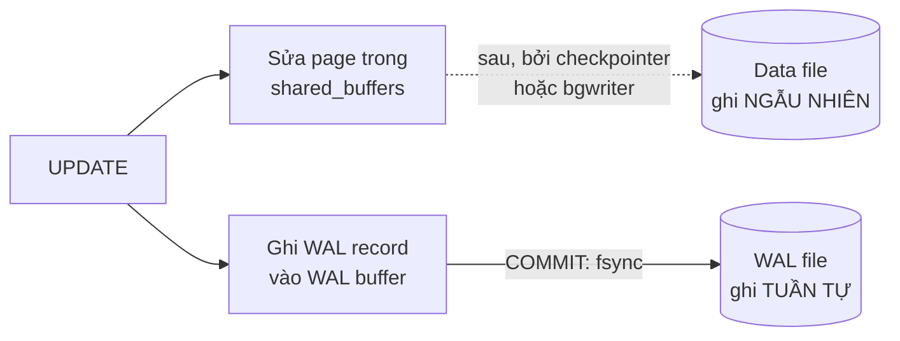

# Phần 09 — WAL, Checkpoint và Durability

> **Mục tiêu:** hiểu chuyện gì xảy ra giữa lúc `COMMIT` trả về và lúc dữ liệu thật sự nằm
> an toàn trên đĩa.

> Từ phần này trở đi, phần thực hành được lồng ngay vào từng mục thay vì tách ra file `lab.md`
> riêng. Mọi khối SQL đều chạy được trên môi trường Phần 00.

---

## 1. Vấn đề: ghi xuống đĩa rất chậm

Khi bạn `UPDATE` một row, PostgreSQL sửa page trong `shared_buffers` — nhanh, trong RAM. Nhưng
nếu mất điện ngay lúc đó, thay đổi biến mất.

Cách ngây thơ: mỗi `COMMIT` ghi hết mọi page bẩn xuống đĩa. Vấn đề: các page nằm rải rác khắp
file, nên đó là hàng loạt lần **ghi ngẫu nhiên** — thao tác chậm nhất mà đĩa phải làm.

**Lời giải WAL (Write-Ahead Logging):** thay vì ghi *dữ liệu*, ghi *nhật ký thay đổi* vào một
file **tuần tự**. Ghi tuần tự nhanh hơn ghi ngẫu nhiên nhiều lần.



Quy tắc bất di bất dịch: **WAL record phải xuống đĩa trước khi page dữ liệu tương ứng xuống
đĩa.** Đó là "write-ahead" trong tên gọi.

Nếu mất điện, PostgreSQL đọc lại WAL và **replay** các thay đổi — gọi là crash recovery.

---

## 2. LSN — địa chỉ trong dòng WAL

LSN (Log Sequence Number) là vị trí byte trong dòng WAL, viết dạng `0/3590860`.

```sql
SELECT pg_current_wal_lsn();
```

Mọi page đều mang LSN của lần sửa gần nhất — chính trường `lsn` bạn đã thấy trong
`page_header()` ở Phần 02. Nhờ đó khi recovery, PostgreSQL biết page nào đã có thay đổi nào
rồi và bỏ qua phần đã áp dụng.

Đo lượng WAL sinh ra bởi một thao tác:

```sql
SELECT pg_current_wal_lsn() AS truoc \gset
UPDATE orders SET status = status WHERE id <= 20000;
SELECT pg_size_pretty(pg_current_wal_lsn() - :'truoc'::pg_lsn) AS wal_sinh_ra;
```

Đây là công cụ đo quan trọng nhất của phần này. Dùng nó để so sánh chi phí WAL giữa các cách
viết khác nhau.

---

## 3. `full_page_writes` — vì sao WAL tăng vọt sau checkpoint

### 3.1. Thí nghiệm

```sql
CHECKPOINT;
SELECT pg_current_wal_lsn() AS l1 \gset
UPDATE orders SET status = status WHERE id <= 20000;
SELECT 'Ngay sau CHECKPOINT: ' || pg_size_pretty(pg_current_wal_lsn() - :'l1'::pg_lsn);

SELECT pg_current_wal_lsn() AS l2 \gset
UPDATE orders SET status = status WHERE id <= 20000;      -- CÙNG câu lệnh
SELECT 'Lần 2, không checkpoint: ' || pg_size_pretty(pg_current_wal_lsn() - :'l2'::pg_lsn);
```

```text
 Ngay sau CHECKPOINT: 6897 kB
 Lần 2, không checkpoint: 4949 kB
```

**Cùng một câu lệnh, cùng số row. Lần đầu sinh nhiều hơn 1.948 kB WAL.**

### 3.2. Vì sao

Đĩa ghi theo đơn vị sector (thường 512 byte hoặc 4KB), còn PostgreSQL ghi theo page 8KB. Nếu
mất điện **giữa chừng** một lần ghi page, page đó bị rách — một nửa cũ, một nửa mới. WAL
record chỉ mô tả "sửa byte thứ N" sẽ không cứu được một page đã hỏng.

Giải pháp: sau mỗi checkpoint, **lần ghi đầu tiên vào mỗi page phải kèm nguyên bản sao 8KB
của page đó vào WAL** (`full_page_writes = on`, mặc định). Các lần ghi tiếp theo vào cùng
page trong cùng chu kỳ checkpoint thì chỉ cần ghi phần thay đổi.

Đó chính là 1.948 kB chênh lệch ở trên.

Hệ quả thực tế:

- **Checkpoint càng thưa, WAL càng ít.** Vì mỗi page chỉ phải ghi full page image một lần cho
  mỗi chu kỳ.
- Đây là lý do `checkpoint_timeout` mặc định 5 phút thường quá ngắn cho hệ thống ghi nhiều.
- **Đừng tắt `full_page_writes`** trừ khi hệ thống file đảm bảo ghi nguyên tử (ZFS với
  `recordsize` phù hợp). Tắt sai là mất dữ liệu khi mất điện.

---

## 4. Checkpoint

### 4.1. Checkpoint làm gì

1. Ghi toàn bộ dirty buffer trong `shared_buffers` xuống data file.
2. `fsync` để chắc chắn chúng nằm trên đĩa.
3. Ghi một record vào WAL đánh dấu "tới điểm này, mọi thứ đã an toàn".
4. Cho phép xóa hoặc tái sử dụng WAL cũ hơn điểm đó.

Sau checkpoint, crash recovery chỉ cần replay WAL **từ checkpoint gần nhất**, không phải từ đầu.

### 4.2. Hai loại checkpoint

```sql
SELECT num_timed, num_requested,
       write_time::bigint AS write_ms,
       sync_time::bigint  AS sync_ms,
       buffers_written
FROM pg_stat_checkpointer;      -- PostgreSQL 17+; trước đó là pg_stat_bgwriter
```

```text
 num_timed | num_requested | write_ms | sync_ms | buffers_written
-----------+---------------+----------+---------+-----------------
        37 |             4 |   580322 |    1481 |           38217
```

| Loại | Nguyên nhân | Đánh giá |
|---|---|---|
| `num_timed` | Hết `checkpoint_timeout` | **Bình thường** |
| `num_requested` | Hết `max_wal_size`, hoặc `CHECKPOINT` thủ công | **Cần chú ý nếu nhiều** |

> **Chỉ số cần theo dõi:** tỷ lệ `num_requested / (num_timed + num_requested)`. Trên 10% nghĩa
> là `max_wal_size` quá nhỏ so với tốc độ ghi — checkpoint bị ép chạy sớm, gây I/O dồn cục.

Ở ví dụ trên: 4/41 ≈ 10% — ngay ở ngưỡng đáng xem lại.

### 4.3. Checkpoint spike

Nếu checkpoint ghi toàn bộ dirty buffer cùng lúc, I/O tăng vọt và mọi query chậm hẳn trong
vài giây tới vài phút. Biểu đồ I/O có hình răng cưa đều đặn theo `checkpoint_timeout`.

`checkpoint_completion_target` (mặc định 0.9) làm checkpointer **trải đều** việc ghi ra 90%
khoảng thời gian giữa hai checkpoint, thay vì dồn một cục.

### 4.4. Tune

| Tham số | Mặc định | Khuyến nghị |
|---|---|---|
| `checkpoint_timeout` | 5min | 15–30min cho hệ thống ghi nhiều |
| `max_wal_size` | 1GB | Đủ lớn để checkpoint chủ yếu là `timed` |
| `checkpoint_completion_target` | 0.9 | Giữ nguyên |
| `full_page_writes` | on | **Giữ nguyên** |

Đánh đổi khi tăng `checkpoint_timeout`:

- **Lợi:** ít full page image hơn → ít WAL hơn → ít I/O hơn.
- **Hại:** crash recovery lâu hơn, vì phải replay nhiều WAL hơn.

Với hệ thống cần khởi động lại nhanh sau sự cố, đừng đặt quá cao.

```sql
SELECT count(*) AS so_file, pg_size_pretty(sum(size)) AS tong FROM pg_ls_waldir();
```

```text
 so_file |  tong
---------+---------
      64 | 1024 MB
```

---

## 5. `synchronous_commit` — đánh đổi giữa tốc độ và độ bền

Khi `COMMIT`, PostgreSQL mặc định **chờ** WAL được `fsync` xuống đĩa mới trả về. Đó là lý do
`COMMIT` có độ trễ.

| Giá trị | `COMMIT` chờ gì | Rủi ro khi mất điện |
|---|---|---|
| `on` (mặc định) | WAL đã `fsync` xuống đĩa local | Không mất gì |
| `remote_apply` | Replica đã **áp dụng** xong | Không mất, chậm nhất |
| `remote_write` | Replica đã nhận và ghi vào OS | Mất nếu cả hai cùng chết |
| `local` | Chỉ local, không chờ replica | Mất nếu primary chết |
| `off` | **Không chờ gì** | **Mất vài trăm ms giao dịch cuối** |

Điểm quan trọng về `synchronous_commit = off`: nó **không** gây hỏng dữ liệu hay mất tính nhất
quán. Database vẫn khôi phục về một trạng thái hợp lệ; bạn chỉ mất các transaction commit trong
khoảng ~`wal_writer_delay × 3` cuối cùng.

Đó là đánh đổi hoàn toàn chấp nhận được cho nhiều loại dữ liệu:

```sql
-- Bảng log, analytics, tracking: chấp nhận mất vài trăm ms
SET LOCAL synchronous_commit = off;
INSERT INTO su_kien_tracking ...;

-- Giao dịch tiền: giữ mặc định
```

Đặt được ở mức từng transaction — đây là cách tận dụng tốt nhất.

```sql
ALTER ROLE analytics_writer SET synchronous_commit = off;
```

---

## 6. Crash recovery

Khi khởi động sau sự cố, PostgreSQL:

1. Đọc `pg_control` để tìm checkpoint gần nhất.
2. Replay WAL từ điểm đó tới cuối.
3. Với mỗi WAL record, so LSN của record với LSN của page — chỉ áp dụng nếu page cũ hơn.
4. Rollback các transaction chưa commit.

**Thực hành — tự gây crash:**

```bash
docker compose -f 00-moi-truong/docker/docker-compose.yml kill -s SIGKILL db
docker compose -f 00-moi-truong/docker/docker-compose.yml up -d
make logs
```

Trong log sẽ thấy:

```text
LOG:  database system was interrupted; last known up at ...
LOG:  database system was not properly shut down; automatic recovery in progress
LOG:  redo starts at 0/...
LOG:  redo done at 0/...
LOG:  database system is ready to accept connections
```

Khoảng thời gian giữa `redo starts` và `redo done` chính là thời gian downtime sau sự cố. Nó
tỷ lệ thuận với lượng WAL sinh ra kể từ checkpoint gần nhất — tức là tỷ lệ thuận với
`checkpoint_timeout`.

Đây là con số bạn cần biết khi đặt RTO (Recovery Time Objective) cho hệ thống.

---

## 7. Backup và PITR

### 7.1. Ba mức

| Cách | Khôi phục được gì | Downtime khi backup |
|---|---|---|
| `pg_dump` | Dữ liệu logic tại một thời điểm | Không, nhưng chậm với DB lớn |
| `pg_basebackup` | Bản sao vật lý toàn cluster | Không |
| `pg_basebackup` + WAL archive | **Bất kỳ thời điểm nào** (PITR) | Không |

### 7.2. `pg_dump` không phải backup cho hệ thống lớn

`pg_dump` chạy trong một transaction dài — và Phần 04 đã chứng minh transaction dài **chặn
VACUUM trên toàn database**. Dump một database 500 GB mất vài giờ, và trong vài giờ đó không
dead tuple nào được dọn.

`pg_dump` phù hợp cho: database nhỏ, xuất một schema, di chuyển giữa các version.
Không phù hợp cho: chiến lược backup của hệ thống production lớn.

### 7.3. PITR

```conf
# postgresql.conf
archive_mode = on
archive_command = 'test ! -f /archive/%f && cp %p /archive/%f'
wal_level = replica          # hoặc logical
```

```bash
pg_basebackup -D /backup/base -Fp -Xs -P -U replicator
```

Khôi phục về một thời điểm:

```conf
# postgresql.conf trên bản khôi phục
restore_command = 'cp /archive/%f %p'
recovery_target_time = '2026-08-10 14:30:00+07'
recovery_target_action = 'promote'
```

Tạo file `recovery.signal` trong thư mục dữ liệu rồi khởi động.

### 7.4. Quy tắc quan trọng nhất về backup

> **Backup chưa từng được khôi phục thử không phải là backup.**

Đưa việc khôi phục thử vào lịch định kỳ, tự động, và đo cả thời gian khôi phục. Rất nhiều tổ
chức phát hiện `archive_command` đã lỗi hàng tháng trời — vào đúng lúc cần dùng.

Kiểm tra archive có hoạt động không:

```sql
SELECT archived_count, last_archived_wal, last_archived_time,
       failed_count, last_failed_wal, last_failed_time
FROM pg_stat_archiver;
```

`failed_count` tăng là báo động đỏ: WAL không được archive, và nó sẽ tích tụ cho tới khi đầy đĩa.

---

## 8. Những gì bạn nên rút ra từ phần này

1. WAL biến ghi ngẫu nhiên thành ghi tuần tự. Đó là lý do PostgreSQL nhanh mà vẫn bền.
2. Full page writes làm lần ghi đầu sau checkpoint tốn nhiều WAL hơn — đo được 6.897 kB so
   với 4.949 kB cho cùng câu lệnh.
3. **Checkpoint thưa hơn = ít WAL hơn**, nhưng crash recovery lâu hơn.
4. `num_requested` chiếm trên 10% tổng số checkpoint nghĩa là `max_wal_size` quá nhỏ.
5. `synchronous_commit = off` **không** gây hỏng dữ liệu, chỉ mất vài trăm ms cuối. Đặt được
   theo từng transaction.
6. `pg_dump` chạy transaction dài nên chặn VACUUM toàn database.
7. Backup chưa khôi phục thử thì chưa phải backup. Theo dõi `pg_stat_archiver.failed_count`.

---

**Tiếp theo:** Phần 10 — Replication & High Availability.
