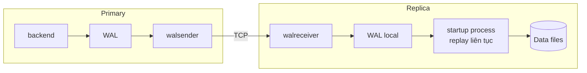

# Phần 10 — Replication & High Availability

> **Mục tiêu:** biết replica đang tụt lại vì lý do gì, và hiểu vì sao replication slot bị bỏ
> quên có thể làm sập cả primary.

---

## 1. Streaming replication hoạt động thế nào

Replica **không** sao chép câu SQL. Nó nhận và replay chính dòng WAL của primary — cùng cơ chế
crash recovery của Phần 09, nhưng chạy liên tục và không bao giờ kết thúc.



Hệ quả trực tiếp của việc replay WAL vật lý:

- Replica là **bản sao byte-level**, không thể khác schema, không thể có index riêng.
- Replica **chỉ đọc**, không phải lựa chọn mà là bắt buộc.
- Mọi database trong cluster đều được sao chép, không chọn lọc được.

Muốn linh hoạt hơn thì dùng logical replication (mục 6).

---

## 2. Dựng một replica

```bash
# Trên primary: tạo user và slot
psql -c "CREATE ROLE replicator WITH REPLICATION LOGIN PASSWORD 'x';"
psql -c "SELECT pg_create_physical_replication_slot('replica1');"
```

```conf
# primary: postgresql.conf
wal_level = replica            # môi trường Phần 00 đã đặt 'logical', bao hàm 'replica'
max_wal_senders = 10
max_replication_slots = 10
```

```bash
# Trên replica: sao chép toàn bộ cluster
pg_basebackup -h primary -U replicator -D /var/lib/postgresql/data \
              -Fp -Xs -P -R -S replica1
```

Cờ `-R` tự sinh `postgresql.auto.conf` với `primary_conninfo` và tạo file `standby.signal`.
Khởi động lên là replica bắt đầu chạy.

Kiểm tra từ primary:

```sql
SELECT client_addr, state, sync_state,
       pg_size_pretty(pg_wal_lsn_diff(sent_lsn, replay_lsn)) AS chua_replay,
       write_lag, flush_lag, replay_lag
FROM pg_stat_replication;
```

---

## 3. Đo replication lag cho đúng

Có **hai** cách đo, và chúng trả lời hai câu hỏi khác nhau.

### 3.1. Lag theo byte — đo trên primary

```sql
SELECT application_name,
       pg_size_pretty(pg_wal_lsn_diff(pg_current_wal_lsn(), sent_lsn))   AS chua_gui,
       pg_size_pretty(pg_wal_lsn_diff(sent_lsn, write_lsn))              AS chua_ghi,
       pg_size_pretty(pg_wal_lsn_diff(write_lsn, flush_lsn))             AS chua_flush,
       pg_size_pretty(pg_wal_lsn_diff(flush_lsn, replay_lsn))            AS chua_replay
FROM pg_stat_replication;
```

Bốn cột này chia lag thành bốn chặng, và **mỗi chặng chỉ về một nguyên nhân khác nhau**:

| Cột lớn bất thường | Nguyên nhân |
|---|---|
| `chua_gui` | Primary sinh WAL nhanh hơn khả năng gửi — nghẽn ở `walsender` hoặc CPU |
| `chua_ghi` | **Nghẽn mạng** |
| `chua_flush` | Đĩa của replica chậm |
| `chua_replay` | Replay chậm — thường do **hot standby conflict** hoặc I/O replica |

Đây là bảng chẩn đoán đáng thuộc: nó biến "replica đang lag" thành một nguyên nhân cụ thể.

### 3.2. Lag theo thời gian — đo trên replica

```sql
SELECT now() - pg_last_xact_replay_timestamp() AS lag_thoi_gian;
```

**Cạm bẫy:** khi primary không có giao dịch nào, con số này **tăng đều** dù replica hoàn toàn
khỏe mạnh — vì không có transaction mới để replay.

Cách viết đúng:

```sql
SELECT CASE
         WHEN pg_last_wal_receive_lsn() = pg_last_wal_replay_lsn() THEN 0
         ELSE EXTRACT(epoch FROM now() - pg_last_xact_replay_timestamp())
       END AS lag_giay;
```

Rất nhiều hệ thống cảnh báo sai lúc 3 giờ sáng chỉ vì thiếu điều kiện `CASE` này.

---

## 4. Synchronous replication

```conf
synchronous_standby_names = 'ANY 1 (replica1, replica2)'
```

| Cú pháp | Ý nghĩa |
|---|---|
| `FIRST 1 (a, b)` | Chờ `a`; nếu `a` chết thì chờ `b` |
| `ANY 1 (a, b)` | Chờ **bất kỳ** một trong hai — chịu lỗi tốt hơn |
| `ANY 2 (a, b, c)` | Chờ hai trong ba |

**Cảnh báo nghiêm trọng:** với `synchronous_standby_names` đặt và **không** replica nào khả
dụng, mọi `COMMIT` trên primary sẽ **treo vô thời hạn**. Cấu hình đồng bộ với đúng một replica
biến replica đó thành điểm chết đơn (single point of failure) cho toàn hệ thống ghi.

Dùng `ANY 1 (a, b)` với ít nhất hai replica, hoặc chấp nhận async.

---

## 5. Hot standby conflict

Replica cho phép đọc, nhưng replay WAL và query trên replica có thể xung đột.

Tình huống: một query dài đang chạy trên replica, cần đọc một row. Trên primary, row đó bị
`DELETE` và VACUUM đã dọn. WAL record "dọn row này" tới replica — nhưng query đang cần nó.

PostgreSQL phải chọn: hoãn replay (làm lag tăng) hoặc hủy query.

```text
ERROR:  canceling statement due to conflict with recovery
DETAIL:  User query might have needed to see row versions that must be removed.
```

Hai tham số điều khiển:

```conf
max_standby_streaming_delay = 30s   # hoãn replay tối đa bao lâu trước khi hủy query
hot_standby_feedback = on           # replica báo primary: "đừng vacuum row tôi đang cần"
```

**`hot_standby_feedback = on` có tác dụng phụ nguy hiểm:** nó giữ `xmin` trên primary. Một
query dài trên replica sẽ **chặn VACUUM trên primary** — đúng cơ chế bloat của Phần 04, nhưng
nguyên nhân nằm ở một máy khác.

```sql
-- Trên primary: replica đang giữ xmin nào
SELECT application_name, backend_xmin, age(backend_xmin) AS tuoi
FROM pg_stat_replication;
```

Đánh đổi:

| | `hot_standby_feedback = off` | `= on` |
|---|---|---|
| Query dài trên replica | Bị hủy | Chạy được |
| VACUUM trên primary | Không bị ảnh hưởng | **Có thể bị chặn** |

Với replica chuyên chạy báo cáo, thường bật. Nhưng phải theo dõi `backend_xmin` trên primary.

---

## 6. Replication slot — con dao hai lưỡi

Slot đảm bảo primary **không xóa WAL** mà replica chưa nhận. Rất hữu ích: replica tắt vài giờ
vẫn bắt kịp được khi bật lại.

Nguy hiểm: nếu replica **không bao giờ** quay lại, primary giữ WAL **mãi mãi** cho tới khi đầy đĩa.

```sql
SELECT slot_name, slot_type, active,
       age(xmin) AS tuoi_xmin,
       pg_size_pretty(pg_wal_lsn_diff(pg_current_wal_lsn(), restart_lsn)) AS wal_bi_giu
FROM pg_replication_slots
ORDER BY pg_wal_lsn_diff(pg_current_wal_lsn(), restart_lsn) DESC;
```

> **Slot có `active = false` và `wal_bi_giu` lớn là báo động đỏ.** Nó gây **đồng thời** hai sự
> cố: đĩa đầy vì WAL, và bloat vô hạn vì `xmin` bị giữ (Phần 04).

Bảo vệ (PostgreSQL 13+):

```sql
ALTER SYSTEM SET max_slot_wal_keep_size = '10GB';
SELECT pg_reload_conf();
```

Vượt ngưỡng, slot bị vô hiệu hóa (`invalidated`) và WAL được giải phóng. Replica đó phải dựng
lại từ đầu — nhưng đó là cái giá rẻ hơn nhiều so với primary chết vì đầy đĩa.

Xóa slot không dùng:

```sql
SELECT pg_drop_replication_slot('slot_bo_quen');
```

---

## 7. Logical replication

Khác biệt căn bản: sao chép **thay đổi ở mức row**, không phải WAL vật lý.

```sql
-- Trên nguồn
CREATE PUBLICATION pub_don_hang FOR TABLE orders, order_items;

-- Trên đích
CREATE SUBSCRIPTION sub_don_hang
  CONNECTION 'host=primary dbname=lab user=replicator password=x'
  PUBLICATION pub_don_hang;
```

| | Physical | Logical |
|---|---|---|
| Phạm vi | Toàn cluster | Chọn từng bảng |
| Version hai bên | Phải giống nhau | **Khác nhau được** |
| Đích có ghi được không | Không | **Có** |
| Index riêng ở đích | Không | **Có** |
| DDL | Tự động | **Không tự động** |
| Sequence | Có | **Không** |

**Ứng dụng quan trọng nhất: nâng cấp major version không downtime.** Dựng cluster mới ở
version mới, logical replication từ cũ sang mới, rồi chuyển traffic.

Ba hạn chế phải nhớ:

1. **DDL không được sao chép.** Thêm column ở nguồn phải tự thêm ở đích trước.
2. **Sequence không được sao chép.** Phải `setval` thủ công khi chuyển đổi — đúng lỗi mà script
   seed ở Phần 00 đã cảnh báo.
3. Bảng phải có `PRIMARY KEY` hoặc `REPLICA IDENTITY FULL`, nếu không `UPDATE`/`DELETE` sẽ lỗi.

Theo dõi:

```sql
SELECT subname, received_lsn, latest_end_lsn,
       latest_end_time, last_msg_receipt_time
FROM pg_stat_subscription;
```

---

## 8. Failover và read-after-write

### 8.1. Failover

PostgreSQL **không** tự failover. Cần công cụ bên ngoài: Patroni, repmgr, hoặc dịch vụ quản lý
của nhà cung cấp cloud.

```bash
pg_ctl promote -D /var/lib/postgresql/data
```

Rủi ro cốt lõi là **split-brain**: primary cũ chưa thật sự chết (chỉ mất mạng) trong khi replica
đã được promote. Hai primary cùng nhận ghi, dữ liệu phân kỳ.

Giải pháp thực tế: dùng một kho lưu trữ đồng thuận (etcd, Consul) để bầu leader — đó chính là
việc Patroni làm. **Đừng tự viết script failover.**

Sau failover, các replica còn lại phải được đồng bộ lại bằng `pg_rewind`.

### 8.2. Bẫy read-after-write

Đây là lỗi ứng dụng phổ biến nhất khi tách đọc/ghi:

```text
1. POST /don-hang   → ghi vào primary
2. GET  /don-hang   → đọc từ replica → CHƯA THẤY, replica còn lag
```

Người dùng vừa tạo đơn hàng nhưng không thấy nó. Ba cách xử lý:

**1. Đọc từ primary trong một khoảng sau khi ghi** — đơn giản, hiệu quả nhất:

```text
Sau khi user ghi, đánh dấu session "đọc từ primary trong 5 giây tới".
```

**2. Chờ replica bắt kịp LSN cụ thể:**

```sql
-- Sau khi ghi trên primary
SELECT pg_current_wal_lsn();                -- lưu lại LSN

-- Trên replica, trước khi đọc
SELECT pg_last_wal_replay_lsn() >= :'lsn_da_luu';
```

**3. Định tuyến theo loại nghiệp vụ:** dữ liệu quan trọng đọc từ primary, báo cáo và thống kê
đọc từ replica.

> **Quy tắc:** replica dùng cho báo cáo, analytics, và các trang chấp nhận dữ liệu trễ vài
> giây. Đừng dùng replica cho luồng đọc-sau-ghi của chính người dùng đó.

---

## 9. Những gì bạn nên rút ra từ phần này

1. Replica replay **WAL vật lý** — nên nó là bản sao byte-level, chỉ đọc, không có index riêng.
2. Chia lag thành bốn chặng (`sent`/`write`/`flush`/`replay`) để biết nghẽn ở đâu.
3. Đo lag theo thời gian phải có điều kiện `CASE` khi primary không có giao dịch, nếu không
   sẽ cảnh báo sai lúc rảnh rỗi.
4. `synchronous_standby_names` với đúng một replica biến replica thành điểm chết đơn cho ghi.
5. `hot_standby_feedback = on` khiến query dài trên **replica** chặn VACUUM trên **primary**.
6. Slot `active = false` gây **đồng thời** đầy đĩa và bloat vô hạn. Đặt `max_slot_wal_keep_size`.
7. Logical replication không sao chép DDL và sequence — nhớ khi dùng để nâng cấp version.
8. Đừng tự viết script failover; split-brain cần đồng thuận phân tán để tránh.
9. Replica không phù hợp cho luồng đọc-sau-ghi của chính người dùng vừa ghi.

---

**Tiếp theo:** Phần 11 — Connection & Resource Management.
