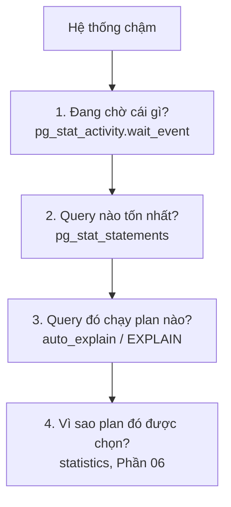

# Phần 14 — Monitoring & Debug production

> **Mục tiêu:** có **quy trình** chẩn đoán thay vì đoán. Phần này là nơi mọi phần trước hội tụ.

---

## 1. Bốn câu hỏi khi hệ thống chậm

Đừng bắt đầu bằng việc nhìn biểu đồ CPU. Hỏi theo thứ tự:



Câu hỏi đầu tiên quan trọng nhất, vì nó phân loại sự cố ngay lập tức.

---

## 2. `pg_stat_activity` — câu hỏi đầu tiên

```sql
SELECT COALESCE(wait_event_type, 'ĐANG DÙNG CPU') AS loai,
       wait_event,
       count(*)
FROM pg_stat_activity
WHERE backend_type = 'client backend' AND state = 'active'
GROUP BY 1, 2
ORDER BY 3 DESC;
```

Kết quả chỉ thẳng tới loại sự cố:

| `wait_event_type` | Nghĩa là gì | Đi tới phần nào |
|---|---|---|
| `NULL` (đang dùng CPU) | Query tốn CPU, hoặc thiếu index | Phần 05, 06, 07 |
| `IO` | Đang chờ đĩa | Phần 01 (cache), Phần 07 (`Buffers`) |
| `Lock` | Đang chờ lock — **có người chặn** | Phần 08 |
| `LWLock` | Tranh chấp nội bộ — thường do quá nhiều connection | Phần 11 |
| `Client` | Đang chờ ứng dụng gửi lệnh | Phần 15 |
| `Timeout` | Đang ngủ có chủ ý | Bình thường |

Đây là bảng đáng thuộc nhất của Phần 14. Nó biến "database chậm" thành một hướng điều tra cụ
thể trong 10 giây.

### Bảng điều khiển một màn hình

```sql
SELECT
    count(*) FILTER (WHERE state = 'active')                       AS dang_chay,
    count(*) FILTER (WHERE state = 'idle')                         AS ranh,
    count(*) FILTER (WHERE state = 'idle in transaction')          AS idle_in_tx,
    count(*) FILTER (WHERE wait_event_type = 'Lock')               AS cho_lock,
    COALESCE(max(EXTRACT(epoch FROM now() - xact_start))
             FILTER (WHERE state = 'idle in transaction'), 0)::int AS idle_tx_lau_nhat_s,
    COALESCE(max(EXTRACT(epoch FROM now() - query_start))
             FILTER (WHERE state = 'active'), 0)::int              AS query_lau_nhat_s
FROM pg_stat_activity
WHERE backend_type = 'client backend' AND pid <> pg_backend_pid();
```

Chạy bằng `\watch 2`. Sáu con số này cho biết hệ thống đang ở trạng thái nào và thủ phạm ở đâu.

---

## 3. `pg_stat_statements` — query nào đáng quan tâm

```sql
SELECT round(total_exec_time::numeric, 0)    AS tong_ms,
       calls,
       round(mean_exec_time::numeric, 2)     AS tb_ms,
       round(stddev_exec_time::numeric, 2)   AS do_lech,
       rows / NULLIF(calls, 0)               AS row_moi_lan,
       round(100.0 * shared_blks_hit /
             NULLIF(shared_blks_hit + shared_blks_read, 0), 1) AS cache_hit_pct,
       left(regexp_replace(query, '\s+', ' ', 'g'), 60) AS query
FROM pg_stat_statements
ORDER BY total_exec_time DESC
LIMIT 20;
```

**Sắp theo `total_exec_time`, không phải `mean_exec_time`.** Query 10ms chạy 1 triệu lần gây
hại hơn query 5 giây chạy 10 lần.

| Tín hiệu | Chẩn đoán |
|---|---|
| `do_lech` ≫ `tb_ms` | Cùng query, hai plan khác nhau — nghi generic plan (Phần 01) |
| `row_moi_lan` rất lớn | Thiếu `LIMIT`, hoặc join nổ |
| `cache_hit_pct` < 95% | Thiếu RAM, hoặc quét bảng lớn |
| `calls` khổng lồ với query đơn giản | N+1 từ ứng dụng (Phần 15) |

---

## 4. Bảng và index

```sql
-- Bảng bị quét tuần tự nhiều
SELECT relname, seq_scan, seq_tup_read, idx_scan,
       seq_tup_read / NULLIF(seq_scan, 0) AS row_moi_lan_quet,
       n_live_tup
FROM pg_stat_user_tables
WHERE seq_scan > 0 AND n_live_tup > 10000
ORDER BY seq_tup_read DESC LIMIT 10;
```

`row_moi_lan_quet` lớn trên bảng lớn = ứng viên cần index.

Nhưng nhớ Phần 05: nếu query lấy trên 10% số row, Seq Scan là **đúng**. Đừng tạo index theo
phản xạ.

```sql
-- Index chưa từng dùng
SELECT s.relname, s.indexrelname, s.idx_scan,
       pg_size_pretty(pg_relation_size(s.indexrelid)) AS kich_thuoc
FROM pg_stat_user_indexes s
JOIN pg_index i ON i.indexrelid = s.indexrelid
WHERE s.idx_scan = 0 AND NOT i.indisunique AND NOT i.indisprimary
ORDER BY pg_relation_size(s.indexrelid) DESC;
```

Kiểm tra `stats_reset` trước khi kết luận:

```sql
SELECT datname, stats_reset FROM pg_stat_database WHERE datname = current_database();
```

```sql
-- Bloat và tình trạng autovacuum
SELECT relname, n_live_tup, n_dead_tup,
       round(100.0 * n_dead_tup / NULLIF(n_live_tup + n_dead_tup, 0), 1) AS pct_dead,
       last_autovacuum, autovacuum_count
FROM pg_stat_user_tables
WHERE n_dead_tup > 1000
ORDER BY n_dead_tup DESC LIMIT 15;
```

---

## 5. `pg_stat_io` (PostgreSQL 16+)

```sql
SELECT backend_type, object, context,
       reads, writes, extends, hits,
       round(100.0 * hits / NULLIF(hits + reads, 0), 1) AS hit_pct
FROM pg_stat_io
WHERE reads > 0 OR writes > 0
ORDER BY reads DESC NULLS LAST LIMIT 15;
```

Giá trị của nó là chia I/O theo **`context`**:

| `context` | Nghĩa là gì |
|---|---|
| `normal` | Đọc ghi thông thường |
| `vacuum` | Do VACUUM — đối chiếu Phần 04 |
| `bulkread` | Quét tuần tự lớn, dùng ring buffer riêng |
| `bulkwrite` | `COPY`, `CREATE TABLE AS` |

`context = 'vacuum'` chiếm phần lớn I/O nghĩa là autovacuum đang là nguồn tải chính — thường
do bloat đã tích tụ quá nhiều.

---

## 6. Ba thứ luôn phải kiểm tra

Ba nguồn này gây sự cố **âm thầm** và đã xuất hiện xuyên suốt giáo trình:

```sql
-- 1. Transaction dài / idle in transaction  (Phần 03, 04, 08)
SELECT pid, now() - xact_start AS tuoi, state, backend_xmin, left(query, 50)
FROM pg_stat_activity
WHERE backend_xmin IS NOT NULL AND now() - xact_start > interval '5 minutes'
ORDER BY xact_start;

-- 2. Replication slot bị bỏ quên  (Phần 04, 10)
SELECT slot_name, active, age(xmin) AS tuoi_xmin,
       pg_size_pretty(pg_wal_lsn_diff(pg_current_wal_lsn(), restart_lsn)) AS wal_bi_giu
FROM pg_replication_slots ORDER BY 4 DESC NULLS LAST;

-- 3. Nguy cơ xid wraparound  (Phần 03, 04)
SELECT datname, age(datfrozenxid) AS tuoi_xid,
       round(100.0 * age(datfrozenxid) / 2000000000, 2) AS pct_gioi_han
FROM pg_database ORDER BY 2 DESC;
```

Cả ba đều có chung một đặc điểm: **không có triệu chứng cho tới khi đã quá muộn.** Phải theo
dõi chủ động.

---

## 7. Metric và ngưỡng cảnh báo

| Metric | Nguồn | Cảnh báo khi |
|---|---|---|
| Số connection | `pg_stat_activity` | > 80% `max_connections` |
| `idle in transaction` lâu nhất | `pg_stat_activity` | > 5 phút |
| Query lâu nhất | `pg_stat_activity` | > 5 phút (tuỳ hệ thống) |
| Session chờ lock | `pg_stat_activity` | > 0 kéo dài trên 1 phút |
| Cache hit ratio | `pg_stat_database` | < 95% |
| Replication lag | `pg_stat_replication` | > 30 giây hoặc > 1 GB |
| Slot không active | `pg_replication_slots` | `active = false` **bất kỳ lúc nào** |
| `age(datfrozenxid)` | `pg_database` | > 1 tỷ (50% giới hạn) |
| Dead tuple % | `pg_stat_user_tables` | > 20% và **đang tăng** |
| Checkpoint requested | `pg_stat_checkpointer` | > 10% tổng số checkpoint |
| Temp file bytes | `pg_stat_database` | Tăng đều |
| Disk free | Hệ điều hành | < 20% |

Nhắc lại Phần 04: `pct_dead` cao **không** tự nó là vấn đề; **xu hướng tăng** mới là.

---

## 8. Playbook sự cố

### 8.1. CPU tăng đột biến

```sql
SELECT pid, now() - query_start AS chay_bao_lau, left(query, 80)
FROM pg_stat_activity
WHERE state = 'active' AND wait_event IS NULL
ORDER BY query_start LIMIT 10;
```

`wait_event IS NULL` + `state = 'active'` = đang thực sự dùng CPU.

Nguyên nhân thường gặp: plan flip sau `ANALYZE` (Phần 06), thiếu index sau khi dữ liệu tăng
(Phần 05), hoặc một query mới được deploy.

**Xử lý tức thời:** `pg_cancel_backend(pid)` cho query tệ nhất, rồi điều tra.

### 8.2. I/O tăng đột biến

Kiểm tra theo thứ tự: checkpoint (Phần 09) → autovacuum (Phần 04) → temp file (Phần 11).

```sql
SELECT num_timed, num_requested, buffers_written FROM pg_stat_checkpointer;
SELECT pid, left(query, 60) FROM pg_stat_activity WHERE backend_type = 'autovacuum worker';
SELECT datname, temp_files, pg_size_pretty(temp_bytes) FROM pg_stat_database;
```

### 8.3. Connection đầy

```sql
SELECT state, count(*) FROM pg_stat_activity GROUP BY 1;
```

Nếu phần lớn là `idle in transaction` → **vấn đề nằm ở ứng dụng**, không phải database. Xem
Phần 15: gọi HTTP bên trong transaction, hoặc quên commit.

Nếu phần lớn là `active` và CPU bão hòa → thiếu connection pool hoặc thiếu index.

> Nhắc lại Phần 11: "pool đầy mà CPU thấp" gần như luôn là transaction bị giữ quá lâu.

### 8.4. Query đột nhiên chậm

```sql
-- So sánh plan hiện tại với plan lúc nhanh (từ log auto_explain)
EXPLAIN (ANALYZE, BUFFERS) <query>;

-- Statistics có cũ không?
SELECT relname, last_analyze, last_autoanalyze, n_mod_since_analyze
FROM pg_stat_user_tables WHERE relname = '...';
```

Ba nguyên nhân, theo thứ tự hay gặp:

1. **Plan flip** do statistics đổi (Phần 06).
2. **Generic plan** sau 5 lần chạy (Phần 01) — kiểm tra `stddev_exec_time`.
3. **Bloat** làm bảng lớn hơn thực chất (Phần 04).

### 8.5. Disk đầy

```sql
SELECT pg_size_pretty(sum(size)) FROM pg_ls_waldir();
SELECT slot_name, active,
       pg_size_pretty(pg_wal_lsn_diff(pg_current_wal_lsn(), restart_lsn))
FROM pg_replication_slots;
SELECT archived_count, failed_count, last_failed_time FROM pg_stat_archiver;
```

Ba nguyên nhân WAL không được dọn: slot bị bỏ quên (Phần 10), `archive_command` lỗi (Phần 09),
hoặc `max_wal_size` quá lớn.

**Đừng bao giờ xóa file WAL bằng tay.** Xóa slot bằng `pg_drop_replication_slot()` để PostgreSQL
tự dọn.

### 8.6. Xid wraparound đang tới gần

```sql
SELECT c.relname, age(c.relfrozenxid) AS tuoi
FROM pg_class c WHERE c.relkind IN ('r','m')
ORDER BY 2 DESC LIMIT 10;
```

Xử lý: tìm và loại bỏ thứ đang giữ `xmin` (mục 6), rồi chạy `VACUUM (FREEZE)` trên các bảng có
tuổi cao nhất. Đây là tình huống cần hành động ngay — xem Phần 03.

---

## 9. Nguyên tắc điều tra

1. **Đo trước, sửa sau.** Đừng tăng `work_mem` vì linh cảm.
2. **Một thay đổi một lần.** Đổi ba thứ cùng lúc thì không biết cái nào có tác dụng.
3. **Ghi lại số liệu trước và sau.** "Có vẻ nhanh hơn" không phải kết quả.
4. **Sửa nguyên nhân, không sửa triệu chứng.** `SET enable_nestloop = off` là chẩn đoán, không
   phải giải pháp (Phần 06).
5. **Kiểm tra ba thứ âm thầm** ở mục 6 trước khi đào sâu vào query.

---

## 10. Những gì bạn nên rút ra từ phần này

1. Câu hỏi đầu tiên luôn là `wait_event_type` — nó phân loại sự cố trong 10 giây.
2. Sắp `pg_stat_statements` theo `total_exec_time`.
3. `stddev_exec_time` lớn là dấu hiệu hai plan cho cùng một query.
4. Ba thứ âm thầm phải theo dõi: transaction dài, replication slot, xid age.
5. `pg_stat_io.context` phân biệt được I/O của vacuum với I/O thường.
6. Slot `active = false` là cảnh báo **ngay lập tức**, không có ngưỡng.
7. `pct_dead` cao không phải vấn đề; **xu hướng tăng** mới là.
8. Không bao giờ xóa file WAL bằng tay.

---

**Tiếp theo:** Phần 15 — Phía application.
