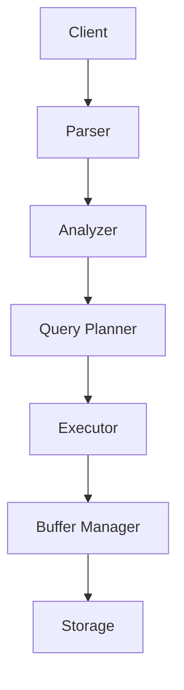

# Quy ước của repository

> File này là **quy tắc bắt buộc** cho mọi phiên làm việc trên repository này.
> Đọc file này trước khi tạo hoặc sửa bất kỳ nội dung nào.

---

## 1. Ngôn ngữ

**Toàn bộ nội dung của repository phải được viết bằng TIẾNG VIỆT.**

Áp dụng cho: README, ROADMAP, PROGRESS, mọi file Markdown, phần giải thích lý thuyết,
ví dụ, bài tập, lab, troubleshooting, case study, câu hỏi kiểm tra, đáp án, chú thích
diagram, phần giải thích SQL, phần giải thích PostgreSQL internals, hướng dẫn thực hành.

Không được tự động chuyển sang tiếng Anh khi giải thích các chủ đề kỹ thuật nâng cao.

Tiếng Anh **chỉ** được dùng cho:

1. Thuật ngữ chuyên ngành
2. Tên công nghệ
3. Tên function
4. Tên PostgreSQL parameter
5. SQL
6. Source code
7. CLI command
8. Đường dẫn source code
9. Tên metric
10. Câu trích dẫn từ tài liệu chính thức khi thực sự cần thiết

Ngay cả khi tài liệu tham khảo là tiếng Anh, phải đọc, hiểu và **diễn giải lại** bằng
tiếng Việt. Không copy nguyên văn, không dịch máy.

---

## 2. Quy tắc thuật ngữ

Thuật ngữ kỹ thuật phổ biến **giữ nguyên tiếng Anh**, nhưng phải được giải thích bằng
tiếng Việt. Không dịch máy móc thành từ tiếng Việt khó hiểu.

Danh sách thuật ngữ giữ nguyên (không đầy đủ):

```text
MVCC (Multi-Version Concurrency Control)
WAL (Write-Ahead Logging)
Query Planner
Query Optimizer
Execution Plan
Sequential Scan
Index Scan
Bitmap Heap Scan
Nested Loop Join
Hash Join
Merge Join
Cardinality
Selectivity
Dead Tuple
Table Bloat
Index Bloat
Checkpoint
Replication
Connection Pool
Buffer Cache
Page Cache
Lock Contention
Query Latency
Throughput
```

**Nên viết:**

> PostgreSQL sử dụng MVCC (Multi-Version Concurrency Control) để cho phép nhiều
> transaction đọc và ghi dữ liệu đồng thời mà không cần khóa toàn bộ dữ liệu.

**Không nên viết:**

> PostgreSQL sử dụng cơ chế điều khiển đồng thời đa phiên bản...

Có thể ghi phần giải thích tiếng Việt phía sau nếu cần:

> Cardinality là số lượng row mà PostgreSQL ước lượng sẽ được trả về tại một bước
> trong Execution Plan.

---

## 3. Phong cách giải thích

Viết theo góc nhìn của một **Backend Engineer / Database Engineer**, không viết kiểu
giáo trình học thuật khô cứng.

Thứ tự trình bày ưu tiên:

```text
Khái niệm
↓
Tại sao cần nó?
↓
PostgreSQL làm nó như thế nào?
↓
Bên trong DB đang xảy ra chuyện gì?
↓
Ví dụ
↓
Thử nghiệm
↓
Vấn đề production
↓
Cách debug
↓
Cách tối ưu
```

Khi gặp khái niệm khó, giải thích theo **3 tầng**:

- **Level 1 — Trực giác:** giải thích đơn giản để người đọc hình thành mental model.
- **Level 2 — Góc nhìn Backend Engineer:** tác động lên application, query, transaction
  và performance.
- **Level 3 — PostgreSQL Internals:** cách PostgreSQL thực sự triển khai bên trong.

**Không viết kiểu:**

> PostgreSQL is a powerful open-source relational database...

**Phải viết:**

> PostgreSQL là một relational database mã nguồn mở, nhưng để hiểu PostgreSQL sâu thì
> không nên chỉ xem nó như nơi lưu dữ liệu. PostgreSQL thực chất gồm nhiều subsystem như
> Query Planner, Executor, Buffer Manager, WAL, MVCC và Storage Engine phối hợp với nhau
> để xử lý một câu SQL.

---

## 4. Quy tắc code

Code, SQL, command line, config parameter và tên thành phần PostgreSQL **giữ nguyên
tiếng Anh**. Sau mỗi block code phải có phần giải thích bằng tiếng Việt.

````markdown
```sql
EXPLAIN (ANALYZE, BUFFERS)
SELECT *
FROM users
WHERE id = 100;
```

Ở execution plan trên, PostgreSQL chọn Index Scan vì điều kiện `id = 100`
có selectivity rất cao và chỉ cần đọc một lượng nhỏ tuple.
````

---

## 5. Diagram

Dùng Mermaid. Tên component trong diagram **giữ tiếng Anh** để đúng terminology, nhưng
phần chú thích và giải thích diagram phải bằng tiếng Việt.

````markdown


Sơ đồ trên mô tả đường đi của một câu SQL từ lúc client gửi lên cho tới lúc dữ liệu
được đọc từ storage.
````

---

## 6. Cấu trúc thư mục và quy ước đặt tên

- Thư mục module đặt tên theo dạng `NN-ten-module` (không dấu, chữ thường, nối bằng `-`).
- Mỗi module gồm các file:

| File | Nội dung |
|---|---|
| `README.md` | Lý thuyết theo phong cách 3 tầng |
| `lab.md` | Bài thực hành có thể chạy được trên máy thật |
| `bai-tap.md` | Bài tập tự làm, **kèm phần đáp án ở cuối file** |
| `kiem-tra.md` | Chỉ tạo riêng khi module đủ lớn để cần bộ câu hỏi tách biệt (xem Phần 01) |
| `troubleshooting.md` | Triệu chứng → chẩn đoán → cách xử lý (chỉ với module liên quan production) |

- Case study nằm ở `case-studies/`.
- Bảng tra cứu, checklist nằm ở `appendix/`.
- Script khởi tạo môi trường, dataset mẫu nằm ở `00-moi-truong/`.

---

## 7. Chuẩn chất lượng cho mỗi bài viết

Một file lý thuyết chỉ được coi là hoàn thành khi có đủ:

1. Phần trực giác trước, internals sau — không đảo ngược.
2. Ít nhất một ví dụ SQL chạy được thật, kèm output mẫu.
3. Ít nhất một thử nghiệm người đọc tự làm lại được (có lệnh tạo dữ liệu).
4. Một mục "Vấn đề thường gặp trong production".
5. Một mục "Cách debug" với query chẩn đoán cụ thể (`pg_stat_*`, `EXPLAIN`, `pg_locks`...).
6. Nêu rõ version PostgreSQL khi hành vi khác nhau giữa các version.
7. Không khẳng định con số hiệu năng nếu chưa đo — nếu là ước lượng phải nói rõ là ước lượng.

---

## 8. Mục tiêu

Repository phải có cảm giác như một:

> **"Giáo trình Database Engineering và PostgreSQL chuyên sâu bằng tiếng Việt dành cho
> Backend Engineer."**

Không phải một bộ tài liệu dịch từ PostgreSQL Documentation.

Mục tiêu cuối cùng: người đọc có khả năng **tự suy luận về hành vi của database khi gặp
vấn đề production**, chứ không phải học thuộc câu lệnh.
